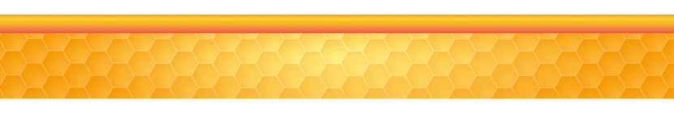
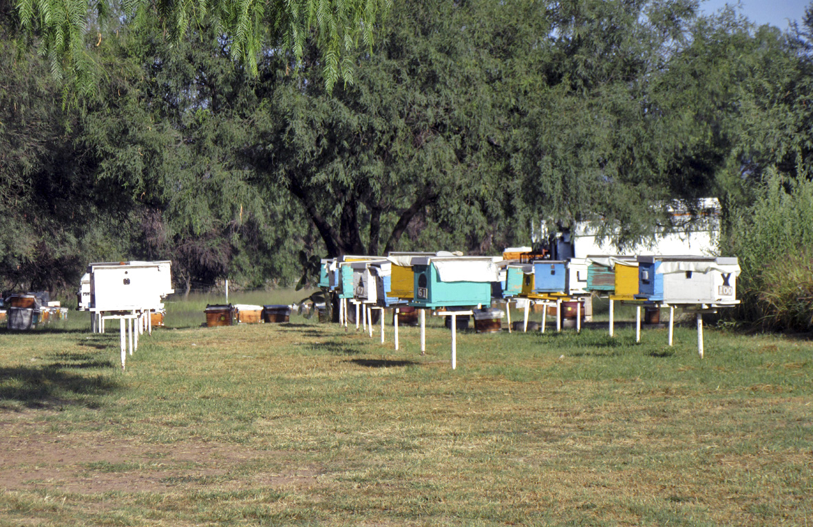
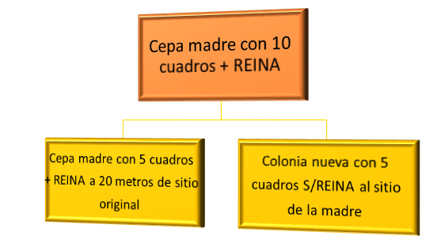
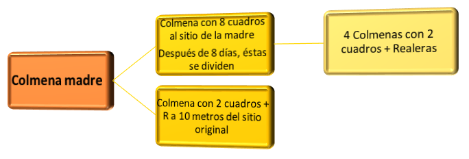
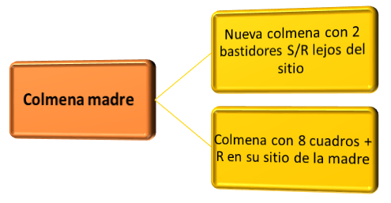
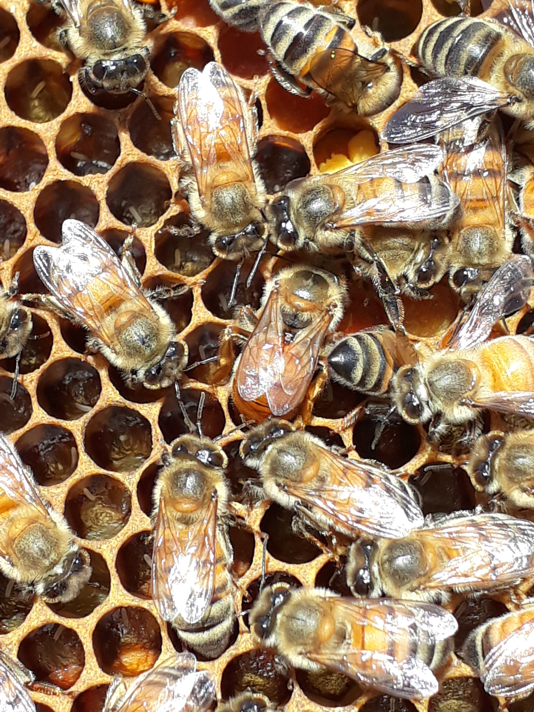

---
title: "**Abejas y apicultura**"
---   


```{r i_4x, fig.align='center', echo=FALSE, cache=TRUE}



```

```{r setup, include=FALSE}
knitr::opts_chunk$set(echo = TRUE)
```


<div class=text-justify>


<br/>

## **2.1 Biología y Comportamiento de las Abejas**
****
<br>

La palabra abeja es el nombre común que reciben los insectos pertenecientes a la superfamilia _Apoidea_ del orden _Himenóptera_ (alas membranosas). En la actualidad, existen más de 20 mil especies de abejas en el mundo clasificadas en 9 familias, de las cuales 6 están presentes en México, con más de 1,800 especies descritas. Dentro de la familia _Apidae_, se clasifican las abejas del género _Bombus_ (abejorros), _Melipona_, _Trigona_, _Euglossa_ y _Apis_, siendo este último el más conocido por sus características de producción a través de las abejas _Apis mellifera_. 
Una colonia de abejas se conforma por tres castas: _reina_, _zángano_ y _obrera_; específicamente una del género _Apis_ puede llegar a tener hasta  60 mil abejas, de las cuales una es reina, cientos son zánganos y miles son obreras. Cada casta de la colonia presenta diferentes características:

**Reina**. Es la encargada de poner los huevos de donde nacerán todas las obreras y zánganos de la colmena. Presenta una metamorfosis de 16 días, proviene de un huevo fecundado y es alimentada con jalea real durante todo el tiempo que permanece en estado larval. Se estima que puede llegar a vivir hasta 5 años en vida silvestre.

**Zángano**. Su función principal es fecundar a la reina; presenta una metamorfosis de 24 días, proviene de un huevo sin fecundar (partenogénesis) y en etapa larvaria se alimenta con jalea real solo por tres días, después recibe néctar y polen de las abejas obreras; su tiempo de vida es variado, ya que después de fecundar a la reina se muere, y aquellos que no se reproducen viven el mismo tiempo que dura el periodo de floración, ya que dejan de ser alimentados al término de dicho periodo.

**Obrera**. Realiza diversas actividades de acuerdo a su desarrollo fisiológico. Presenta una metamorfosis de 21 días, su origen es a partir de un huevo fecundado y en etapa de larva es alimentada con jalea real por tres días, y después recibe pan de las abejas, alimento elaborado a base de miel y polen; su tiempo de vida  en época de floración se estima en 45 días, o hasta 3 meses si no hay actividades de pecoreo.

<br/>

**COMPORTAMIENTO**

Las abejas se pueden clasificar según sus rasgos de socialidad en abejas solitarias y abejas eusociales. Las de este último tipo, se caracterizan por utilizar un mismo nido, cooperar en el cuidado de la cría mediante un sistema de castas y tener generaciones superpuestas donde las crías ayudan a los adultos.

Las abejas melíferas son consideradas como uno de los mejores insectos eusociales y su comportamiento es determinado por un conjunto de substancias químicas llamadas feromonas, las cuales son secretadas por diversas glándulas presentes en su cuerpo como son: la glándula hipofaríngea, mandibular y cerígena, entre otras. Cada feromona origina un comportamiento específico en las abejas. Por lo general, las feromonas contienen más de un componente químico y se pueden sintetizar en cualquier momento, ya sea durante un periodo de tiempo o solo por algún evento esporádico.

Se pueden identificar feromonas que estimulan un comportamiento inmediato y reversible en cuanto son percibidas (liberadoras). Un ejemplo son las _feromonas de alarma_, cuya liberación desencadena un comportamiento defensivo entre las obreras. Existen otras feromonas que producen cambios en las respuestas fisiológicas (iniciadoras). Un ejemplo típico es la _feromona real_, que inhibe el desarrollo de los ovarios de las obreras de la colmena.

De forma general, las actividades de las abejas a partir del día que emergen de la celdilla son:

• _Obreras_. Dentro de los primeros cinco días, realizan actividades de limpieza y regulación de la temperatura interna de la colmena; posteriormente, cuando se desarrolla la glándula hipofaríngea, tienen la capacidad de producir jalea real, por lo que se dedican a alimentar a la cría hasta llegar a los 12 días. Durante un periodo que va de los 13 a los 18 días, pueden realizar diferentes actividades conforme a las necesidades de la colonia; es posible identificar abejas que se encargan de la construcción de los panales y del opérculo, gracias a la formación de cera mediante las  glándulas cerígenas; otras que se encargan de recibir las cargas de alimento, agua y propóleos para depositarlos dentro de las celdillas o en lugares donde son necesarios. Ya más avanzadas de edad (día 19 al 21) y una vez que son capaces de producir veneno a través de ciertas glándulas, realizan actividades de guardia y protección; y finalmente, aproximadamente a los 22 días y hasta que termina su vida, se dedican a realizar actividades de pecoreo para traer néctar, polen y demás recursos necesarios para la colonia.


• _Reina_. Durante los primeros 20 días pasa por diferentes procesos hasta alcanzar su madurez sexual y realizar vuelos de apareamiento con varios zánganos, posteriormente se dedica a ovopositar, llegando a colocar de mil a dos mil huevos al día.

• _Zángano_. Durante los primeros 12 días se reúne en zonas de congregación con otros zánganos, donde tras desarrollar su madurez sexual, puede realizar vuelos de apareamiento con una abeja reina.

<br/>

***Fuente:***

[SADER. (2018). _Buenas Prácticas Pecuarias en la producción de Producción de Miel._ ](pdfs/Manual_BPP_en_la_Producci_n_primaria_de_Miel_octubre_2018.pdf){target="_blank"}

<br/>
<br/>
<br/>

## **2.2 La Apicultura como Actividad Económica**  
****

<br/>

La apicultura es una actividad agropecuaria orientada a la crianza de abejas, que se ha desarrollado a la par del surgimiento de las civilizaciones.

En nuestro país tiene un alto valor social y económico, de ella dependen más de 43 mil productores, cuyo esfuerzo permite que nuestro país se ubique como el tercer exportador de miel en el mundo, después de China y Argentina.

A pesar de los problemas que implican la presencia de la _abeja africana_ en México (desde 1986) y la _Varroa_ (desde 1992), los cambios climáticos y el deterioro de los recursos naturales vinculados a la producción apícola en los últimos años, la apicultura nacional ha mantenido sus niveles de producción, lo que refleja el arduo trabajo de los apicultores mexicanos, y el impacto positivo que han tenido los programas de apoyo gubernamental como el *Programa de Adquisición de Activos Productivos* y el *Programa Soporte en Inocuidad Pecuaria*.

La producción de miel en México en el periodo 2014-2018, registró variaciones, reportándose un promedio de producción anual de 57,995 toneladas. En materia de exportaciones, durante el mismo periodo se estuvieron enviando al extranjero alrededor de 34,000 toneladas anuales, teniendo como destinos principales: Estados Unidos, Alemania, Bélgica, Arabia Saudita y Reino Unido; generando por este medio, un ingreso promedio anual de 124 millones de dólares, lo que confirma que la apicultura es una importante fuente de divisas para la economía mexicana.

Actualmente, en todo el mundo se están impulsando proyectos para que los pequeños productores implementen la apicultura como una forma de ayudar a la gente a fortalecer su economía, promover el desarrollo de las comunidades y asegurar la continuidad del hábitat y de la diversidad biológica.

<br/>

#### **Beneficios de la apicultura:**

•	La polinización de las plantas en flor, salvajes o cultivadas, es indispensable para que la vida continúe sobre la tierra. Este proceso esencial es de un valor inestimable.

•	A la gente de todo el mundo le gusta la miel: el más popular de los productos de la apicultura. Tradicionalmente, en casi todas las sociedades, la miel ha tenido una función medicinal y nutritiva. Ya sea comercializada a granel o envasada, la miel produce ganancias, y es capaz de crear medios de vida y desarrollo en varios sectores dentro de una sociedad.

•	La cera de abeja es un producto importante de la apicultura. La mayor parte del abastecimiento mundial proviene de los países en vías de desarrollo.

•	Los demás productos de la apicultura, como el polen, propóleos y la jalea real pueden ser comercializados, aunque se necesiten técnicas y materiales específicos para obtenerlos.

•	Los apicultores y otros miembros de la comunidad pueden generar bienes usando la miel y la cera de abeja en la elaboración de productos derivados, tales como candelas, ungüentos para la piel y hasta cerveza. La comercialización de un producto derivado generalmente se traduce en mejores ganancias al productor que la venta de la materia bruta. 

•	Los productos de la apicultura son usados para la *Apiterapia*, en muchas sociedades.

•	La miel de abeja, la cera y sus productos derivados, tales como velas y productos alimenticios, tienen valor cultural en algunos lugares, y pueden ser usados en rituales para nacimientos, casamientos, funerales y ceremonias religiosas.

•	Los apicultores generalmente son respetados por el trabajo que desempeñan. Las abejas y los apicultores tienen una buena reputación.

Estos beneficios fortalecen el sistema de vida y desarrollo de la población. La apicultura puede contribuir a reducir la vulnerabilidad económica de las comunidades, sobre todo en los estratos más pobres, y a promover un entorno de desarrollo económico sustentable.


***Fuentes:*** 

[UNAM. Facultad de Medicina Veterinaria y Zootecnista. (2016). _Memorias de la _Reunión Internacional de Ciencias Veterinarias._ Junio.](pdfs/ABEJAS_CONEJOS_ORGANISMOS_ACUATICOS_MEMORIAS.pdf){target="_blank"}

[Organización de las Naciones Unidas para la Alimentación y la Agricultura, FAO. (2005). *La apicultura ayuda a crear sistemas de vida sostenibles*. La apicultura y los medios de vida sostenibles (Folleto de la FAO sobre diversificación).](http://www.fao.org/docrep/008/y5110s/y5110s00.htm){target="_blank"}

<br/>
<br/>
<br/> 

## **2.3 Las Abejas, Promotoras del Equilibrio Ecológico**
****

<br/>

En general, los insectos tienen un papel crucial en los ecosistemas naturales, pues forman parte fundamental de la biodiversidad.

En el caso específico de las abejas, su rol con respecto al equilibrio ecológico es clave, dado su relevante papel en la polinización. La pérdida de biodiversidad que sobrevendría si las abejas desaparecieran o se vieran minimizadas, significaría una catástrofe ambiental. En términos de nutrición humana, la seguridad alimentaria se vería comprometida, pues alrededor de un 35% de la producción mundial de alimentos depende directamente de la polinización que ellas producen. 

Para la mayor parte de las especies vegetales, la reproducción necesita el traslado del polen desde las anteras, o partes masculinas de una flor, hasta los estigmas, o sea, sus partes femeninas, ya sea de la misma planta o de otras plantas que se encuentren a cierta distancia; lo anterior es lo que se denomina _polinización_. Después de miles de años de evolución y de adaptación a los ambientes locales, cada especie vegetal tiene exigencias específicas para el transporte de su polen; muchas de las cuales dependen de los insectos forrajeadores que lo trasladan de flor en flor. Muchas especies de insectos visitan las flores para buscar su néctar o polen y, mientras lo hacen, transportan los gránulos que contribuirán a la polinización.

Las abejas melíferas son insectos polinizadores altamente eficaces, ya que tienen el cuerpo cubierto de pelos que recogen fácilmente miles de gránulos de polen cuando se mueven al interior de las flores; además, visitan solamente una especie de flor durante cada uno de sus viajes. En una sola jornada una abeja puede visitar miles de flores de una misma especie, recogiendo el néctar y el polen y esparciendo en todo momento los gránulos de polen por todas las flores que visita.

Más allá del aspecto económico, la polinización adquiere relevancia en términos de supervivencia, puesto que asegura la continuidad de las especies vegetales en el planeta. Si este proceso falla, la cadena trófica también lo hará. Por ello, incluso una leve disminución en la eficacia de la polinización, se traduciría en irremediables pérdidas de especies animales y vegetales, contando con aquellos que el ser humano necesita para asegurar su alimentación.

Abejas y plantas forman de este modo, un pilar que alimenta y enriquece el ecosistema, y que a su vez nutre a multitud de insectos, aves y mamíferos.

La Secretaría de Agricultura y Desarrollo Rural (SADER) señala que la apicultura en México tiene una gran importancia socioeconómica y ecológica, ya que las abejas son fundamentales para el equilibrio del medio ambiente, por ello, es importante implementar acciones que favorezcan su conservación y protección en el país.

***Fuentes:***

[Organización de las Naciones Unidas para la Alimentación y la Agricultura, FAO. (2005). _Las abejas son los diligentes polinizadores de las frutas y cultivos_. La apicultura y los medios de vida sostenibles (Folleto de la FAO sobre diversificación).](http://www.fao.org/docrep/008/y5110s/y5110s00.htm){target="_blank"}


<br/>
<br/>
<br/>

##  **2.4 Instalación, Manejo y Mantenimiento de Apiarios** 

****

<br/>

```{r i2_5_01, fig.align='center',fig.height= 6, fig.width= 12, echo=FALSE, cache=TRUE, fig.cap="**Figura 2.1. Apiario con núcleos de fecundación**", out.width = "80%"}



```

Del lugar y condiciones de que dispongan las abejas dependerá en gran medida que los resultados del apiario sean satisfactorios. Si las abejas cuentan con los medios para fortalecer y desarrollar su colonia, acopiarán en abundancia néctar y polen, lo que se traducirá en beneficios económicos para el apicultor.

La instalación de los apiarios debe hacerse en terrenos que al momento de la floración no estén sujetos a la aplicación de plaguicidas agrícolas y otras sustancias tóxicas, debe evitarse instalar los apiarios cerca de desagües de aguas negras, granjas pecuarias, a pie de carretera,
fábricas o zonas urbanas y escolares, principalmente.

En México se lleva a cabo un proceso de africanización, por lo que existe el riesgo de problemas por ataques de abejas a personas y animales. Para evitar esta situación, se recomienda ubicar los apiarios en zonas que ofrezcan el máximo de seguridad a la comunidad. Estas y otras sugerencias son fundamentales para la buena instalación de un apiario. El apicultor debe estar atento a las condiciones que puedan beneficiar o afectar a las abejas y a la calidad de sus productos, en todo momento, a fin de evitar riesgos innecesarios.

Asímismo, en la instalación de apiarios se debe evitar colocar las colmenas en lugares húmedos. En regiones muy calurosas se recomienda ubicarlas en sitios de sombra y procurar que no sean completamente cerradas. El lugar en donde se instalen las colmenas debe estar limpio de maleza, sin hormigueros u otros enemigos de las abejas alrededor. Las colmenas se deben colocar sobre una base resistente de metal, piedras o ladrillos para que no estén directamente sobre el piso, y alcancen una altura mínima de 20 cm del suelo, lo que facilitará su manejo y favorecerá la ventilación de la colmena. La instalación de apiarios debe contar con el espacio suficiente entre colmenas y deberá estar debidamente señalizado, y procurar que tenga buen acceso todo el año para el vehículo o equipo que se use en el traslado o recolección de alzas.

Se sugiere también que el apiario se sitúe preferentemente en un lugar nivelado y seco, con espacio suficiente, de tal forma que se transite libremente por detrás de las colmenas para realizar las diferentes prácticas de manejo. Se recomienda de 2 a 3 metros de separación entre cada colmena.

El manejo en las colmenas reúne una serie de actividades y procedimientos destinados a aumentar la reproducción de las abejas y posteriormente su productividad. Incluye las consideraciones para la compra y uso de cera estampada; así como la alimentación artificial.
 

***Fuentes:*** 

[Universidad Nacional Autónoma de México (UNAM). Facultad de Medicina Veterinaria y Zootecnista, FMVZ. (2016). *Memorias de la _Reunión Internacional de Ciencias Veterinarias.* Junio.](pdfs/ABEJAS_CONEJOS_ORGANISMOS_ACUATICOS_MEMORIAS.pdf){target="_blank"}

[SADER. (2018). _Buenas Prácticas Pecuarias en la producción de Producción de Miel_.](pdfs/Manual_BPP_en_la_Producci_n_primaria_de_Miel_octubre_2018.pdf){target="_blank"}

<br/>
<br/>
<br/>


## **2.5 División de Colmenas**
****

<br/>

Una división es la toma de una o varias colmenas de abejas capaces de formar una nueva colonia. La división es para aumentar el número de colmenas en producción en la época de cosecha; es una práctica que se realiza 2 meses antes de primavera en trópico; es decir en los meses de enero y marzo con la finalidad de poseer gran número de colmenas ya sea en el año en curso o en la siguiente cosecha. 

Otra de las razones de las divisiones es para disminuir la fiebre de la enjambrazón, control de las enfermedades y para aumentar los ingresos por la venta de los núcleos resultantes de las divisiones. Antes de hacer la enjambrazón artificial primero se debe tener un conocimiento general de su pasado de las colonias participantes como colonia madre, edad de la reina, provisiones, patrón de postura, estado de salud y su nivel de producción en los últimos dos años.

Existen muchas formas de enjambrar artificialmente a las colmenas, pero en este apartado únicamente se explicará 3 maneras que son las más usadas en la apicultura como son:

*División en dos a partir de una colmena.* La colmena se divide en dos partes iguales, tomando igual número de cuadros, abejas para ambas nuevas familias, y la reina queda en la colmena madre. La colonia huérfana o nueva colonia, se coloca en el sitio de la cepa madre con el fin de reforzar con las pecoreadoras que estaban fuera al momento de realizar la división. La cepa madre es llevada a 20 metros del sitio original, para evitar que las abejas sin reina se cambien de caja, ya que no están acostumbradas a vivir sin reina. 

```{r img2_5_1, fig.align='center', fig.cap= "**Figura 2.2. División en dos a partir de una colmena**", echo=FALSE, out.width = "70%", cache=TRUE}
 #par(mfrow = c(2, 2),


```

<br/>

*Método de abanico.* Se toman 8 cuadros con abejas sin reina de la cepa madre y se trasladan a una caja nueva, esto es colocada en el sitio de la madre para reforzar con las pecoreadoras que llegan de recolectar néctar y polen, por lo que la colmena original con dos cuadros junto con la reina es llevada a 20 metros de su sitio original. La colmena con 8 cuadros sin reina se divide en 4 nuevas colonias. Después de 8 a 10 días se considera un periodo suficiente para que las abejas construyan celdas realeras.
<br/><br/>

```{r img2_5_2, fig.align='center', fig.cap= "**Figura 2.3. Método de abanico**", echo=FALSE, out.width = "70%", cache=TRUE}
 #par(mfrow = c(2, 2),


```

*Método provenzal.* Es un método similar al método de abanico solo que los dos cuadros con abejas y sin reina se lleva lejos del sitio original, mientras los otros 8 cuadros más la presencia de la reina permanece en el sitio original de la colmena madre.

```{r img2_5_3, fig.align='center', fig.cap= "**Figura 2.4. Método provenzal**", echo=FALSE, out.width = "70%", cache=TRUE}
 #par(mfrow = c(2, 2),


```

***Fuente:***

[Universidad Autónoma Chapingo. (2012). _Manual de Apicultura_.](pdfs/ftapicultura.pdf){target="_blank"}

<br/>
<br/>
<br/>


##  **2.6. Acciones y Programas Gubernamentales en Pro de la Apicultura**
****

<br> 

### 2.6.1. Programa de Fomento Ganadero de la SADER en Apoyo a la Apicultura


En los últimos años, en los planes nacionales de desarrollo se ha establecido como una de las cinco metas nacionales, la construcción de un sector agropecuario y pesquero productivo que garantice la seguridad alimentaria del país, mediante cinco estrategias: Impulsar la productividad a través de la inversión en el desarrollo de capital físico, humano y tecnológico; el aprovechamiento sustentable de los recursos naturales del país; así como los modelos de asociación que generen economías de escala y mayor valor agregado de los productores del sector agroalimentario.  

Por otra parte, la Ley Federal de Presupuesto y Responsabilidad Hacendaria establece que la Cámara de Diputados en el Presupuesto de Egresos, podrá señalar los programas, a través de los cuales se otorguen subsidios, y que deberán sujetarse a reglas de operación, con el objeto de asegurar que la aplicación de los recursos públicos se realice con eficiencia, eficacia, economía, honradez y transparencia.  

Bajo ese contexto, las reglas de operación de los programas de la SADER se integran con una estructura dirigida a desarrollar y potencializar la productividad y eficiencia de los productores del sector agropecuario, pesquero y acuícola; definen los diferentes tipos de apoyo que se otorgan en efectivo o en especie, señalando montos o unidades a entregar por beneficiario.  

Los programas y sus componentes están sujetos al presupuesto autorizado en el Presupuesto de Egresos de la Federación para el año fiscal correspondiente; incluyen estímulos de diferente orden, y sus objetivos, componentes y conceptos se complementan para atender las necesidades de los productores. 

El objetivo del _Programa de Fomento Ganadero_ es la inversión en el sector pecuario para incrementar la producción de alimentos de origen animal en las unidades económicas pecuarias.  

<br/>

Los componentes a los cuales se puede acceder para capitalizar las unidades de producción apícola son:  

**I.	Capitalización Productiva Pecuaria.**  

A través de: Infraestructura, Maquinaria y Equipo para la transformación de productos pecuarios.  

**II.	Estrategias Integrales para la Cadena Productiva.**  

Comprende:

  1. Incentivos a la Postproducción Pecuaria.  
  2. Reproducción y Material Genético Pecuario.  

**III.	Investigación, Innovación y Desarrollo Tecnológico Pecuarios.**

Consta de:

  1. Investigación, Innovación y Desarrollo Tecnológico Pecuarios.  
  2. Recursos Zoogenéticos Pecuarios.   

<br/>
<br/>

**Requisitos específicos por componente:**  

  1. **Infraestructura, Maquinaria y Equipo para la transformación de productos pecuarios.** _Solicitud de Apoyo Programa de Fomento Ganadero_; _Listado de Productores Integrantes de la Persona Moral Solicitante_; y _Proyecto de Inversión_, apegado al guión único incluido en las reglas de operación, para inversiones mayores a quinientos mil pesos.
    
  2. **Reproducción y Material Genético Pecuario.** Sementales, semen, embriones de las distintas especies pecuarias y material genético apícola. Se ajustarán a lo establecido en los _Elementos Técnicos y Valores de Referencia_ de los conceptos de _Apoyo al Programa de Fomento Ganadero_.
    
  3. **Paquete Tecnológico Reproductivo.** El paquete tecnológico reproductivo deberá ser autorizado por la Unidad Responsable a solicitud de la Instancia Ejecutora.
    
  4. **Investigación, Innovación y Desarrollo Tecnológico Pecuarios.** Solicitud de Apoyo Programa de Fomento Ganadero; Listado de Productores Integrantes de la Persona Moral Solicitante; Guión para elaboración de Proyectos del Componente de Investigación, Innovación y Desarrollo Tecnológico Pecuarios (incluido en las reglas de operación del programa).  

<br/>

***Fuente:***

[SADER. (2019). *Programa de Fomento Ganadero*.](https://www.gob.mx/agricultura/documentos/documentos-del-programa-de-fomento-ganadero-2019){target="_blank"}

<br/>
<br/>


### 2.6.2. Programa Nacional para el Control de la Abeja Africana (PNPCAA)  


**La abeja africana se reportó por primera vez en México en 1986**; estas abejas se caracterizan por presentar elevado comportamiento reproductivo, escaso almacenamiento de miel, abandono o evasión de las colmenas ante situaciones de riesgo o falta de alimento y un marcado instinto de defensa. Su comportamiento puede ocasionar pérdidas en la infraestructura (colmenas despobladas), disminución de la producción apícola, mayores costos de producción para los apicultores (por la necesidad de usar equipo de protección, la reubicación de sus apiarios hacia zonas más alejadas y el cambio de abejas reina), y frecuentes ataques a personas y animales domésticos, lo que adicionalmente ocasiona el rechazo de la población a la presencia de apiarios. Todo esto, puede llevar al abandono de la actividad por parte del apicultor. Paradójicamente, la abeja africana tiene un alto potencial para generar abejas con buenas características, mediante selección y mejoramiento genético.


Previo al arribo de la abeja africana a México, y con el propósito de evitar un impacto negativo en la apicultura, similar a lo registrado en Sur y Centroamérica, el 30 de octubre de 1984, se emitió el decreto presidencial por el cual se considera de orden público e interés social la prevención y control de la abeja africana. Posteriormente, la entonces _Secretaría de Agricultura y Recursos Hidráulicos_ (ahora SADER), creó el **Programa Nacional Para el Control de la Abeja Africana**, el 3 de diciembre de 1984; y el 10 de abril de 1985 se publicó el acuerdo por el cual se establece el Comité Consultivo, como instrumento de coordinación y asesoría para el cumplimiento del Programa.  

Tomando como base el proceso de africanización en el sur del continente y ante el inminente arribo, dispersión y establecimiento de la abeja africana en nuestro país, se consideraron cuatro fases en la estrategia de acciones a adoptarse en la actividad apícola, para afrontar a la abeja africana y sus posibles efectos:
    
•	La primera fase, denominada de _PREVENCIÓN_, comprendió las actividades de los apicultores previo al ingreso de las abejas africanas a su región, a fin de que afrontaran el problema con la mayor capacidad y preparación.
    
•	En la segunda fase, de _CONTENCIÓN_, se consideró la vigilancia y notificación del arribo de los primeros enjambres, así como la ejecución de acciones para retrasar la dispersión y multiplicación de colonias africanas. Se inició la captura del máximo posible de enjambres africanos, así como la protección de la comunidad y los animales domésticos.
    
•	La tercera fase, llamada de _CONTROL_ correspondió a la reproducción de las colonias africanas. En esta fase, se requirió intensificar las acciones de control, sobre todo orientadas a inducir el cambio de reinas, a fin de mantener las características favorables de las abejas producto de la cruza de reinas europeas y zánganos africanos; así como el desarrollo de investigación científica sobre la abeja africana.
    
•	La cuarta fase, de _MEJORAMIENTO_, fue aplicable tras la saturación. En ella, se han mantenido acciones y técnicas de control conocidas. Se aplica el mejoramiento genético y el desarrollo de estudios tendientes al aprovechamiento óptimo de las colonias africanas seleccionadas.  

Tal como fue previsto, **actualmente existe presencia de abejas africanas en todas las regiones apícolas del país**, representando un riesgo latente para la producción apícola y para la sociedad. Al no existir una tecnología que permita su erradicación, se requieren acciones de control en forma permanente, para evitar altos niveles de africanización en los apiarios (reemplazo de genes europeos por africanos en las abejas) y los efectos mencionados.  

<br/>

#### **Servicios proporcionados a través del PNPCAA**  

Con el propósito de **proteger el valor social y económico de la apicultura en México**, de los riesgos inherentes a la presencia de la abeja africana, a través del Programa Nacional para el Control de la Abeja africana se proporcionan diversos servicios a los apicultores, destacando:  

  1. El acompañamiento técnico a los productores apícolas sobre la importancia, prevención y control de los riesgos derivados de la presencia de la abeja africanizada y las acciones inherentes como son: la correcta instalación de apiarios, el manejo, control y aprovechamiento de enjambres, y la sustitución de abejas reina, entre otros.  

  2. La **supervisión y asesoría a productores o criadores de abejas reina y de núcleos de abejas interesados en obtener la certificación genética y sanitaria** de la producción del material biológico apícola, para garantizar que éste se obtenga, comercialice y movilice en estricto apego a la normativa oficial. Adicionalmente, esta acción permite a los productores ser proveedores de este material biológico en los programas de apoyo de la SADER.

  3. La asesoría para el desarrollo de programas de selección y mejoramiento genético apícola, a fin de que los productores, especialmente en las zonas con alta presencia de abeja africana, aprovechen las características favorables de esta abeja (mayor actividad y menor susceptibilidad a la presencia de enfermedades) y reducir la frecuencia de aquellos comportamientos negativos, para que una vez seleccionada, puedan emplearla como pie de cría en la producción de abejas reina.  

  4. **Asesoría para la prevención de accidentes en personas y animales**, como mecanismo para reducir riesgos a la población, el rechazo a la práctica apícola en zonas rurales por temor a las abejas, y posicionar la importancia de la apicultura entre la población. 

  5. La atención de solicitudes de servicios de **capacitación en el manejo y control de enjambres** para la prevención de accidentes, dirigidos a los cuerpos de seguridad, como son los cuerpos de bomberos y de policía municipal, así como las brigadas de protección civil, entre otras.  

  6. La promoción e inducción, directamente con las instancias de protección civil en sus distintos niveles, para la integración de los comités para el control de la abeja africana. Asimismo, la inducción de campañas de promoción a la prevención de accidentes por abejas, en coordinación con las instituciones vinculadas a la protección de la ciudadanía.  

  7. La coadyuvancia con las instancias municipales de protección civil para prevenir accidentes por abejas en la población.  

  8. La organización y realización de **eventos para la promoción del consumo de la miel y otros productos de las abejas**, y la promoción a la importancia de la apicultura (y en especial de las abejas), como mecanismo para generar mayores ingresos a los productores, necesarios para afrontar el incremento en sus costos de producción, derivados de la presencia de la abeja africana. Entre estas acciones se encuentran:  

      8.1. _Eventos de degustación de miel y subproductos apícolas (EXPOMIEL)_, en los cuales los propios apicultores realizan la comercialización de sus productos y asesoran al público en general acerca de sus propiedades y de la forma en la que pueden prevenir fraudes por la venta de productos adulterados o apócrifos.  

      8.2. _Organización del Concurso de Dibujo Infantil_, realizado año con año, a nivel estatal y nacional, en coordinación con instancias de educación, consistente en la difusión de la importancia de la abeja y sus productos, a través de pláticas en escuelas y la convocatoria para que los niños elaboren dibujos con dicha temática.  

9.	**La capacitación especializada, para la adopción de tecnología** y la diversificación de la actividad apícola; sustituyendo el esquema tradicional de producción exclusiva de miel y su comercialización a granel, por la producción adicional de polen, propóleos, jalea real y su agregación de valor mediante la industrialización, para generar subproductos, como complementos alimenticios y cosméticos, entre otros.  

10.	**Acompañamiento técnico en la adopción de las Buenas Prácticas de Producción Apícola**, a fin de que los productores apícolas puedan integrarse a las cadenas productivas y se mantenga la competitividad de la miel mexicana en el mundo, aún cuando se trabaja con abejas africanizadas. Como parte de esta acción, se realiza la supervisión de unidades de producción y se emite un reconocimiento a los productores que modifican su infraestructura y procedimientos productivos conforme a los _Manuales de Buenas Prácticas de Producción de Miel_, elaborados y difundidos por la SADER.  

<br/>

Los distintos servicios **se proporcionan a demanda y de forma gratuita**, a través del personal adscrito a este programa en las delegaciones y en las oficinas centrales de la SADER, siendo susceptibles de atención todos los productores y organizaciones solicitantes, de acuerdo a la disponibilidad de recursos.

<br/>

```{r i0_2_10_01, fig.align='center', echo=FALSE, out.width = "80%", fig.cap="**Figura 2.5. Oficina en Aguascalientes para el apoyo a la apicultura.**", cache=TRUE}

knitr::include_graphics("imag/_MG_3483.JPG")

```
***Fuente:***

[Norma Oficial Mexicana NOM-002-SAG/GAN-2016, Actividades técnicas y operativas aplicables al Programa Nacional para el Control de la Abeja Africana.](http://dof.gob.mx/nota_detalle.php?codigo=5455751&fecha=05/10/2016){target="_blank"}


<br/>
<br/>
<br/>

<a name=a002></a>

##  **2.7. Asociaciones Nacionales y Locales de Apicultores, Profesionales e Investigadores**  
**** 

<br/>

El siguiente, es un directorio de algunas de las más importantes instituciones especializadas, cámaras empresariales, asociaciones de industriales, y centros editoriales vinculados al giro.

<br/>

<p align="center"> **Cuadro 2.1. Asociaciones, cámaras, instituciones y publicaciones relacionadas con la apicultura.** [`r icon::fa("download")`](tabs/asociaciones_api2.csv) </p>

```{r tab2_10_1, echo=FALSE, warning=FALSE }
library(kableExtra)
tab2_10_1 <- read.csv("tabs/asociaciones_api2.csv", encoding = "UTF")
names(tab2_10_1) <- c( "NOMBRE", "DIRECCIÓN Y TELÉFONO")

kableExtra::kable(tab2_10_1) %>%
  kableExtra::kable_styling(bootstrap_options = c("striped", "hover"))%>%
  kableExtra::scroll_box(width = "100%", height = "600px")

```

<br/>

***Fuente:***

[Secretaría de Economía. Instituto Nacional del Emprendedor. (2019). *Guías empresariales. Miel*.](http://www.contactopyme.gob.mx/guiasempresariales/guias.asp?s=8&guia=38&giro=1){target="_blank"}

<br/>
<br/>
<br/>

##  **2.8. Inventarios de Activos Productivos Apícolas**   

****

<br/>

Para el 2017, el SIAP reportó un inventario de 1.9 millones de colmenas, en donde laboraron 43 mil productores apícolas. La producción de miel en México en el periodo 2014-2018, registró variaciones, reportándose un promedio de producción anual de 57,995 toneladas.


México ocupa el octavo lugar mundial como productor (fuente FAOSTAT promedio 2013-2017) de miel de abeja y el tercero como exportador (fuente FAOSTAT promedio 2010-2016) a exigentes mercados internacionales de Europa, Asia y Medio Oriente. Esto debido a sus altos estándares de calidad e inocuidad, y porque la miel mexicana es de las más cotizadas en el mundo. Entre 120 y 140 mil colmenas se utilizan en promedio para la polinización. Desde hace más de cinco décadas se ha comercializado el producto en Alemania, Estados Unidos, Gran Bretaña, Irlanda del Norte, Arabia Saudita y Bélgica; además, en Japón existe una alta demanda de miel de cítrico procedente de Nuevo León y San Luís Potosí.

<br/>

***Fuente:*** 

[FAOSTAT, 2017.](http://www.fao.org/faostat/es/#data/QL){target="_blank"}

<br/>
<br/>
<br/>

	

##  **2.9. Impacto de la Polinización de Cultivos y la Agricultura**  
****

<br/>


Si bien la polinización no es un producto, sino un servicio que presta la apicultura, en muchas zonas del país es una fuente alterna de ingresos y de hecho, en entidades como Sinaloa, Chihuahua y Coahuila, se ha convertido en el fin principal de la explotación de las abejas, quedando como actividad secundaria la obtención de miel.  

En 2008, más de 135 mil 500 colmenas fueron destinadas a la polinización de cultivos hortícolas y frutícolas, presentando una marcada recuperación en los últimos años en número de colmenas y en superficies agrícolas atendidas, redituando ganancias muy importantes tanto para el apicultor como para el agricultor.  

Los cultivos beneficiados con la polinización por abejas son principalmente los orientados a obtener productos destinados a la exportación, destacando el pepino, berenjena, calabacita, sandia, melón, cártamo, manzana, fresa, aguacate, cítricos, entre otros.  


<p align="center"> **Cuadro 2.2. Colmenas utilizadas en polinización durante el 2008.**  [`r icon::fa("download")`](tabs/poliniza_colm.csv) </p>

```{r tab0x11, echo=FALSE }
library(kableExtra)
tabtab0x11 <- read.csv("tabs/poliniza_colm.csv", encoding = "UTF")
names(tabtab0x11) <- c( "DELEGACIÓN SADER", "CULTIVOS", "COLMENAS")

kableExtra::kable(tabtab0x11, align = c('l','l','r')) %>%
  kableExtra::kable_styling(bootstrap_options = c("striped", "hover"))

# para icon:
# devtools::install_github("rstudio/fontawesome")
# devtools::install_github("ropenscilabs/icon")

```

<br/>

***Fuente:*** 

[SADER. (2010). *Situación actual y perspectiva de la apicultura en México.* Revista Claridades Agropecuarias. Núm. 199, marzo, p. 3-34. ](pdfs/ca199-3.pdf){target="_blank"}

<br/>
<br/>

Según datos del [*informe de evaluación de la Plataforma Intergubernamental Científico-normativa sobre Diversidad Biológica y Servicios de los Ecosistemas sobre polinizadores, polinización y producción de alimentos*](pdfs/ipbes_4_19_annex_ii_spm_pollination_es.pdf){target="_blank"}, las especies polinizadoras son en su inmensa mayoría silvestres, e incluyen más de 20.000 especies de abejas, algunas especies de moscas, mariposas, polillas, avispas, escarabajos, tisanópteros, aves, murciélagos y otros vertebrados. La gestión de algunas especies de abejas está muy extendida, entre ellas la abeja melífera occidental (Apis mellifera), la abeja melífera oriental (Apis cerana), algunos abejorros, abejas sin aguijón y algunas abejas solitarias. La abeja melífera occidental es el polinizador gestionado mas extendido del planeta: se calcula que en el mundo existen alrededor de 81 millones de colmenas que producen 1,6 millones de toneladas de miel al año.

El siguiente video, realizado en 2018 por dicho organismo, resalta este importante aspecto:

</div>

<br>

<div class=text-center>

<iframe width="710" height="427" src="https://www.youtube.com/embed/6362aJNNt1s" frameborder="0" allowfullscreen></iframe>

</div>


<div class=text-justify>

<br/>
<br/>
<br/>


##  **2.10. Trashumancia y Movilización de Colmenas**  
****

<br/>

Se denomina **trashumancia**, al movimiento de colmenas de una localización geográfica a otro lugar. La apicultura trashumante es la que realizan los apicultores que movilizan sus colmenas según las diferencias térmicas y climáticas debidas a la latitud, longitud y altitud, que repercuten sobre la floración de interés apícola. De esta manera se introdujeron al continente americano y australiano la especie de *Apis mellifera*.

Cuando las floraciones se producen de forma muy distanciada, se ralentiza la oviposición de la reina, disminuye el relevo generacional y desciende la población. Si las abejas tienen que recurrir a las reservas de los panales, motivadas por un cese de los aportes a la colmena, entonces la puesta se detiene por completo, la colmena se somete a restricciones, e incluso a la expulsión de los zánganos como una adaptación obligada a esa situación de penuria. Esto perjudica al apicultor al no generar excedentes de miel sobre los panales.

En México, Jaime Rodríguez López, delegado federal de la SADER en Michoacán, informó en 2017 que en dicho estado los servicios de polinización que demandan los productores de melón, pepino, fresa, zarzamora, frambuesa, arándanos y aguacate, favorecieron la trashumancia, al registrar movilizaciones de colmenas procedentes de otros estados y del interior de la misma entidad, de alrededor de 20 mil colmenas para este propósito, lo cual seguirá incrementándose, ya que se requieren poco más de 600 mil colmenas aproximadamente, para cubrir la demanda de dicho servicio. 

Es importante considerar que para realizar esta práctica en México, se debe contar con el [Certificado Zoosanitario de Movilización](https://www.gob.mx/tramites/ficha/solicitud-para-la-expedicion-del-certificado-zoosanitario-de-movilizacion/SENASICA4996){target="_blank"}, expedido por SENASICA, en particular con los requisitos referentes a las abejas.

<br/>

***Fuente:***

[Delegación SADER Michoacán. (2017). *Destacada la Actividad de la Apicultura, Señala SADER Michoacán.*  Boletín de prensa, mayo.](https://www.gob.mx/sader/michoacan/articulos/destacada-la-actividad-de-la-apicultura-senala-sagarpa-michoacan?idiom=es){target="_blank"}

<br/>
<br/>
<br/>

##  **2.11. Investigación y Mejoramiento Genético Apícola**  
****

<br/>

Tradicionalmente, se considera que una colonia de abejas superior es aquella que es buena productora de miel; otro enfoque considera que son las que presentan mayor habilidad de polinización, resistencia a enfermedades, o bien, abejas muy dóciles. Es muy difícil encontrar líneas de abejas que reúnan muchas características deseadas. Por tanto, la superioridad o calidad de una colmena depende de los objetivos del apicultor y de las condiciones de la región donde éstas se exploten. 

Los programas de mejoramiento genético permiten reducir costos de producción, mejorar la eficiencia de la producción y, en consecuencia, la rentabilidad de la actividad; ya que de esta manera se obtienen abejas con mayor instinto de pecoreo, se reduce la posibilidad del ataque de enfermedades y parásitos y por tanto, la necesidad de controlarlas mediante el uso de costosos productos químicos, potenciales contaminantes de la miel.

Las abejas de buena calidad responden satisfactoriamente a las buenas prácticas de manejo, conformando colonias vigorosas en el momento justo antes del ciclo de producción; lo que permite beneficiar y aprovechar al máximo los recursos forestales naturales, así como reducir los riesgos que las abejas con alto grado defensivo y de enjambrazón representan para la sociedad.

Las características productivas que observamos (_fenotipo_) en un organismo vivo, dependen en mayor o menor grado del material genético (_genotipo_) que le transmiten sus padres, de la calidad del ambiente donde se encuentra y de la manera que ese genotipo responde a dicho ambiente (_interacción genotipo-ambiente_). Los _programas de mejoramiento genético_ consisten en identificar y propiciar la reproducción de individuos que, en el ambiente donde se encuentran, manifiestan el comportamiento deseado, asegurando que esa habilidad se transmita de generación a generación (padres a hijos). 

<br/>

```{r i0_2_16_01, fig.align='center', fig.cap="**Figura 2.6. Abeja reina ovipositando**", echo=FALSE, out.width = "50%", cache=TRUE}



```

<br/>

#### **BASES PARA ESTABLECER UN PROGRAMA DE MEJORAMIENTO GENÉTICO EN ABEJAS**

<br/>

1. **Definir los objetivos de producción.**
Lo primero que se debe definir antes de iniciar una empresa apícola, es establecer los objetivos de producción en la misma; esto es, conocer qué se quiere obtener con la crianza de las abejas. Una vez establecidos los objetivos de producción, se definen las estrategias a seguir para lograrlos, considerando las características más relacionadas con éstos. 

<br/>

2. **Establecer controles de producción.**
Los controles de producción consisten en registrar en papel los datos que permitan clasificar adecuadamente a cada una de las colmenas, de acuerdo a su comportamiento real para la(s) característica(s) de importancia para el productor. Con base en esa clasificación, se pueden tomar decisiones acerca de cuáles abejas reproducir, y hacer el manejo adecuado para mejorar su desempeño. Es indispensable identificar cada colmena con un sistema individual (de preferencia numérico); no deben existir identificaciones repetidas en colmenas del mismo productor. 

    2.1 **¿Qué características registrar?**
    
    La superioridad de las abejas depende de muchas características económicamente importantes, por lo que cada una de éstas deberá ser cuantificada; lo cual es difícil, porque éstas pueden presentarse de forma diferente de un ambiente a otro. El ambiente incluye la temperatura, humedad ambiental, condición de la flora, topografía de terreno, competencia con otras abejas o insectos diferentes, incidencia de enfermedades, tipo de manejo de la colmena, entre otras; es decir, son factores que influencian positiva o negativamente sobre la manifestación de un determinado genotipo y muchos de ellos no pueden ser controlados por el hombre. Dentro de las principales características de importancia económica a considerar en la apicultura comercial, independientemente de sus objetivos, podemos mencionar las siguientes:
    
    • Cantidad y calidad de postura de la abeja reina
    
    • Sanidad de la colonia
    
    • Capacidad de pecoreo, que se puede estimar en base a la cantidad de miel y polen almacenados en la colmena
    
    • Grado de docilidad 
    
    • Nivel de enjambrazón
    
    • Tamaño (condición) de la población

<br/>

3. **Selección.**
Es una herramienta del mejoramiento genético que consiste en propiciar la reproducción y multiplicación de las colonias de abejas que presentan el comportamiento deseado por el productor. De esta forma se fija más fácilmente el tipo de material genético deseado en la población. Su efectividad depende fuertemente de la influencia del ambiente sobre la expresión de la característica de interés; cuanto más influya el ambiente sobre una característica, menores serán los beneficios de la selección. La superioridad de un individuo no se transmite de padres a hijos, si el ambiente juega un papel preponderante. Sin embargo, siempre hay que escoger como padres de la siguiente generación a aquellos individuos que presenten el mejor comportamiento dentro de un grupo, en el cual todos tuvieron la misma oportunidad (todos manejados de forma similar en el mismo ambiente).

    3.1 **Métodos de Selección**
        
    3.1.1 _Selección gamética._ Es la que se realiza a través de los zánganos. El material genético de éstos depende solo de su madre, ya que provienen de huevos no fertilizados. Los zánganos hijos de reinas de buena calidad genética, son buenos candidatos para su utilización en programas de inseminación artificial. Es recomendable inducir a las reinas de alta calidad genética a producir zánganos, con el fin de incrementar la proporción de éstos en las áreas naturales de apareamientos.
        
    3.1.2 _Selección individual._ Los individuos son seleccionados para ser padres de la siguiente generación, mediante el comportamiento particular de cada colonia. Un ejemplo de selección individual podría ser que un grupo de reinas seleccionadas producen reinas vírgenes y otro grupo produce zánganos. Tiene la ventaja de ser un método más controlado, y disminuye el riesgo de consanguinidad (apareamiento entre parientes). Es el primer método usado en poblaciones que no han sido mejoradas, ofreciendo grandes avances iniciales.
        
    3.1.3 _Selección por la progenie._ Este método se basa en el comportamiento de la progenie de la reina, sus hijas o las colonias de ellas. Es más eficiente, pero muy dependiente de la información de terceros. Es más específica para empresas cuyos objetivos son los de la producción y comercialización de abejas reina.

<br/>

Para obtener las abejas reinas con la calidad genética deseada, se requiere de trabajo especializado y, sobre todo, enfocado específicamente a eso. El apicultor comercial, debe identificar aquellos criaderos de abejas reina que le ofrezcan la calidad deseada. Pero también puede, a pequeña escala, utilizar los métodos de selección gamética y la individual en sus apiarios.

La sola práctica de cambiar la abeja reina una vez al año a la colonia comercial de abejas, provoca un gran avance en el mejoramiento genético de las mismas; por lo tanto, el logro del mejoramiento genético en la apicultura comercial depende fuertemente de la calidad y cantidad de abejas reinas introducidas.

<br/>

***Fuente:***

[SADER - Instituto Nacional de Investigaciones Forestales, Agrícolas y Pecuarias (INIFAP). (2008). _Generalidades del Mejoramiento Genético en Abejas._ Noviembre.](pdfs/Generalidades del mejoramiento genetico de las abejas.pdf){target="_blank"}

<br/>
<br/>
<br/>

##  **2.12. Enfermedades y Plagas de las Colmenas**  
****

<br/>

### 2.12.1. Enfermedades de la Cría Presentes en México  

<br/>

<p align="center"> **Cuadro 2.3. Principales enfermedades de las crías de abejas en México.**  [`r icon::fa("download")`](tabs/cua_enferm_1s.csv) </p>

```{r tab0004, echo=FALSE }

library(kableExtra)
tab0004 <- read.csv("tabs/cua_enferm_1s.csv", encoding = "UTF")
names(tab0004) <- c( "ENFERMEDAD", "TIPO", "CAUSADO POR","AFECTA A", "SIGNOS", "DIAGNÓSTICO EN LABORATORIO", "TRATAMIENTO")
#knitr::kable(tab0004, format = "markdown")

kableExtra::kable(tab0004) %>%
  kableExtra::kable_styling(bootstrap_options = c("striped", "hover"))%>%
  kableExtra::scroll_box(width = "100%", height = "600px")

```


Si desea saber más sobre las enfermedades que afectan a las abejas y su tratamiento consulte el [Manual de Patología, Diagnóstico y Control de las Principales Enfermedades y Plagas de las Abejas Melíferas.](pdfs/PATOLOGIA_DIAGN_CNTRL_ENFRMDDS_ABEJAS_MELIFERAS.pdf){target="_blank"} SADER, 2012.  

<br/>
<br/>

### 2.12.2. Enfermedades de las Abejas Adultas Presentes en México  

<br/>

<p align="center"> **Cuadro 2.4. Principales enfermedades de las abejas adultas en México.**  [`r icon::fa("download")`](tabs/cua_enferm_2s.csv) </p>

```{r tab0005, echo=FALSE }

tab0005 <- read.csv("tabs/cua_enferm_2s.csv", encoding = "UTF")
names(tab0005) <- c( "ENFERMEDAD", "TIPO", "CAUSADO POR","AFECTA A", "SIGNOS", "DIAGNÓSTICO EN LABORATORIO", "TRATAMIENTO")
#knitr::kable(tab0005, format = "markdown")

kableExtra::kable(tab0005) %>%
  kableExtra::kable_styling(bootstrap_options = c("striped", "hover"))%>%
  kableExtra::scroll_box(width = "100%", height = "600px")

```


Si desea saber más sobre las enfermedades que afectan a las abejas y su tratamiento consulte el [Manual de Patología, Diagnóstico y Control de las Principales Enfermedades y Plagas de las Abejas Melíferas.](pdfs/PATOLOGIA_DIAGN_CNTRL_ENFRMDDS_ABEJAS_MELIFERAS.pdf){target="_blank"} SADER, 2012.  

<br/>
<br/>


### 2.12.3. Principales Plagas de la Abeja Melífera en México  

<br/>

<p align="center"> **Cuadro 2.5. Principales plagas de las abejas en México.**  [`r icon::fa("download")`](tabs/cua_plaga_4s.csv) </p>

```{r tab0006, echo=FALSE }

tab0006 <- read.csv("tabs/cua_plaga_4s.csv", encoding = "UTF")
names(tab0006) <- c( "PLAGA", "TIPO", "CAUSADO POR","DAÑOS", "PRESENCIA EN MÉXICO", "PREVENCIÓN", "CONTROL")
#knitr::kable(tab0006, format = "markdown")

kableExtra::kable(tab0006) %>%
 kableExtra::kable_styling(bootstrap_options = c("striped", "hover"))

```  


Las larvas del PEC pueden confundirse con las de la polilla de la cera, por lo que el diagnóstico diferencial entre ambas es necesario.

<br/>

Además de las anteriores, las abejas pueden ser infestadas por otras plagas:

<br/>

<p align="center"> **Cuadro 2.6. Otros tipos de plagas de las abejas.**  [`r icon::fa("download")`](tabs/cua_otras_6s.csv) </p>

```{r tab0007, echo=FALSE }

tab0007 <- read.csv("tabs/cua_otras_6s.csv", encoding = "UTF")
names(tab0007) <- c( "Plaga por", "Tipo", "Daños", "Control/Prevención")
#knitr::kable(tab0007, format = "markdown")

kableExtra::kable(tab0007) %>%
  kableExtra::kable_styling(bootstrap_options = c("striped", "hover"))

```

<br/>
<br/>
<br/>


##  **2.13. La Africanización de las Abejas en México** 
****

<br/>

Desde 1986, la apicultura nacional se ve afectada por la Africanización de las abejas, la cual consiste en el establecimiento de las características dominantes de la abeja africana _Apis mellifera scutellata_ sobre las colonias de abejas locales de origen europeo, denominándose abejas africanizadas, mismas que presentan un mayor comportamiento defensivo, de enjambrazón, evasión y pillaje, lo que incrementa los costos de producción hasta un 30% debido al cambio anual de abejas reina, compra de equipo de protección, manejos específicos y reubicación de apiarios, entre otros. Además, debido a su alta defensividad, aumenta el número de incidentes por picadura de abejas en personas o animales, lo que ocasiona un malestar entre la población, incitando a la destrucción de apiarios y el abandono de la actividad.  

Tras los daños causados por la abeja africana en Sudamérica y con el fin de reducir su impacto negativo para proteger el valor social y económico de la apicultura en México, se creó en 1984 mediante un decreto presidencial el _Programa Nacional para el Control de la Abeja Africana_ (PNPCAA) con el objeto de implementar cuatro fases en la estrategia de acciones para proteger la actividad apícola: prevención, contención, control y mejoramiento.   

Desde la llegada de las abejas africanizadas a México, el impacto sobre la producción de miel se observó en el rendimiento promedio por colmena, el cual disminuyó aproximadamente 25%; esto aunado a la reducción en el inventario apícola, ocasionó que la producción nacional de miel se redujera en un 34% al cabo de diez años de su introducción.  

La africanización se considera como un problema socioeconómico y de salud pública que enfrenta la apicultura nacional, debido a que presenta mayores efectos negativos que positivos, sin embargo, al ser un problema de carácter genético, el control debe ser continuo para que los genes que expresan la defensividad en las abejas no sean mayores a los que expresan las características de producción, acciones encaminadas en el aprovechamiento de algunas características de estas abejas, ya que diferentes estudios señalan que colonias de abejas con niveles de africanización menores al 25% pueden ser manejables de forma adecuada y presentar un control activo contra las enfermedades.  

Actualmente la Coordinación General de Ganadería a través del PNPCAA, mantiene e impulsa acciones relacionadas con el mejoramiento genético de abejas reinas para disminuir los efectos negativos de la africanización; esto a través de la supervisión técnica de criaderos que implementan programas de selección y mejoramiento genético. En promedio, se cuenta a nivel nacional con cuarenta criaderos certificados en la producción de abejas reinas comerciales y/o productores de núcleos de abejas, así como tres criaderos de abejas reinas progenitoras. Se estima una producción anual de más de 200 mil abejas reinas seleccionadas con buenas características de producción y control de enfermedades, que fomentan la sana convivencia de la apicultura productiva con las abejas africanizadas.  

Adicionalmente el PNPCAA, proporciona diferentes servicios como la capacitación especializada y transferencia de tecnología apícola a productores y técnicos en relación al manejo integral de la colmena, así como a brigadistas de protección civil y de los cuerpos de bomberos en la prevención y control de enjambres.

<br/>

***Fuente:***

[Guzmán Novoa E.,Correa Benítez A., Espinosa Montaño L.G., Guzmán Novoa G. (2011). *Colonización, impacto y control de las abejas melíferas africanizadas en México.* Veterinaria México, Facultad de Medicina Veterinaria y Zootecnia, UNAM., V.42, No.2, México, abr-jun.](pdfs/v42n2a5.pdf){target="_blank"}

<br/>
<br/>
<br/>

##  **2.14. Problemas de las Abejas Derivados del Cambio Climático**  
****

<br/>

El clima se define como aquellas condiciones de aire, agua y temperatura que ocurren en un determinado tiempo. Dichas condiciones meteorológicas determinan un clima normal, y cuando ocurre alguna variación de éstas, se presenta un _cambio climático_. Fenómenos de este tipo normalmente permiten el desarrollo de la vida, por ejemplo, la energía del sol que penetra hasta la superficie es absorbida por la tierra mediante gases de efecto invernadero (GEI) como el dióxido de carbono, ozono y metano, entre otros; este proceso ha permitido mantener la temperatura media del planeta en unos 15°C, haciendo posible la vida. De lo contrario se encontraría en -18°C. 

El problema inicia cuando se rompe ese delicado equilibrio y los cambios no permiten una adaptación, por ejemplo, las emisiones de GEI se han ido incrementando notablemente, lo que genera mayor retención de energía en la atmósfera, dando como resultado un aumento en la temperatura promedio, siendo el _calentamiento global_ uno de los principales problemas que genera un impacto significativo en el ambiente y su biodiversidad.

El cambio climático altera el comportamiento y fisiología de las abejas, si bien éstas son capaces de adaptarse para sobrellevar las condiciones ambientales, la presión del ambiente que hoy en día se presenta es mayor a su capacidad adaptativa. Una ola de calor extrema y/o prolongada origina que la mayoría de las abejas se encaucen en recolectar más agua para regular la temperatura de la colonia, es decir que se tienen menos abejas dedicadas a recolectar néctar o polen.

En algunas regiones donde la temperatura llega a alcanzar más de 40°C, la cera comienza a derretirse dentro de la colmena. Por otro lado, un periodo prolongado de bajas temperaturas condiciona comportamientos de diapausa, retardando el desarrollo de las actividades dentro y fuera de la colmena. De igual forma, durante los periodos de lluvias las abejas permanecen dentro de la colmena por mayor tiempo, lo que favorece la presencia de enfermedades, principalmente aquellas originadas por hongos.

La presión del medio también origina que las abejas permanezcan en un estado de estrés constante, lo que debilita su sistema inmunológico y favorece la presencia de enfermedades. Estos problemas originados por el cambio climático impulsan a las abejas a realizar migraciones para encontrar distribuciones geográficas con características ambientales óptimas para su desarrollo, generando nuevas relaciones entre especies, parásitos, plagas y depredadores.

Lo anterior puede llegar a ocasionar problemas, por ejemplo, en los últimos años el Continente Europeo se ha visto afectado por una sobrepoblación de enjambres de avispas _Vespa velutina_ y _Vespa tropica_, provenientes del Continente Asiático. Los enjambres de abejas huyen para eludir a estas especies de avispones, que son sus depredadores naturales, además de que los enjambres de avispas provocan accidentes por picaduras entre la población, ocasionando un problema social para países como España, donde no existía ese tipo de insectos. Esta problemática tuvo origen debido a los cortos periodos de invierno causados por el calentamiento global, lo que permitió a las avispas ampliar las regiones de desarrollo de sus colonias.

Por todo lo anterior, es importante que el productor este pendiente de las variaciones climáticas que puedan poner en riesgo la supervivencia de las abejas, y poder implementar acciones encaminadas en contrarrestar los efectos negativos del cambio climático, por ejemplo, brindarles una fuente cercana de agua potable, alimentos ricos en nutrientes, zonas de sombra, control de enfermedades, entre otros, ya que de no realizar alguna acción pertinente, las probabilidades de que la colonia sucumba se incrementan.

Mitigar los efectos del cambio climático, no es solo compromiso de los productores, se requiere la participación de toda la población en general; por lo que se debe promover la búsqueda de formas sustentables de las actividades humanas, coherentes con las necesidades del medio ambiente.

<br/>

***Fuente:***

Medellín-Pico R.A. (2012). *Impacto del Cambio Climático en la Apicultura.* Memorias del 3er Encuentro Latinoamericano de Apicultores. La Habana, Cuba. Abril.


<br/>
<br/>
<br/>

	

##  **2.15. Las Abejas y los Pesticidas**  
****

<br/>

De acuerdo a la información arrojada por apicultores de diversos estados, se estima haber perdido desde un 30 hasta un 88 porciento de colmenas entre 2015 y 2016. De los estados más afectados, Jalisco ha tenido pérdidas de 50 mil colmenas, el equivalente a 2,500 millones de abejas y 750 toneladas de miel. Diversos factores han sido atribuidos como causantes de este fenómeno, tales como el cambio climático, plagas e infecciones, así como el uso de plaguicidas de uso agrícola. 

Sin embargo, aunque México aún carece de información al respecto, el punto común es que todos los apicultores que han sufrido pérdida masiva de colmenas lo relacionan a la aplicación de plaguicidas en cultivos cercanos. Es por ello que el Centro de Investigación y Asistencia en Tecnología y Diseño del Estado de Jalisco, A.C. (CIATEJ), ha contribuido generando información sobre la relación que existe entre el uso de plaguicidas, con este problema. El CIATEJ es un Centro de Investigación que pertenece a la Coordinación de Medio Ambiente, Salud y Alimentación del Sistema de Centros Públicos de Investigación (CPI) del Consejo Nacional de Ciencia y Tecnología (CONACYT).

El Dr. Octavio Gaspar, del CIATEJ, se especializa en toxicología ambiental y molecular, y junto con su equipo de trabajo, ha construido una plataforma analítica para identificar y cuantificar sustancias tóxicas, en este caso plaguicidas en diversas matrices ambientales y alimentarias, entre ellas, miel, ceras y abejas. De esta manera, se ha podido establecer una cercanía con diversos grupos de apicultores para atender casos muy particulares de aquellos que han sufrido pérdidas importantes de colmenas.
 
Entre los insecticidas pueden encontrarse sustancias como los _neonicotinoides_ y el _fipronil_, entre otros, incluso a dosis letales, lo cual explica la mortandad masiva de abejas, dentro o alrededor de sus propias colmenas. Caso contrario a la comarca Lagunera en donde se han hallado mezclas de _neonicotinoides_ y _organofosforados_ en muestras de miel y cera a concentraciones muy bajas. En este caso, las abejas abandonaron las colmenas, posiblemente por desorientación espacial debida a la exposición a dosis subletales de los pesticidas.

Todo plaguicida es tóxico; sin embargo, la dosis es la que determina el efecto. Científicamente está comprobado que los insecticidas actúan sobre el sistema nervioso de la abeja generando daños irreversibles como la pérdida de la memoria, parálisis y muerte, en este sentido, dosis subletales resultan en desorientación y pérdida de la memoria, es por ello que las abejas salen de sus colmenas en busca de alimento y ya no regresan, así que la colmena colapsa. De todas las familias de insecticidas, los neonicotinoides son de los más tóxicos, por ejemplo, solo una dosis oral de 5 nanogramos de _imidacloprid_ es suficiente para matar a una abeja.

Debido a que este es un problema emergente y de gran relevancia en México, la cámara de diputados ha solicitado información y apoyo científico para fortalecer exhortos dirigidos a la SADER, a la Secretaría de Medio Ambiente y Recursos Naturales (SEMARNAT) y a la Comisión Federal para la Protección contra Riesgos Sanitarios (COFEPRIS).  

Asimismo, es necesario impulsar iniciativas que establezcan la regulación, la vigilancia, el buen uso o, en su caso, la prohibición de plaguicidas altamente peligrosos. Sin embargo, ante la prioridad de la mortandad de abejas, se debe proteger al sector apícola a través de una estrecha comunicación entre autoridades, agricultores y apicultores; asimismo, hacer efectivas las recomendaciones que da el manual de buenas prácticas de la SADER. tras la aplicación de plaguicidas en cultivos.

<br/>

***Fuente:***

[CIATEJ. (2017). _El impacto de los plaguicidas en el sector apícola._  Agosto.](https://ciatej.mx/el-ciatej/comunicacion/Noticias/El-impacto-de-los-plaguicidas-en-el-sector-apicola/34){target="_blank"}

<br/>
<br/>
<br/>
	


##  **2.16. Síndrome del Colapso de la Colonia**
****

<br/>

El Síndrome del Colapso de la Colonia (SCC), bautizado así en los Estados Unidos en el año 2006 para definir la inexplicable desaparición abrupta de abejas, a diferencia de los sucesos que recientemente el sector apícola mexicano ha comenzado a sufrir, por mortandad masiva de abejas relacionada con el mal de uso de agroquímicos. 

Es un fenómeno caracterizado porque las abejas obreras desaparecen abruptamente de una colmena, lo que conduce a su colapso y cuya causa no es conocida y se relaciona con diversos factores.
Actualmente se desconoce si este fenómeno de alta mortandad de colonias se trata de una enfermedad en particular, sin que hasta el momento se haya identificado un factor causal único, los investigadores sugieren considerarlo como un síndrome de origen multifactorial.   

Este síndrome tiene fuertes implicaciones económicas y biológicas, ya que al perderse grandes poblaciones de abejas se reduce el número de agentes polinizadores, lo que trae como consecuencia pérdidas económicas de consideración, debido a una insuficiente polinización de cultivos agrícolas lo que afecta a la cadena alimenticia; además, el impacto en la biodiversidad es enorme, pues su valor ecológico es incalculable.  

La cantidad de factores que se han mencionado como posibles responsables del SCC es innumerable, pero la evidencia científica hasta ahora disponible, limita la lista a los siguientes factores: patógenos, insecticidas, acaricidas, apicultura migratoria, manejo deficiente y cambio climático.  

El único signo relevante y común en todos los casos es el colapso de la colonia. Sin embargo, pudieran observarse uno o varios de los siguientes signos:  

1. Colonias débiles sin causa aparente, lo que conduce a un insuficiente número de obreras para mantener a las crías.

2. Las abejas dejan de consumir el alimento suministrado (jarabe o suplementos proteicos).

Por otro lado, una colonia que ha colapsado pudiera presentar una o varias de las siguientes condiciones: 

1. Ausencia completa de abejas adultas vivas y de cadáveres de abejas dentro de las colmenas.

2. Presencia de cría operculada.

3. Presencia de reservas (miel y polen).   

Como recomendación, se sugiere controlar, en la medida de lo posible, los factores que pudieran causar el SCC:

• Control contra patógenos como _V. destructor_, _Nosema spp_ y los virus de asociación.

• Buenas prácticas de manejo que incluyan: el cambio anual de reinas mejoradas, alimentación artificial en épocas de escasez y revisión frecuente para corregir problemas que pudieran llevar a la pérdida de colonias.  
 
 <br/>
 
***Fuente:***

[SADER (Comp.). (2012). *Manual de Patología, Diagnóstico y Control de las Principales Enfermedades y Plagas de las Abejas Melíferas.*](pdfs/PATOLOGIA_DIAGN_CNTRL_ENFRMDDS_ABEJAS_MELIFERAS.pdf){target="_blank"}


</div>

