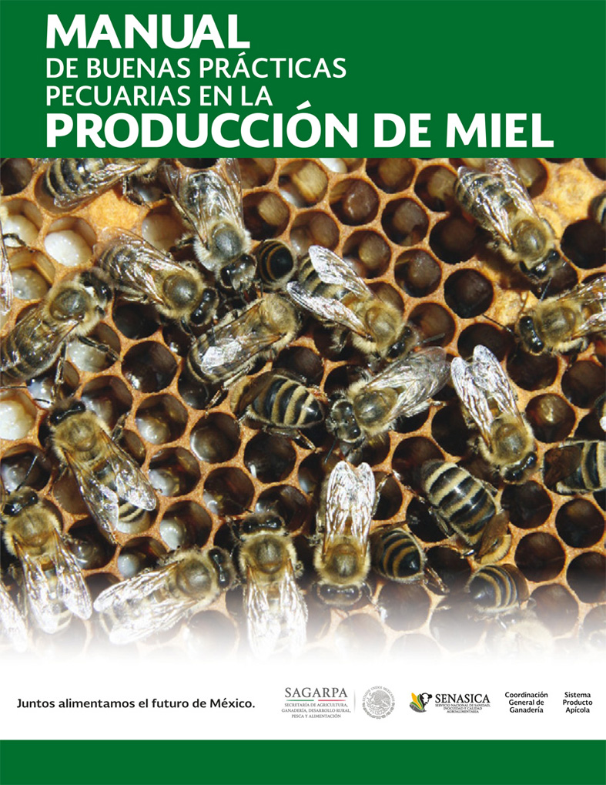

---
title: "**La Miel en México**"
---   


```{r i_3x, fig.align='center', echo=FALSE, cache=TRUE}

knitr::include_graphics("imag/3_La_Miel.gif")


```

```{r setup, include=FALSE}
knitr::opts_chunk$set(echo = TRUE)
```

<div class=text-justify>

<br/>


##  **3.1 Historia de la Apicultura en México** 
****

Por [Laura G. Espinosa Montaño](#a001) 

<br>

Describir los eventos históricos que caracterizaron el desarrollo de la apicultura en México merece iniciar considerando que desde épocas prehispánicas se desarrolló una actividad muy importante en la región mesoamericana por parte de pobladores mayas, quienes cultivaron diversas variedades de abejas nativas de los géneros *Trigona* y *Melipona*, conocidas genéricamente como meliponinos, y dentro de los cuales destacó la especie Melipona beecheii Bennett (en maya llamada  *Xuna'an Kab*, *Kolel'Kab* o *Po'ol Kab*, la cual, al igual que otros meliponinos, presenta como característica física primordial el carecer de aguijón, situación que les diferencia de las abejas *Apis mellifera* oriundas del viejo mundo. 

Es pues así que la actividad que se desarrolló con los meliponinos (meliponicultura), a decir de los conquistadores españoles, presentaba gran semejanza con la apicultura que se realizaba con gran auge en la España de los siglos XVI al XVIII con abejas de la especie *A. mellifera*. Ya Fernández de Oviedo en su obra “Historia General y Natural de las Indias”, describe las actividades y cuidados que los mayas daban a sus abejas, las cuales criaban en colmenas rústicas conocidas como hobones (troncos huecos gruesos, con aberturas de los extremos cubiertas con discos de madera sellados con lodo) los cuales se colocaban sobre delgados troncos inclinados y protegidos dentro de chozas cubiertas de palmas de guano.  Estas características, aunadas a los manejos que se les daba a estas abejas, dieron lugar a considerar que esta actividad estaba más extendida que la apicultura en cualquier otra parte de Europa.  

La miel obtenida tuvo múltiples aplicaciones, como alimento, como remedio medicinal y hasta ritual, esto último quedando de manifiesto a través de su uso en festividades religiosas, como aquella que se celebraba en honor al Dios maya de las abejas “Ah-Muzen-cab” donde se preparaba una bebida suave de maíz hervido llamada “sac-ha” para consumo de las mujeres y otra para los varones denominada “balché” la cual además se preparaba con agua y la corteza de un árbol del mismo nombre (*Lonchocarpus longistylus pitier*).  

La evidencia de las actividades que llevaban a cabo los mayas con estas abejas quedaron documentadas en el códice Troano, Maya o de Madrid. Igualmente Fray Diego de Landa documentó las festividades religiosas en honor al Dios de las abejas que se celebraban durante los meses de noviembre (Tzec) y diciembre (Mol) para asegurar un buen flujo de néctar. La miel se comercializaba desde Tabasco por mar hacia Honduras y Nicaragua, mientras que la cera se comercializaba desde los puertos de Sisal, Yuc. y de Campeche, Camp. (de ahí que a la cera se le conociera como “Cera de Campeche”) hacia el puerto de Veracruz y a otros pertenecientes al Imperio Español; probablemente a cambio de la miel y cera, los mayas recibían cacao y piedras preciosas.  

Se dice que la introducción de las abejas *Apis mellifera* a México, especialmente a la Península de Yucatán, no ocurrió inmediatamente durante la conquista ya que, por lo que respecta a esta región, los mayas mantenían el suministro de la miel y la cera que obtenían de los meliponinos como tributo a los españoles,  sobre todo de este segundo producto el cual se utilizaba de manera creciente en las actividades religiosas de los españoles, máxime porque los cargamentos de cera de España no cubrían esta clase de necesidad.   

La primera referencia que se tiene de la introducción de abejas de la subespecie *Apis mellifera* a un territorio que en aquel entonces era de posesión española fue Florida, dado que al parecer se quería incrementar su contribución a la corona española, sin embargo no se tuvo el éxito deseado por lo que colonias de esa misma subespecie se introdujeron a Cuba en 1764, donde se expandió la apicultura, lo cual aparentemente influyó para que a partir de esta isla y a fines de los 1760´s o principios de los 1770´s se transportaban abejas al continente, teniendo como destino el centro de la Nueva España; algunas referencias indirectas además de citarse la presencia de estas abejas por F.J. Clavijero en su obra “Historia Antigua de México” respaldan esta hipótesis.  

Por lo que respecta a la península de Yucatán, se estima que las primeras abejas *A. m. mellifera* fueron introducidas al estado de Yucatán a fines de los 1800 o principios de los 1900, empleándose las colmenas Dadant lo que generó un gran auge de la apicultura en el poblado de Izamal y de ahí al resto del estado, dando inicio a las exportaciones de miel a través del surgimiento de algunas sociedades apícolas.  

Para el año 1911 se introduce la raza *Apis mellifera ligústica*, la cual, conjuntamente con el advenimiento de nuevas tecnologías, dentro de las que destaca la utilización de la colmena con marcos móviles, dio lugar a la expansión de una apicultura moderna a partir de 1920, determinándose un gran potencial de crecimiento futuro de las actividades apícolas en función de las características eco-geográficas que en aquel entonces se presentaban en el país, caracterizadas por la abundancia de recursos apibotánicos.  


En la década de los años 1930´s comenzaron a conformarse algunas organizaciones de apicultores, primordialmente en los estados de Yucatán, Jalisco, Michoacán, Puebla y Veracruz. Más tarde, al surgir la Ley de Asociaciones Ganaderas y su Reglamento, en 1964 nace la Unión Nacional de Apicultores (UNAPI) constituyéndose legalmente en 1965 y formando parte de la Confederación Nacional Ganadera. Adosadas a esta agrupación se integraron 76 Asociaciones de apicultores en 25 estados de la república. Destaca que en el sur del país surge una importante organización denominada Consejo Apícola del Sureste, al cual se agruparon diversas sociedades de producción rural como por ejemplo Apícola Maya de Mérida Yucatán, Miel de Abeja de Campeche, Apícola de Tabasco, entre otras, algunas de ellas contando con alrededor de 5,000 apicultores y plantas para la recepción de miel para exportación. En 1977 se constituye el Comité Nacional de Planificación Apícola que se integró por los representantes de la UNAPI, del Consejo Apícola del Sureste, representantes de dependencias oficiales como la Secretaría de Agricultura y Recursos Hidráulicos (SARH), la Secretaría de la Reforma Agraria, Secretaría de Educación Pública, Instituto Nacional Indigenista y del Banco Nacional de Crédito Rural.  

En el año de 2001, se publica el decreto de la Ley de Desarrollo Sustentable de la cual emanaron los Sistemas-Producto, que para este caso involucraría al Sistema Producto Apícola constituido por el Comité Sistema Producto Apícola Nacional, el Comité Regional Sistema Producto Apícola y los Comités Estatales Sistema Producto Apícola y dentro de los cuales participaron representantes de diversos sectores involucrados en el área.

En el año 2005, la UNAPI cambia su denominación a ONA (Organización Nacional de Apicultores), recibiendo la resolución de aceptación del cambio de nombre por parte del Registro Nacional Agropecuario en marzo de 2006; dependiendo de la ONA se crea la Asociación Nacional de Apicultores A.C. La ONA a través de muchos años organizó el Seminario Americano de Apicultura, foro en el cual se presentaban los avances tecnológicos y de investigación en el área.  

Referente a organizaciones de especialistas, en el año 1993 se constituye la Asociación Nacional de Médicos Veterinarios Especialistas en Abejas A.C. (ANMVEA), con el fin básico de atender las necesidades y problemáticas del sector. Al igual que la ONA,  año con año se organiza un evento de carácter científico y tecnológico denominado Congreso Internacional de Actualización Apícola, que al momento de escribir este documento llega a su 25ava edición.  

Destaca que estas agrupaciones así como dependencias oficiales federales y estatales, han participado con gran esmero en la conformación de Normas Oficiales Mexicanas, Normas Mexicanas, publicaciones de manuales, además de que algunos agremiados forman parte de institutos de investigación, instituciones educativas y de investigación, organismos internacionales como OIRSA y FAO así como en empresas privadas o el ejercicio libre de la actividad.

Tal como antes se mencionó, la apicultura en México fue creciendo, con cantidades importantes de producción y exportación de miel, lo que permitió que el país se ubicara en lugares preponderantes en ambos rubros a nivel mundial, no obstante, en el año de 1986 se registra oficialmente el ingreso de la “Abeja Africanizada” en Chiapas, híbrido específicamente derivado de la cruza de la subespecie Apis mellifera scutellata con abejas europeas locales que ocurrió durante su migración desde Brasil en 1957.  

Esta situación dio pie a que, desde que se conocieron sus efectos negativos, la SARH creara el Programa Nacional para el Control de la Abeja Africana” que se publicó en el Diario Oficial de la Federación el diciembre de 1984 con el fin de implementar medidas de prevención y control de este insecto. En septiembre de 1987 la SARH y el Departamento de Agricultura de los Estados Unidos de Norteamérica, (USDA) formalizaron un convenio de colaboración con el fin de establecer un programa de manejo integrado para el control de la abeja africanizada (Programa Cooperativo SARH-USDA para el control de la Abeja Africanizada), mismo que tuvo como objetivo, retardar o frenar el avance de esta abeja hacia el norte del país y así ganar tiempo para que se desarrollara tecnología para su control, manteniendo la producción de miel lo más alto posible y minimizar los problemas asociados a estas abejas; dos fueron las unidades operativas establecidas para coadyuvar con sus fines: la del pacífico (Centro Operativo ubicado en Puerto, Escondido, Oaxaca) y la del golfo (Centro Operativo ubicado en Jalapa, Ver.).

Años más tarde otro problema afectó a la apicultura nacional: la llegada del ácaro ectoparásito de las abejas melíferas *Varroa destructor* (antes conocido como *Varroa jacobsoni*) oficialmente detectado en el estado de Veracruz en 1992, el cual igualmente traería repercusiones negativas como las que se presentaban en Europa y Estados Unidos. Esta situación motivó la creación del Programa de la Campaña Nacional Contra la Varroasis de las Abejas, dependiente del Programa Nacional para el Control de la Abeja Africanizada oficializándose en 1992 en el Diario Oficial de la Federación.

Si bien todo lo anteriormente escrito se ha basado en la apicultura, es importante mencionar el gran esfuerzo que diversas instituciones como El Colegio de la Frontera Sur, la Universidad Autónoma de Yucatán (Campus de Ciencias Biológicas y Agropecuarias), la Universidad de Guadalajara (Campus Centro Universitario de la Costa Sur), la Universidad Autónoma de Chiapas, el Colegio de Posgraduados y la ANMVEA y empresas o centros de capacitación como AIPROCOPA S.A., el CISEAT ubicado en Ciudad de México, Desarrollo y Consultoría Apícola de Quintana Roo S.C., entre otras, han realizado en pro de rescatar y fortalecer la meliponicultura del país. A este respecto sobresale la organización de Seminarios sobre Abejas sin Aguijón que surgieron en el año 1999 derivado de la inquietud de notables académicos e investigadores , eventos que ya también se llevan a cabo en diferentes países de Centroamérica y que al igual que en México tienen como fin promover el desarrollo de las abejas nativas sin aguijón. 

<br/>

***Referencias:***

Cajero-Avelar, S. (1990). *Avances en las acciones para el control de la abeja africana en México, antecedentes.* Memorias del 3er Seminario Americano de Apicultura. Acapulco, Gro., septiembre-octubre. p.1-3.

González-Ruíz, J.J. (1990). *Descripción del área de trabajo y acciones del Programa Cooperativo SARH-USDA para el control de la abeja africanizada, en la costa de Oaxaca.* Memorias del 3er Seminario Americano de Apicultura. Acapulco, Gro., septiembre-octubre, p.33-38.

Labougle-Rentería, J.M. y Zozaya-Rubio, J.A. (1986). *La Apicultura en México.*  Ciencia y Desarrollo. CONACyT., Num. 69, año XII. julio-agosto, p.17-36.

Martínez-López, J.F. (1963). *Apicultura. 3ª. Ed.* Consejo Apícola de Yucatán. Mérida, Yucatán.

Medina-Camacho M. (2013). *Cómo nació el Congreso Mesoamericano de Abejas Nativas.* Memorias del VIII Congreso Mesoamericano de Abejas Nativas. 26-31 agosto, Costa Rica. p.13-14.

ANMVEA A.C. (2018). *Compendio Científico-Técnico Apícola 2018.* 25o. Congreso Internacional de Actualización Apícola. 16-18 mayo, Querétaro.

<br/>
<br/>
<br/>

 

##  **3.2 ¿Qué es la Miel?**  
****

Por [Laura G. Espinosa Montaño](#a001)

<br>


Con base en el _Codex Alimentarius_ de la FAO, se entiende por miel a la sustancia dulce natural producida por las abejas melíferas a partir de néctar de plantas o a partir de secreciones de partes vivas de éstas o de excreciones de insectos succionadores de partes vivas de plantas, y que las abejas recolectan, transforman a través de combinar sustancias específicas propias, depositan, deshidratan, almacenan y dejan en el panal para que madure y añeje.

En cuanto a su composición, en la miel se encuentran presentes diferentes azúcares, predominantemente fructuosa y glucosa, así como otras sustancias, tales como ácidos orgánicos, enzimas y partículas sólidas derivadas de su cosecha. El color de la miel varía desde el casi incoloro al café obscuro. Su consistencia puede ser fluida, viscosa o incluso cristalizada. El sabor y el aroma varían, pero se derivan de la planta de origen.  

Por todo lo anterior, no debe considerarse como miel a los jarabes neutros o con diferentes sabores que se expenden bajo diferentes marcas comerciales y que sirven para endulzar bebidas, postres y otros alimentos, ya que en la composición de éstos predomina la fructuosa de maíz o la glucosa, aún cuando por su consistencia líquida y viscosa semejen a la miel.


<br/>
<br/>
<br/>


##  **3.3 Cosecha y Procesos de la Miel** 
****
<br/>

Para obtener la miel de las abejas se deben reunir condiciones que las estimulen a recolectar el néctar y lo almacenen en las celdas de sus panales; esto ocurre cuando comienzan las temporadas en las que las flores aparecen en los campos o en los cultivos. En estos períodos, las abejas recolectan el néctar y lo llevan a la colmena para almacenarlo y madurarlo con el fin de tener reservas energéticas, en caso de que se presenten condiciones de escasez. 

La maduración ocurre por procesos físicos y químicos. En el primer caso, las abejas evaporan el exceso de humedad que tiene el néctar a través de aletear dentro de la colmena para provocar corrientes de aire que expulsen la humedad interna. Por otro lado, las transformaciones químicas involucran la adición de sustancias tales como enzimas que producen las abejas y que actúan sobre el azúcar del néctar, que es la sacarosa, para desdoblarla en dos azúcares simples: glucosa y fructuosa. 

Una vez llevados a cabo estos procesos, las abejas sellan con un tapón de cera impermeable, llamado opérculo, la superficie de las celdas que contienen la miel ya madurada, de esta manera se evita que absorba la humedad que pueda existir dentro de la colmena. Así, las abejas van llenando cada vez más celdas, de tal forma que los apicultores, al revisar las colmenas, se dan cuenta que los panales se van saturando de néctar, miel y de crías (larvas y pupas). En este momento, los apicultores colocan sobre la cámara de cría de las colmenas (cubo inferior de la colmena, donde se encuentra la reina depositando huevos que se convertirán en larvas y pupas, así como celdas conteniendo polen y miel como reservas alimenticias de la población) unos cubos llamados alzas, los cuales contienen panales para que las abejas depositen el néctar y lo conviertan en miel, de tal suerte que se despeje la cámara de cría para que no se saturen las celdas, y así evitar que las abejas abandonen la colmena por falta de espacio, situación que se asocia con el comportamiento reproductivo de la colonia de abejas denominada “enjambrazón”.  

Pasados unos días y conforme se van llenando los panales con miel madura (operculada), los apicultores retiran dichos panales quitando a las abejas para transportarlos a establecimientos o locales llamados “plantas o locales de extracción”, lugares donde se extrae la miel de los panales.
La extracción de la miel hasta su envasado en frascos, cubetas o tambores de miel para exportación, conlleva los siguientes procesos:  

**Desoperculado:** Consiste en retirar los tapones de cera que cubren las celdas. Este procedimiento comúnmente se realiza cortando la capa de opérculos de los panales, con miel, con un cuchillo que cuenta con una resistencia para calentarlo, de tal manera que se facilite dicho corte. Cuando este procedimiento se realiza de manera industrial o semi industrial se utilizan máquinas desoperculadoras.  

**Extracción:** Consiste en depositar los panales ya desoperculados, con sus respectivos bastidores, en el interior de un cilindro que tiene una canastilla interna y que se mueve con fuerza centrífuga ya sea manualmente o con un motor. Dichos cilindros reciben el nombre de extractores, los cuales además pueden ser tangenciales o radiales, o bien de eje vertical u horizontal.  

**Colado:** Después de que sale la miel del extractor se hace pasar por un colador, de tal manera que se retiren impurezas como restos de cera que pudieron mezclarse con la miel al momento de extraerse. La miel circulará por una tubería para depositarse en otros contenedores para que se sedimente.  

**Sedimentación:** La miel que llega a los tanques de sedimentación pasará un promedio de 24 horas en reposo, con el fin de permitir que las partículas de cera que no pudieron separarse con el colador, floten sobre la superficie de la miel; así podrán retirarse de la superficie dichas impurezas, mientras que la miel más limpia pasará por la parte inferior de los tanques de sedimentación para depositarse en otros tanques que funcionan como envasadoras.  

**Envasado:** Es un proceso en el cual la miel se deposita en diferentes tipos de envases, ya sea para venta al menudeo, medio mayoreo o mayoreo, esto es, desde envases de aproximadamente ¼ de kilo hasta tambos de 300 kg. 

Algunas empresas tienen procesos intermedios como la homogenización, el calentado y el filtrado de la miel.
En el primer caso, cuando la miel sale de los extractores y es colada, pasa a unos tanques donde se mezcla con otras mieles procedentes de diferentes apiarios. Este paso tiene como principal objetivo homologar el color de las mieles para producir lotes uniformes.

Por lo que respecta al calentado, este es un proceso en el cual la miel se somete a un calentamiento y luego rápidamente se enfría, ello con el fin de destruir levaduras que puedan ocasionar que la miel fermente, y también para retardar el proceso de cristalización.

<a name=a001></a> 

En cuanto al filtrado, es un proceso más fino que el colado, y tiene como propósito retirar de la miel partículas más pequeñas para asegurar la ausencia de materias extrañas. No obstante, todos estos procesos pueden demeritar la calidad del producto.


Elaboró:

**Laura G. Espinosa Montaño:** *Profesora Asociada C, TC. Departamento de Medicina y Zootecnia de Abejas, Conejos y Organismos Acuáticos. Facultad de Medicina Veterinaria y Zootecnia. Universidad Nacional Autónoma de México. Correo electrónico: laugespi@unam.mx Tel.(55) 56-22-59-29 ext 6.*

<br/>
<br/>
<br/>


##  **3.4 Usos de la Miel**
****

<br/>

La miel es apreciada en todas partes como un alimento dulce y apetitoso. En períodos de escasez es una fuente útil de carbohidratos que contiene oligoelementos y agrega una diversidad nutritiva en un régimen alimenticio demasiado pobre. La miel ocupa un lugar importante en la preparación de alimentos tradicionales.

En muchas partes del mundo la miel es utilizada como medicina o jarabe y como tratamiento especial para niños. La medicina moderna está aumentando el uso de la miel en una gran variedad de tratamientos.

La miel fresca local es siempre considerada de mejor calidad que la miel de importación. Muchos apicultores venden sus productos directamente a los consumidores. La miel es usada con frecuencia como un bien de intercambio en algunas aldeas, especialmente en áreas remotas o aisladas por la guerra o bloqueos económicos. La miel es un bien estable que se conserva por mucho tiempo. Si es cosechada cuidadosamente, puede ser conservada por varios años, en un ambiente fresco, seco preferentemente en un frasco con cierre hermético y cuidándola de no exponer al sol y/o altas temperaturas. 

La miel es usada ampliamente como una fuente de azúcares para producir vino y cerveza de miel. Tiene también un alto valor para las industrias cosmética y farmacéutica, pues cada vez son más los productos de belleza como cremas, jabones, shampoos, y preparaciones medicinales que la incluyen como ingrediente.  
  
<br/>

***Fuente:***

[Nicola Bradbear(2005). *FAO. La apicultura y los medios de vida sostenibles.*](http://www.fao.org/3/y5110s/y5110s06.htm#bm06){target="_blank"}


<br/>
<br/>
<br/>


##  **3.5 Manejo y Comercialización de la Miel**  
****

<br/>

Aunque México exporta miel a Estados Unidos,  Japón, Alemania se mantiene como el primer destino de las exportaciones mexicanas de este producto, con 15.3% de las mismas, en 2017. Esto es una evidencia de que la calidad y sabor de la miel mexicana es bien vista en los mercados internacionales, lo que acarrea beneficios a los pequeños productores y mujeres emprendedoras de zonas rurales del país, principalmente.

En un comunicado, la SADER informó que en 2017 se lograron producir 50,955 toneladas de este endulzante natural, por lo que implementa programas y acciones que fomentan la actividad apícola en el país, con el fin de recuperar el volumen histórico promedio de producción. Refirió que de acuerdo con el *Servicio de Información Agroalimentaria y Pesquera* (SIAP), noviembre y diciembre fueron los meses de mayor producción durante 2017, al alcanzar 9,477 y 8,048 toneladas, respectivamente.

Para garantizar a los consumidores que la miel mexicana cumple con altos estándares de inocuidad, el *Servicio Nacional de Sanidad, Inocuidad y Calidad Agroalimentaria* (SENASICA) lleva a cabo un programa de monitoreo permanente de residuos tóxicos y contaminantes, y trabaja de la mano con los productores para preservar su inocuidad. A través del *Programa de Monitoreo de Residuos Tóxicos y Contaminantes a Bienes de Origen Animal, Acuícola y Pesquero*, explicó que el personal del SENASICA comprueba que la miel producida en México no tiene contaminantes físicos, químicos o microbiológicos que pudieran afectar su calidad de exportación.

Los verificadores sanitarios recolectan muestras de manera aleatoria en las unidades de producción de miel orgánica o convencional de todo el país y las canalizan al Centro Nacional de Servicios de Constatación en Salud Animal (CENAPA), para su análisis. Este centro realiza los estudios con base en los lineamientos establecidos en las regulaciones internacionales, el *Codex Alimentarius* de la FAO, y la Unión Europea, en referencia a los límites máximos de residuos para asegurar la inocuidad y calidad del producto. Todo ello con la finalidad de ofrecer cada vez mayores garantías a los consumidores nacionales y extranjeros de que los productos mexicanos son sanos y libres de contaminantes.

<br/>

***Fuente:***

SADER. (2018). *Comunicado de prensa.* Enero.
<br/>
<br/>
<br/>


##  **3.6 Los Costos en la Producción de Miel**  
****

<br/>

En un estudio realizado en la zona comunitaria maya del litoral en el centro del estado de Yucatán, se encontró que la estructura porcentual de los costos de producción de la miel se compone mayoritariamente por el costo variable (alrededor de ¾ partes), cuyos principales rubros fueron el valor del azúcar y el desembolso por mano de obra. Por su parte, el costo fijo lo constituyó principalmente la depreciación en infraestructura. La ganancia fue positiva en los estratos considerados; el rendimiento y el precio de la miel, determinantes del ingreso, fueron los principales elementos de la variación en la rentabilidad que se obtiene en el proceso de producción apícola.

La información base del estudio se obtuvo mediante una encuesta por muestreo estadístico a productores apícolas del municipio de Motul, considerado como caso de estudio representativo de la región maya del Litoral Centro de Yucatán, el cual comprendió parte de la anterior zona henequenera. En la encuesta se utilizó una cédula de entrevista con diversos apartados como la tenencia de colmenas, prácticas de manejo, infraestructura e información económica. La muestra preliminar se integró al azar con 30% del marco lista integrado por productores de la cabecera del municipio de interés y de las localidades de Kaxatah, Kiní, Ucí, Santa Teresa, Dzununcán, Santa Cruz Pachón, Kopté y San Pedro Chacabal. La muestra final fue de 55 productores, inferior al de la muestra preliminar. A la primer categoría (productores que explotaban hasta 25 colmenas) le correspondió 58 % de la muestra, 28% al segundo estrato (de 26 a 50 colmenas), y 14% a la tercera categoría (de 51 a 100 colonias). 

La apicultura enfrenta problemas socioeconómicos y técnicos, los cuales han tenido considerables consecuencias en la estructura de los costos y, por tanto, en los beneficios económicos. Los problemas principales son la falta de adopción de tecnologías actuales acordes a las exigencias de inocuidad del mercado, las formas de comercialización, principalmente hacia el exterior, donde sólo participan exportadores con un esquema de intermediarismo. Aunado a esto se encuentra el cambio climático que ha provocado modificaciones en la temperatura, precipitación pluvial, modificación de las estaciones, lo que repercute negativamente en la producción. Al variar la producción apícola, la rentabilidad sufre el mismo cambio. Como resultado de esta investigación se tiene que la disponibilidad de activos fijos se asocia al bajo nivel tecnológico.  

El estudio reveló que la variable que más influye en la rentabilidad de un apiario es el rendimiento de las colmenas, expresado como la capacidad de producción en kg/colmena. Asimismo, otra causa importante de la probable variación en el nivel de rentabilidad de las explotaciones apícolas en el territorio nacional lo constituye la caída del ingreso por la venta de miel, debido a una baja de precios del producto. 

Se observó que el precio de los insumos aumentan constantemente, que los rendimientos por colmena varían con relación al manejo técnico y a los factores climáticos adversos, además de que el precio de venta está sujeto a las condiciones que imponen los intermediarios locales. A pesar de lo anterior, se encontró que los ingresos del apicultor, fueron superiores a los costos de producción, por lo que la actividad apícola en la región presentó un superávit con márgenes elevados, mismo que es aprovechado por los productores para invertir en infraestructura básica, como equipo de extracción, que ante las exigencias imperantes de los países importadores se ven en la necesidad de modernizar tanto sus equipos como sus prácticas de manejo de la colonia, esto para cumplir con las normas de inocuidad de la miel.  

<br/>

***Fuente:*** 

[Contreras U.C.L., y Magaña Magaña M. (2017). *Costos y rentabilidad de la apicultura a pequeña escala en comunidades mayas del Litoral Centro de Yucatán, México.* Investigación y Ciencia, 25 (71), p. 52-58.](pdfs/67452917007.pdf){target="_blank"}


<br/>
<br/>
<br/>


##  **3.7 Consumo Per Cápita de Miel en México**   
****

<br/>

México produce 57,995 toneladas de miel en promedio por año (periodo 2014-2018) y es el octavo productor a nivel mundial. Mientras que la mitad de la producción se consume a nivel nacional, el **consumo anual per cápita es de alrededor de 300 gramos** y el país continúa siendo el tercer mayor exportador del mundo. Actualmente hay alrededor de 43,000 apicultores en todo el país, con más de 30% de la producción concentrada en Yucatán, Campeche y Quintana Roo: 17,000 apicultores que manejan más de 0.5 millones de colmenas. México es también uno de los mayores exportador mundial de miel orgánica en el mundo.

Existen nuevas oportunidades de mercado en la diferenciación de variedades de miel, especialmente si se aumenta la producción de miel de la abeja nativa Maya Real, que puede generar precios de alrededor de US$30 por 900 gramos. En los últimos años, las tendencias del mercado mundial han demostrado que los consumidores prefieren un producto claramente identificado por su origen floral, lo que es otra oportunidad de mercado que requiere de un entrenamiento en la producción, certificación y etiquetado.

La venta al por mayor se realiza principalmente en tambores de miel a granel, de 300 kg en promedio; la mayor parte para la exportación. Una pequeña cantidad es envasada para el mercado nacional, y también algunos subproductos como cera, veneno y jalea real. La mayoría de los grupos de productores tienen personalidad jurídica (cooperativas) y también se agrupan en asociaciones. Varias de estas asociaciones se encuentran en proceso de transición hacia esquemas de certificación orgánica. Algunas ya han tenido éxito. También están intentando posicionarse en el mercado de la miel diferenciada por su origen botánico (por ejemplo, miel de cafetales), y la venta de miel con marca propia en el mercado interno.

<br/>

***Fuentes:*** 

[FAOSTAT, 2017.](http://www.fao.org/faostat/es/#data/QL){target="_blank"}

[Comisión Nacional para el Conocimiento y Uso de la Biodiversidad, CONABIO. (2018). *Sistemas productivos sostenibles y biodiversidad.*](https://www.biodiversidad.gob.mx/SPSB/apicultura.html){target="_blank"}

<br/>
<br/>
<br/>


##  **3.8 El Problema de la Adulteración de la Miel**  
****

<br/>

La miel es una sustancia dulce natural que las abejas (*Apis mellifera*) elaboran al transformar o combinar el néctar o secreciones que producen las flores, con sustancias específicas propias.

Las características de la miel dependen de la fuente donde las abejas recolectan el néctar, sin embargo, el producto no debe tener sabor ni aroma desagradables, debe estar libre de materia extraña y de contaminantes químicos; tampoco debe contener aditivos alimentarios para su conservación, estar diluida en agua o mezclada con almidones, melazas, glucosas, dextrina, fructosa u otros azúcares, de acuerdo con lo que establece el Proyecto de Norma Oficial Mexicana [**NOM-004-SAG/GAN-2018, Producción de miel y especificaciones.**](https://dof.gob.mx/nota_detalle.php?codigo=5546962&fecha=20/12/2018){target="_blank"}. Esta Norma Oficial, por aprobarse, establece las características generales para la producción de miel que propicien el cuidado de las abejas melíferas y su correcto desarrollo, así como, las especificaciones que la miel debe cumplir para su comercialización, ya sea para consumo directo y/o procesamiento; a fin de coadyuvar en el desarrollo de la apicultura nacional y la competitividad de la cadena de la miel. 

La anterior se complementa con la Norma [**NMX-F-036-NORMEX-2006. Alimentos, Miel. Especificaciones y métodos de prueba.**](pdfs/NMX-F-036-1981.PDF){target="_blank"}, que establece las especificaciones que debe cumplir la miel de abeja
destinada para consumo humano directo en envases menores de 10 Kgs, y también la Norma [**NOM-145-SCFI-2001. Información comercial. Etiquetado de miel en sus diferentes presentaciones**](pdfs/NOM-145-SCFI-2001.PDF){target="_blank"}, que establece los lineamientos para el etiquetado de miel en sus diferentes presentaciones.

En particular, el *Servicio Nacional de Sanidad, Inocuidad y Calidad Agroalimentaria* (SENASICA), publicó desde 2012 un [Manual de Buenas Prácticas de Manejo y Envasado de la Miel](pdfs/Manual_de_Buenas_Pr_cticas_en_el_Manejo_y_Envasado_de_Miel_oct.pdf){target="_blank"}, con el objetivo de reducir los riesgos de contaminación de la miel durante las distintas etapas que comprenden las fases de extracción, sedimentación, filtrado, envasado y transporte de la miel.

<br/>

<p align="center"> **Cuadro 3.1. Composición nutricional característica de la miel** [`r icon::fa("download")`](tabs/nutrientes_miel.csv) </p>

<br/>

```{r tab0008, echo=FALSE, out.width= "60%",warning=FALSE}
library(kableExtra)
tab0008 <- read.csv("tabs/nutrientes_miel.csv", encoding = "latin1")
names(tab0008) <- c( "NUTRIENTE", "CANTIDAD PROMEDIO EN 100 g")
#knitr::kable(tab0008, format = "markdown")

kableExtra::kable(tab0008, align = c('l','r')) %>%
 kableExtra::kable_styling(bootstrap_options = c("striped", "hover")) %>%
  scroll_box(height = "400px")

```  

<br/>

Diversas técnicas analíticas se utilizan para la determinación de la autenticidad de la miel, como son los análisis enzimáticos, métodos cromatográficos, electroquímicos y espectrométricos. Sin embargo, aunque estas técnicas son precisas, son complicadas, consumen tiempo, y requieren una preparación especial de las muestras. La espectroscopia infrarroja (FTIR) permite el análisis de muestras de miel con una poca o ninguna preparación de esta, reduciendo así el tiempo, el costo y la complejidad del análisis.

Entre las alteraciones comunes podemos encontrar: presencia de glucosas o fructuosas, almidones, harinas, yeso y exceso de humedad.

Una miel madura sólo se consigue si se extrae de panales con celdas bloqueadas por cera, si se obtiene de panales con celdas que no están tapadas con cera, la miel carecerá de sus azúcares naturales y contendrá mucha humedad.

Para detectar las adulteraciones con glucosas, que son las más frecuentes, se requieren análisis en laboratorios especializados. No obstante, es importante señalar que la miel de abeja pura cristaliza por naturaleza. Una miel que no cristaliza muy posiblemente está adulterada con algún tipo de fructosa o glucosa como retardante para la cristalización.

Desafortunadamente, el incremento de la demanda mundial de miel no solo es una oportunidad para aumentar los ingresos para las regiones productoras de ésta, sino que también ha provocado un alza en las prácticas fraudulentas en las que se adiciona jarabe de maíz, soya o arroz a la miel para aumentar su volumen. 

También existe otro fraude en la industria apícola, que se relaciona con su origen, es decir, miel importada de otros países (principalmente de China) que es re-etiquetada y vendida como producto de origen nacional a un precio muy bajo. Esto impacta negativamente en toda la industria apícola mexicana.

<br/>

***Fuentes:*** 

[PROFECO. (2018). *Estudio de calidad: miel de abeja.* Revista del Consumidor, junio.](pdfs/Estudio_de_Calidad_Miel_de_Abeja.pdf){target="_blank"}

[CONACyT. (2018). *¿Miel de México o de China?* Abril.](http://www.conacytprensa.mx/index.php/centros-conacyt/20873-ciencia-tecnologia-apicultura){target="_blank"}

[PROFECO. (2015). *Estudio de calidad: miel de abeja.* Revista del Consumidor, febrero.](pdfs/RC456_Estudio_Calidad_de_Miel_de_Abejas.pdf){target="_blank"}

[Ríos Corripio M.A. y Rojas López M. (2012). *Análisis de adulteración en miel de abeja de la región Puebla-Tlaxcala empleando espectroscopía infrarroja.* XIV Congreso Nacional de Biotecnología y Bioingeniería. Nov.](pdfs/CIII-80.pdf){target="_blank"}

[PROFECO. (2011). *Estudio de calidad: miel de abeja.*  Revista del Consumidor, junio.](pdfs/Estudio_Miel_de_abejas_30-42_Junio_2011.pdf){target="_blank"}


<br/>
<br/>
<br/>


##  **3.9. Certificación y Normas Oficiales de Manejo y Producción**
****

<br/>

```{r i0_3_12_01, fig.align='center', echo=FALSE, fig.cap="**Figura 3.1. Manual de Buenas Prácticas para la Producción de Miel en México.**", out.width = "80%", cache=TRUE}



```

<br/>

El crecimiento poblacional aunado a la diversificación de los mercados ha originado un cambio constante en las condiciones de comercio. Cada día, los requisitos que deben cumplir los productos, especialmente los alimentos, son más estrictos.  

Aun cuando ciertos principios de calidad de los alimentos dependen de los gustos y exigencias del público, existen criterios generales para calificar un determinado producto. Actualmente, la demanda de los consumidores se orienta hacia productos que no perjudiquen su salud. Dicho reclamo se fundamenta en los riesgos reales causados por sustancias que en forma accidental o inducida contaminan los alimentos, tales como antibióticos, plaguicidas, hormonas, fertilizantes agrícolas, conservadores, etc.  

En este sentido, las nuevas condiciones del mercado requieren la adopción de sistemas de producción más eficientes y con estrictos controles de calidad. Estos procedimientos deben considerar las actividades que se realizan en la obtención de la materia prima, hasta la venta del producto. Su correcta aplicación no depende solamente de la implementación de programas gubernamentales, sino de la participación comprometida de productores, envasadores y comercializadores.  

La miel, que desde siempre ha contado con un amplio reconocimiento como alimento puro y natural no puede quedar exenta de esta dinámica. Es por eso, que quienes participan en su producción, extracción, envasado y comercialización deben corresponder a la responsabilidad que implica participar en este proceso.  

Consciente de esta preocupación, la Secretaría de Agricultura y Desarrollo Rural (SADER), a través de la Coordinación General de Ganadería (CGG) y del Servicio Nacional de Sanidad, Inocuidad y Calidad Agroalimentaria (SENASICA) se han enfocado en la tarea de actualizar un [**Manual de buenas prácticas pecuarias en la producción de miel (2018)**](pdfs/Manual_BPP_en_la_Producci_n_primaria_de_Miel_octubre_2018.pdf){target="_blank"} para que sirva como una herramienta necesaria para reducir los riesgos de contaminación de la miel durante las distintas etapas que comprende la fase de producción, con el firme propósito de contribuir a que el consumidor final tenga acceso a un producto inocuo y de alta calidad.  

De acuerdo al Programa Nacional de Inocuidad y Calidad de la Miel, las medidas recomendadas en este Manual dan oportunidad a los productores de atender los requerimientos del mercado nacional e internacional. Asimismo, se podrá contar con un padrón nacional de productores confiables y elegibles para la comercialización.  

Cabe mencionar, que la aplicación de estas técnicas implica algunos costos adicionales al productor y requiere de más atención hacia su trabajo en campo, con la responsabilidad que implica la producción de alimentos, brindándole a cambio la obtención de un producto de óptima calidad e inocuidad y el incalculable beneficio que representa mantener la competitividad de la miel en los mercados local, nacional e internacional.

<br/>

***Fuente:*** 

[SADER. (2018). _Buenas Prácticas Pecuarias en la producción de Producción de Miel.](pdfs/Manual_BPP_en_la_Producci_n_primaria_de_Miel_octubre_2018.pdf){target="_blank"}

<br/>
<br/>
<br/>


##  **3.10 Requisitos, Aranceles y Normas para la Exportación de la Miel Mexicana**
****

<br/>

### 3.10.1 Normas Técnicas

Las normas son la herramienta fundamental para el desarrollo industrial y comercial de un país. Sirven como base para mejorar la calidad en la gestión de las empresas, en el diseño y fabricación de los productos y en la prestación de servicios, aumentando la competitividad en los mercados nacionales e internacionales. Protegen a los consumidores, usuarios y a la sociedad en general, permitiéndoles obtener una referencia para conocer el nivel de calidad y seguridad que deben exigir a los productos o servicios que utilizan.

Algunos de los problemas en el comercio bilateral con la Unión Europea (UE) resultan de la existencia de diferentes normas o procedimientos de evaluación de conformidad que podrían ser en parte solucionados gracias a un conocimiento más profundo de los respectivos sistemas y a una mayor concordancia con las normas internacionales existentes.

El Proyecto de Facilitación del Tratado de Libre Comercio entre México y la Unión Europea (PROTLCUEM) prevé fomentar el desarrollo de las actividades de normalización, promoviendo la utilización y creación de normas, reglamentos técnicos y procedimientos de evaluación de la conformidad conforme a prácticas, normas y lineamientos internacionales e incrementando el conocimiento y entendimiento mutuo de las mismas, con el fin de facilitar los intercambios comerciales de bienes y servicios entre México y la UE, y una estrecha cooperación entre todas las partes interesadas de ambas partes en los campos técnico, científico y económico.

En el caso de la miel para exportación, además de la normatividad exigida por la UE, el producto debe cumplir con la [*NORMA Oficial Mexicana NOM-251-SSA1-2009, Prácticas de higiene para el proceso de alimentos, bebidas o suplementos alimenticios.*](http://www.dof.gob.mx/normasOficiales/3980/salud/salud.htm){target="_blank"}

<br/>

***Fuente:***

[Secretaría de Economía. (2010). *Normas Técnicas*.](http://www.protlcuem.gob.mx/swb/es/Protlcuem/p_Normas_Tecnicas){target="_blank"}

<br/>
<br/>

### 3.10.2 Aduanas

Las administraciones de aduanas son los organismos gubernamentales encargados de controlar y gestionar la entrada y salida de mercancías a los respectivos territorios aduaneros. El comercio internacional es el motor fundamental de la prosperidad económica y las administraciones de aduanas están llamadas a garantizar la fluidez del comercio global de modo que no impida, sino que, por el contrario, facilite la circulación de las mercancías.  

Las competencias de las administraciones de aduanas tales como: la autorización para inspeccionar la carga y las mercancías que entran y salen del país o que circulan dentro del mismo, así como la facilitación o prohibición de entrada o salida de mercancías y la facultad para solicitar información previa sobre las mercancías objeto de importación o exportación, hacen que las aduanas puedan y deban desempeñar un papel fundamental en la seguridad y la facilitación del comercio global.  

En este contexto, el PROTLCUEM pretende alcanzar la mejora del intercambio de información y la cooperación entre las aduanas de México y la Unión Europea (UE), promover la formación y capacitación del personal de la aduana mexicana fortaleciendo la capacidad de la Administración General de Aduanas (AGA) en la aplicación del Tratado en el ámbito del componente Aduanas, así como el incremento de la eficiencia del funcionamiento de las aduanas relevantes para el comercio entre México y la UE Todo ello debe contribuir a fomentar la circulación fluida y segura de las mercancías a través de la cadena logística, la facilitación del comercio entre las partes, reforzar la cooperación entre las administraciones de aduanas y mejorar la capacidad para detectar envíos de alto riesgo.  

<br/>
***Fuente:***

[Secretaría de Economía. (2010). *Aduanas.*](http://www.protlcuem.gob.mx/swb/es/Protlcuem/p_Aduanas){target="_blank"}

<br/>
<br/>

### 3.10.3 Medidas Sanitarias y Fitosanitarias (MSF)  
 
El problema que sustenta la aplicación de medidas sanitarias y fitosanitarias se basa en la pregunta: ¿cómo garantizar que se suministren a los consumidores de un país alimentos inocuos, esto es, “inocuos” con arreglo a los criterios que se consideren apropiados? Y al mismo tiempo, ¿cómo se puede garantizar que la aplicación de normas estrictas de salud y seguridad no sea una excusa para proteger a los productores nacionales?  

La Organización Mundial del Comercio (OMC) establece, en uno de sus Acuerdos, las reglas básicas sobre la adopción de medidas gubernamentales relativas a la inocuidad de los alimentos, la salud de los animales y la preservación de los vegetales (MSF).  

En este marco general, el PROTLCUEM promueve una mayor cooperación técnica entre las autoridades y organismos nacionales de regulación sanitaria, las entidades de acreditación, los organismos de certificación y laboratorios de México y de la Unión Europea (UE) para la utilización de medidas sanitarias y fitosanitarias y de procedimientos de evaluación de la conformidad, acordes con la OMC y con base en los estándares y recomendaciones de organismos internacionales, y mejorando la transparencia y el acceso de las empresas a la información sobre requisitos y procedimientos de certificación en las dos partes.  

<br/>
***Fuente:***

[Secretaría de Economía. (2010). *Medidas Sanitarias y Fitosanitarias.*](http://www.protlcuem.gob.mx/swb/es/Protlcuem/p_Med_Sanit){target="_blank"}

<br/>
<br/>

### 3.10.4 Requisitos y Trámites  

**Requisitos de la Unión Europea para exportar miel natural.**  

En la página del PROTLCUEM se encuentra publicada una Guía de [Requisitos y Trámites](http://www.protlcuem.gob.mx/swb/es/Protlcuem/p_requisitosm){target="_blank"} para la exportación de miel a países de la Comisión Europea, elaborada para facilitar a los países en vías de desarrollo el acceso a los mercados de la Unión Europea.   

En dicha página se debe de acceder al menú indicado en la Guía y escribir el número de la fracción arancelaria del producto que se quiere exportar hacia la Unión Europea, en este caso, para la miel es 04090000.   

Después, se debe seleccionar el país de origen, en este caso México, y seleccionar el país destino de la Unión Europea donde se piensa comercializar el producto y activar la búsqueda con el botón *Ver*.

Es conveniente observar las Normas Oficiales Mexicanas para cumplir con estándares de calidad. Los requisitos que se deben cumplir, además de dicha Norma, son:

<br/>

1. **El registro de una marca** no es un requisito obligatorio, sin embargo, es recomendable obtenerlo para tener el derecho exclusivo de uso. Para registrar una marca, aviso o nombre comercial se debe acudir ante el Instituto Mexicano de la Propiedad Industrial (IMPI), o ante las subdelegación de la Secretaria de Economía (SE) en los estados.
 
2. **El código de barras** o código de producto tiene como objetivo identificar cada producto a través de un lenguaje universal y común. De esta manera se hacen eficientes los procesos de logística, distribución y almacenamiento. La institución encargada en México para asignar el código de barras a las empresas que lo soliciten es la Asociación Mexicana de Estándares para el Comercio Electrónico (AMECE). 

3. **Cupos.** La miel fresca, de acuerdo con la Secretaría de Economía (SE), tiene un cupo negociado con la Unión Europea por el método “Primero en Tiempo, Primero en Derecho”

4. **Requisitos y trámites ante las dependencias gubernamentales:**

    Solicitud de Certificado para Exportación en la Comisión Federal para la Protección contra Riesgos Sanitarios (COFEPRIS) de la Secretaría de Salud (SSA).

    Solicitud de Certificado Zoosanitario de Exportación para productos y subproductos de origen animal ante SENASICA (SADER).

    Solicitud de Certificado de Origen de la Secretaria de Economía.

5. Es muy recomendable **contratar los servicios de un agente aduanal** certificado por la Confederación de Agentes Aduanales de la República Mexicana. El agente aduanal se hace cargo de las exportaciones de comercio exterior a nombre del exportador. El exportador debe entregar al agente aduanal para elaborar el pedimento: 

      La factura comercial

      Los documentos que acrediten cumplir con las restricciones no arancelarias. (Pago de derechos).

      También debe enviar al socio comercial:

      Certificados Fitosanitarios

      Certificado de Origen

      Certificados Sanitarios

6. El exportador debe **elegir el Régimen de Exportación**, que puede ser temporal o definitivo, para el pago de derechos.

7. **Realizar el pago de derechos** de acuerdo a la Ley de los Impuestos Generales de Importación y de Exportación (LIGIE), así como verificar si es necesario pagar aranceles de exportación.

<br/>

***Fuente:***

[Secretaría de Economía. (2010). *Requisitos y Trámites para Exportación a la Unión Europea.*](http://www.protlcuem.gob.mx/swb/es/Protlcuem/p_requisitosm){target="_blank"}


<br/>
<br/>
<br/>


##  **3.11 Importancia Sociocultural de la Apicultura en México**   
****

<br/>

La apicultura en México tiene una gran importancia socioeconómica y ecológica, ya que es considerada como una de las principales actividades pecuarias, dedicada a la crianza de las abejas, además de que la miel es un factor de beneficio en cuestiones de salud y belleza para los humanos; también se procesan productos no menos importantes como el polen, jalea real, ceras, propóleos y veneno de abejas.

Las abejas son fundamentales para un equilibrio del medio ambiente ya que al obtener el alimento de las flores fomentan en las plantas la capacidad de fecundarse, actividad llamada polinización cruzada, con ésta, las plantas generan el oxígeno suficiente para la vida y, además, aumentan el rendimiento en los cultivos, lo que favorece un incremento en alimentos de origen vegetal, materia prima textil, e insumos agropecuarios.

Las actividades de un apicultor oscilan entre primavera y verano normalmente para trabajar con las abejas realizando inspecciones de control de población y extracción de la miel, sin embargo, durante el invierno o estación de receso, el trabajo consiste en el mantenimiento de la población de abejas sanas (colonia) y en buenas condiciones, así como la preparación de material de madera para la temporada que viene, en donde alojará las nuevas familias, así como advertir posibles enfermedades o plagas de las poblaciones de abejas para poder tratarlas a tiempo.

Los medios de vida y desarrollo en la apicultura se basan en la presencia de recursos naturales: abejas, plantas en flor y el agua. En forma silvestre, las abejas recogen la goma y la resina usando las plantas y los árboles como hábitat para sus panales. Las abejas son un recurso libremente disponible en la naturaleza.

Siempre que no hayan sido contaminadas, dañadas o perjudicadas, éstas volarán por todas partes donde se encuentren plantas en flor. Las áreas silvestres o cultivadas, las zonas deprimidas e incluso aquellas áreas donde podría haber campos minados, tienen un valor inestimable para la apicultura. Esta actividad se puede desarrollar en áreas áridas, o terrenos donde la siembra u otras modalidades de cultivo han fracasado, ya que las raíces de los árboles que producen néctar pueden alcanzar el nivel freático muy por debajo de la superficie. Esto hace que la apicultura sea factible en condiciones marginales, lo que es muy importante para la gente que desee rehabilitar sus medios de vida y desarrollo o crear nuevos.

La apicultura se integra fácilmente con una buena cantidad de sistemas de vida y desarrollo, porque utiliza los mismos recursos, por ejemplo: la silvicultura, la agricultura y las actividades de conservación. Garantiza una excelente ventaja adicional a la cosecha porque solamente las abejas son capaces de recoger el néctar y el polen, sin entrar en competencia con otros insectos o animales por estos recursos que, de no ser por ellas, serían inalcanzables para el hombre. 

La importancia de la actividad apícola se ha vinculado a la función directa que tiene para elevar la productividad de ciertas hortalizas o frutos. En Estados Unidos en particular en California, se ha generalizado el uso de colmenas para aumentar la producción de casi cualquier tipo de cultivo, con resultados positivos en términos económicos.

El valor de la polinización es difícil de medir, pero si pudiera ser calculado, sería el más alto de todos los elementos que componen la apicultura. Por su definición, un sistema de vida y desarrollo debería fortalecer las capacidades sin deteriorar los recursos naturales de base. La apicultura va más allá, porque ayuda a preservar los recursos naturales. En todo el mundo, desde siempre, la apicultura ha formado parte de la agricultura de los poblados.

Los recursos sociales, tales como las redes y asociaciones de productores y comerciantes, son de fundamental importancia para el desarrollo de la apicultura. Las asociaciones locales ponen a disposición de los apicultores los medios para que den a conocer su trabajo, ejerzan presión a favor de la protección de las abejas, organicen en colectividad la transformación de la miel y la cera de abeja, y tengan acceso al mercado. El acceso a las redes a un nivel superior, por medio de las organizaciones no gubernamentales y asociaciones de carácter regional o nacional, ayuda a obtener contactos en el ámbito nacional e internacional, a encontrar fuentes de capacitación y mercados, a tener acceso a los resultados de investigaciones recientes y a mejorar sus conocimientos sobre la apicultura.

<br/>

**Abejas Nativas**

Una mención aparte, merece el desarrollo de estudios recientes en el país respecto a las especies de abejas nativas. En América (y por lo tanto en México) las únicas abejas sociales nativas que nos pueden proporcionar miel son las abejas sin aguijón. La abeja melífera y su variedad africana, de las cuales generalmente tomamos su miel, son originarias de Europa, África y Asia, y fueron introducidas al continente americano. En México se reportan 46 especies de abejas sin aguijón agrupadas en 16 géneros. Los estados que tienen mayor número de especies son: Oaxaca, Chiapas, Veracruz, y Quintana Roo. 

A los apicultores de abejas nativas se les denomina meliponicultores. En México, actualmente se trabaja en la meliponicultura con alrededor de 19 de las 46 especies de abejas sin aguijón que existen en el país. 


<br/>

***Fuentes:***

[SADER. Fideicomiso de Riesgo Compartido. (2016). *Apicultura, Actividad De Gran Importancia Para La Economía Y El Medio Ambiente En México.*](https://www.gob.mx/firco/articulos/apicultura-actividad-de-gran-importancia-para-la-economia-y-el-medio-ambiente-en-mexico?idiom=es){target="_blank"}

[FAO. (2005). *La apicultura ayuda a crear sistemas de vida sostenibles.*](http://www.fao.org/docrep/008/y5110s/y5110s02.htm){target="_blank"}

Arnold, N., Zepeda, R., Vásquez, M. y Aldasoro, M.  (2018). *Las abejas sin aguijón y su cultivo en Oaxaca, México. El Colegio de la Frontera Sur y Comisión Nacional para el Conocimiento y Uso de la Biodiversidad. 1a. ed. [http://bioteca.biodiversidad.gob.mx/janium/Documentos/14197.pdf](http://bioteca.biodiversidad.gob.mx/janium/Documentos/14197.pdf){target="_blank"}

Ayala, R. (1999). *Revisión de las abejas sin aguijón de México (Hymenoptera: Apidae: Meliponini)*. Folia Entomológica, México 106, p. 1–123.

Ayala, R., González, V.H. y Engel, M.S. (2013). *Mexican Stingless Bees (Hymenoptera:Apidae): Diversity, Distribution, and Indigenous Knowledg.* Pot-Honey: A legacy of stingless bees (eds. Vit, P., Pedro, S. R. M. & Roubik, D. W.) 135–152 (Springer New York). 

Ayala, R., Griswold, T.L. y Yanega, D. *Apoidea (Hymenoptera). Biodiversidad, taxonomía y biogeografía de artrópodos de México: Hacia una síntesis de su conocimiento*. (eds. Llorente Bousquets, J. E., García Aldrete, A. N. & González Soriano, E.) 423–464 (UNAM y CONABIO). 

Arnold, N., Ayala, R., Mérida, J., Sagot, P. y Aldasoro, M. *Nuevos registros de abejas sin aguijón (Apidae: Meliponini) para los estados de Chiapas y Oaxaca, México.* Revista Mexicana de Biodiversidad. 


<br/>
<br/>
<br/>


##  **3.12 Organización de Productores Apícolas**
****

<br/>

Es de suma importancia que los apicultores se organicen en asociaciones locales o regionales para intercambiar conocimientos, crear redes de cooperación técnica y de financiamiento, representarse como gremio frente a las autoridades, presionar por apoyos gubernamentales y hacer frente común a amenazas a sus actividades. 

En lo referente a organización de productores apícolas, la Unión Nacional de Apicultores (UNAPI) en 2005, se modificó para constituir la Organización Nacional de Apicultores (ONA), como organismo cúpula de este sector productivo. En marzo de 2015 se constituyó la Unión Nacional de Asociaciones de Apicultores de México (UNAAMEX), y está también la Federación Mexicana de Apicultores. La existencia de diversas asociaciones de carácter nacional pone en evidencia la necesidad de coordinar los esfuerzos de estas organizaciones que persiguen objetivos comunes.

Adicionalmente, otras figuras asociativas se han fortalecido en los últimos años a nivel regional, entre ellas las Cooperativas y Sociedades de Solidaridad Social (SSS) y Sociedades de Producción Rural (SPR), sólo por citar algunas. Respecto a exportadores, La Asociación Nacional de Exportadores de Miel de Abeja (ANEMAAC), con 10 socios; La Asociación Ganadera Nacional de Criadores de Abejas Reina y Núcleos, que albergan entre 40 y 50 socios; La Asociación Nacional de Médicos Veterinarios Especialistas en Abejas, A. C. (ANMVEA) con aproximadamente 40 agremiados.

Las 8 sociedades cooperativas con mayor número de socios son: *Miel y Cera de Campeche* y *Mielera de Champotón* en el estado de Campeche, agremiando a 3,000 productores; en Yucatán existe la *Cooperativa Sociedad de Solidaridad Social Apícola Maya* con más de 4,000 agremiados y en el estado de Quintana Roo hay 5 Cooperativas con un total de 2,000 asociados. Aunado a estos, existen grupos de Solidaridad Social, Grupo de Mujeres Apicultoras, Grupos Solidarios con la Comisión Nacional para el Desarrollo de los Pueblos Indígenas y apicultores independientes.

Las empresas más importantes en la producción, acopio y envasado de miel son: *Miel Carlota* (Grupo Herdez) y *Miel Abarca*, en la Ciudad de México; *Tía Trini* y *Miel Oro*, en Jalisco; *Hermez Honey*, en Chihuahua; *Rucker de México*, en Morelos; *Oaxaca Miel*, en Oaxaca; *Mimiel*, en Yucatán; *Miel Morelia*, en Michoacán, y *Vita Real*, en el Estado de México.

En el [**Capítulo 2.7**](cap2.html#a002) se muestra un directorio con las principales asociaciones de apicultores del país. Adicionalmente, puede consultarse el directorio de [Productores de Miel de Abeja Orgánica en México por Estado, 2005.](http://vinculando.org/organicos/directorio_de_agricultores_organicos_en_mexico/productores_de_miel_de_abeja_organica_en_mexico_por_estad.html){target="_blank"}


<br/>

***Fuente:***

[SADER. (2010). *Situación actual y perspectiva de la apicultura en México.* Revista Claridades Agropecuarias. Núm. 199, marzo, p. 3-34. ](pdfs/ca199-3.pdf){target="_blank"}


<br/>
<br/>
<br/>


##  **3.13 Factores Climáticos que Influyen en la Producción Apícola**   
****

<br/>

El clima se define como aquellas condiciones del aire, agua y tierra que se esperan en un determinado tiempo, dichas condiciones meteorológicas
promedio, determinan un clima normal. Cuando ocurre alguna variación de las propiedades meteorológicas, se presenta “El Cambio Climático”, si esto
ocurre, el sistema requiere ajustes, de acuerdo al periodo de tiempo en el que se presenta ya que pueden ser de corto, mediano y largo plazo. 

Hoy en día, uno de los principales cambios climáticos se da en la atmósfera cerca de la superficie, ya que se observa un aumento en la temperatura. Esta variación se conoce como *Calentamiento Global*. Lo que genera un impacto significativo en la actividad humana así como en la biodiversidad de insectos. 

El cambio climático representa el mayor reto para la humanidad en el siglo XXI, el calentamiento global implícito ha incrementado en 1 °C la temperatura global con respecto al inicio de la era industrial, por las emisiones de gases efecto invernadero (GEI), que provocan efectos negativos ambientales, económicos y sociales. 

El impacto del Cambio Climático sobre la Apicultura, radica en la importancia de ésta en el Medio Ambiente; la función principal de las abejas va más allá del procesamiento de la miel, éstas juegan un papel muy importante en la generación de alimentos y oxígeno para los seres vivos a través de la polinización. 

<br/>

#### **Existen dos tipos de impactos del clima en la actividad apícola, directos e indirectos.**

<br/>

#### **Impactos directos**

Lo constituyen la **influencia del cambio climático en la vegetación** referente a los cambios en la vegetación como resultado de variaciones (aumento) en la temperatura y la acumulación de dióxido de carbono, que influyen directamente en la floración de las especies; asimismo, los procesos de erosión, lixiviación, sequía y lluvias torrenciales asociados al calentamiento global, incrementan el riesgo de pérdida de nutrientes, la disposición de los mismos, y en consecuencia, la concentración y volumen de producción de néctar de las flores a las que las abejas acuden.

Un factor de suma importancia en este sentido, es el incremento de temporadas de **sequía** e incluso el avance de un proceso de desertificación en ciertas regiones. El agua es indispensable para las abejas tanto para su consumo como para la regulación de la temperatura interna de la colmena, el retraso en las lluvias o falta de agua, origina disminución de producción y calidad de cultivos, e interrumpe el desarrollo de diversas fases vegetativas, por lo que además de no encontrar fuentes de agua, tienen problemas para encontrar alimento suficiente. El aumento de temperatura que se presenta durante las sequías reduce la cantidad de néctar y calidad del polen, afectando la disponibilidad de alimento y el desarrollo de la cría; en ocasiones, existe la presencia de flores, pero éstas no tienen la humedad suficiente para producir néctar.

Pero no sólo son periodos de sequía lo que debe preocupar del cambio climático. Como consecuencia del calentamiento y la desertificación mencionada, se encuentran condiciones cada vez más extremosas de temperatura en zonas habitualmente templadas. Las **heladas** fuera de temporada invernal son cada vez más comunes. El enfriamiento del aire por debajo de 0° C, provoca el congelamiento del agua al interior de los tejidos vegetales, que al cristalizarse afectan las paredes de las células sin que exista regeneración alguna, por lo que la planta afectada se pierde. Si una helada se presenta en épocas de floración, se rompe el flujo de néctar hacia la colmena, lo que deja sin alimento a las abejas y sin cosecha a los apicultores.

Del mismo modo, si bien el agua es importante para el correcto desarrollo de las colonias de abejas, los **periodos largos y discontinuos de lluvia** originan alteraciones en las épocas de floración, la lluvia diluye el néctar y éstas pierden atractivo para las abejas, además, debido a que no pueden salir de las colmenas con la misma frecuencia, se incrementa el tiempo de resguardo, acompañado de un incremento en la humedad, favoreciendo la incidencia de enfermedades. Por otra parte, las tormentas tropicales y huracanes que actualmente se registran con más fuerza destructiva originadas por el cambio climático, pueden destruir apiarios por completo.

Por otro lado, aunque en general los insectos responden de manera rápida a los cambios de temperatura y precipitación en el ambiente, por ser organismos *ectotérmicos* y con ciclos de vida cortos, están limitados en su distribución por las temperaturas registradas en las diferentes latitudes. El incremento en la temperatura que trae consigo el cambio climático proyecta un cambio en la distribución de estas especies hacia latitudes más elevadas, permitiendo a las poblaciones de insectos ampliar y movilizar su hábitat, pero restringiéndolo a zonas cada vez más frías, con menor alimento disponible. 

En particular *Apis mellifera L.* es una especie de abeja que requiere de condiciones de temperatura (34-35°C) dentro de la colmena para su óptimo desarrollo, por lo que la temperatura del ambiente representa el factor abiótico más importante que influye directamente en el óptimo desarrollo de la cría y por consiguiente en el comportamiento y actividades de la población.

Con base en el incremento en la temperatura global y los cambios en los patrones de lluvia de los escenarios de proyección, se espera que las abejas respondan limitando la postura de huevos y disminuyan la actividad en el pecoreo de néctar y polen, por agua. Está demostrado que la especie *A. florae* disminuye su actividad de pecoreo en cultivos de mango, con temperaturas superiores a 32°C y *A. mellifera* presenta un comportamiento similar, bajo las mismas condiciones de temperatura, dejando en evidencia la vulnerabilidad del género y la especie ante los incrementos de temperatura, principalmente. Lo anterior, sumado a la presencia de otros factores climáticos que interfieren en las actividades de una colmena, como se describió anteriormente.

<br/>

#### **Impactos indirectos**

El desequilibrio entre la *fenología* (parte de la meteorología que estudia las repercusiones del clima sobre los fenómenos biológicos de ritmo periódico, como el florecimiento o la migración de aves) de las plantas y la dinámica de las abejas, producto de las variaciones climáticas, ocasiona que el inicio prematuro de las floraciones se desfase con el ciclo de vida de las colmenas, ocasionando que el acopio de miel pueda ser deficiente, y como consecuencia, reducir el volumen de cosecha de miel para el apicultor, quien debe de modificar sus labores de manejo para
mantener la producción y la salud de las colmenas.

La escasez de alimento, el desajuste en la dinámica poblacional y las limitaciones de pecoreo no son los únicos impactos potenciales a consecuencia del cambio climático. Los incrementos de temperatura y la presencia prolongada de lluvia y humedad, incrementan la vulnerabilidad hacia la presencia de enfermedades y plagas propias de las abejas, como *Varroa destructor*, ectoparásito considerado la principal plaga que amenaza las colmenas y que debe sus niveles de infestación a la dinámica reproductiva de la propia abeja y las condiciones climáticas prevalecientes, debilitando las colmenas por desnutrición animal y favoreciendo el desarrollo de otros patógenos que limitan la producción de miel.

<br/>

***Fuentes:***

[Medellín-Pico, R.A. (2011). *Impacto del Cambio Climático en la Agricultura.* SADER - UNAM.FMVZ.](pdfs/1 Cambio.pdf){target="_blank"}
 
[Castellanos Potenciano B.P., Gallardo López F., Sol Sánchez A., Landeros Sánchez C., Díaz Padilla G., Sierra Figueredo P., Santibañez Galarza J.L. (2016).  *Impacto Potencial del Cambio Climático en la Apicultura.* Revista Iberoamericana de Bioeconomia y Cambio Climático, V.2, Núm. 1,  p. 1-19.](pdfs/2016_ 2.pdf){target="_blank"}

<br/>
<br/>
<br/>


##  **3.14 Plantas Productoras de Néctar y Polen**   
****

<br/>

```{r i0_3_20_01, fig.align='center', fig.cap="**Figura 3.2. Abeja extrayendo néctar**", echo=FALSE, out.width = "80%", cache=TRUE}

knitr::include_graphics("imag/IMAG0469.png")

```

<br/>

Como ya se ha mencionado, dentro de la problemática para el desarrollo de la apicultura destaca el deterioro de los recursos naturales vinculados a la producción de miel, ya que la mayor parte de la producción y del mantenimiento de las colmenas depende de la floración de especies nativas.

Debido a la ausencia de estudios sobre el mantenimiento de las colmenas es necesario centrar esfuerzos regionales para caracterizar y ubicar la flora con amplitud melífera con la finalidad de apoyar a los apicultores en cuanto al manejo y movilidad de las colmenas. En relación a esto, algunas entidades del país presentan características idóneas para la producción de miel, debido a la cobertura vegetal natural e inducida de que disponen, lo que ha favorecido el desarrollo de una gran variedad de especies de plantas útiles para la apicultura.

La siguiente es una lista de los documentos disponibles sobre las especies vegetales que se pueden encontrar en cada entidad federativa.

[Universidad Autónoma de Aguascalientes. (2012). **Flora Apícola del Estado de Aguascalientes.**](https://editorial.uaa.mx/catalogo/cca_floraapicola_9786078227938.html){target="_blank"}

[SADER. (2000). **Flora Nectarífera y Polinífera en el Estado de Chiapas.**](pdfs/FloraNectarifera y polinifera Chiapas.pdf){target="_blank"}

[INIFAP. (2016). **Flora Nectarífera y Polinífera de Guanajuato.**](pdfs/Flora Nectarífera y polinifera en Guanajuato.pdf){target="_blank"}

[SADER. (2002). **Flora Nectarífera y Polinífera en el Estado de Guerrero.**](pdfs/Flora Nectarífera y polinifera en Guerrero.pdf){target="_blank"}

[SADER. (2012). **Flora Nectarífera y Polinífera en el Estado de Hidalgo.**](https://drive.google.com/open?id=1two-4KxlzEBlmii9fuz_8kTmiy4cgckD){target="_blank"} 

[SADER. (1999). **Flora Nectarífera y Polinífera en el Estado de Michoacán.**](pdfs/FloraNectarifera y polinifera Michoacan.pdf){target="_blank"}

[SADER. (2004). **Flora Nectarífera y Polinífera en el Estado de Tabasco.**](https://drive.google.com/open?id=1ztuiUm1BGpq4xg451btfl4Kq-E1grdxy){target="_blank"}

[SADER. **Flora Nectarífera y Polinífera en el Estado de Tamaulipas.** 2003.](pdfs/Flora Nectarífera y polinifera Tamaulipas.pdf){target="_blank"}

[SADER. (2000). **Flora Nectarífera y Polinífera en el Estado de Veracruz.**](https://drive.google.com/open?id=1wbZCgujzgn0rF9v-J-HtkRb9N4c1hMIW){target="_blank"}

[SADER. (1998). **Flora Nectarífera y Polinífera en la Península de Yucatán.**](https://drive.google.com/open?id=1Lgo-deiR-qunIR0t5S9VtWKTOolEjVx2){target="_blank"}

<br/>
<br/>
<br/>


##  **3.15 Regiones Apícolas en México**   
****

<br>

Debido a los diferentes climas y floraciones que existen en México, se registran diversos grados de desarrollo de los apicultores con gran variedad en su producción de mieles en cuanto a sus características de humedad, color, aroma y sabor. Por lo que, para clasificar algunas características semejantes, se divide en cinco regiones apícolas. Estas regiones son:

<br/>

**Región Norte**: Caracterizada principalmente por la miel de mezquite, de color ámbar extra clara cuya producción en su mayoría se destina al mercado de los EE.UU. El precio de esta miel es uno de los mejores a nivel nacional. Los estados que integran esta región son Baja California, Baja California Sur, Sonora, Chihuahua, Durango, Zacatecas, Coahuila, Nuevo León y partes del norte de Tamaulipas y del altiplano de San Luis Potosí. Esta región representa en promedio el 7.4% de la producción nacional.  

**Región Golfo**: Destaca por poseer una gran producción de miel de cítricos, de colores ámbar clara producida principalmente a partir de la flor del naranjo, siendo esta una miel muy apreciada en el mercado internacional. También se obtienen mieles de color obscuro. Esta región se compone por el estado de Veracruz y parte de los estados de Tabasco, Tamaulipas y la región Huasteca de San Luis Potosí, Hidalgo y Querétaro. Esta región representa en promedio el 9% de la producción nacional.  

**Región Costa del Pacífico**: Se caracteriza por producir mieles de origen multiflora y de mangle, siendo principalmente de color obscuras, aunque también se obtienen las de color ámbar y ámbar clara. Forman parte de esta región los estados de Sinaloa, Nayarit, poniente de los estados de Jalisco y Michoacán, Colima, así como las regiones costeras de los estados de Guerrero, Oaxaca y Chiapas. Esta región representa en promedio el 21.4% de la producción nacional.  

**Región Altiplano**: Se distingue por tener mieles de color ámbar y ámbar clara, y algunas mieles llamadas _miel mantequilla_, derivado de su consistencia, y que por su presentación tiene mucha demanda del mercado europeo. El origen principal de esta miel es multiflora, así como del acahual y la acetilla principalmente. Esta región se compone de los estados de Tlaxcala, Puebla, Morelos, Guanajuato, Aguascalientes, Estado de México, la parte oriente de los estados de Jalisco, Michoacán, Guerrero, Oaxaca y Chiapas; parte poniente de Hidalgo y Querétaro; la región media de San Luis Potosí, así como las delegaciones rurales de la Ciudad de México. Esta región representa en promedio el 29.8% de la producción nacional.  

**Región Península de Yucatán**: La más importante en cuanto a volumen de producción de miel y por ubicar a la mayor parte de las colmenas del país. Está conformada por los estados de Campeche, Yucatán y Quintana Roo y parte de los estados de Chiapas (Noreste) y Tabasco (Oriente). La miel de esta zona goza de gran prestigio nacional y sobre todo internacional, ya que se caracteriza por tener su origen en floraciones únicas, como son la de Tzitzilche y Tajonal, quienes proporcionan el 85% de la producción de miel, destinada en su mayoría a la exportación. Esta región representa en promedio el 32.4% de la producción nacional.

<br/>

***Fuente***

[SADER. (2010). *Situación actual y perspectiva de la apicultura en México.* Revista Claridades Agropecuarias. Núm. 199, marzo, p. 3-34. ](pdfs/ca199-3.pdf){target="_blank"}

<br/>
<br/>
<br/>


##  **3.16 Zonas Productoras de Miel Orgánica**
****

<br>

Ante una creciente demanda por productos orgánicos, parte de la producción apícola se ha ido enfocando a la obtención de miel orgánica, principalmente, en áreas geográficas libres de aplicación de químicos.  

Si bien la obtención de ésta implica costos adicionales por el equipo y los procesos de certificación necesarios, así como por la aplicación indispensable de técnicas diferentes que aseguren la producción libre de químicos, la tendencia es creciente, ya que se hace rentable por el mejor
precio de esta de miel, superior hasta en un 30% con relación al precio de la miel convencional.  

En 2008, la producción de miel orgánica alcanzó las 701 toneladas, destacando los estados de Oaxaca, Chiapas, Yucatán, Quintana Roo, Zacatecas, Jalisco, Veracruz y Campeche. 

<br/>

***Fuente***

[SADER. (2010). *Situación actual y perspectiva de la apicultura en México.* Revista Claridades Agropecuarias. Núm. 199, marzo, p. 3-34. ](pdfs/ca199-3.pdf){target="_blank"}

<br/>
<br/>
<br/>


##  **3.17 Comportamiento Estacional de la Producción de las Abejas**   
****
<br>

La producción de miel está supeditada a las condiciones del medio ambiente y a la disponibilidad del néctar de las flores, por lo que en la mayor parte del país ésta se presenta fundamentalmente en dos épocas del año. La primera, en las regiones Sureste y Costas del país, donde la producción se obtiene entre los meses de marzo y mayo (primavera-verano), generando el 40 por ciento de la producción. La segunda, se obtiene en el Altiplano y Norte del país, entre los meses de septiembre y de noviembre (otoño-invierno), obteniendo el 60 por ciento restante de la producción. Es importante señalar que, en el caso de la Península de Yucatán, ésta se da durante los meses de diciembre a junio.

<br/>

***Fuente***

[SADER. (2010). *Situación actual y perspectiva de la apicultura en México.* Revista Claridades Agropecuarias. Núm. 199, marzo, p. 3-34. ](pdfs/ca199-3.pdf){target="_blank"}

<br/>
<br/>
<br/>


##  **3.18 Ranking Nacional de la Producción Apícola**  
****

<br/>

La siguiente es una tabla donde se muestra la posición de cada entidad federativa, como productoras de miel, durante el periodo 2003-2019. Se aprecia el predominio de las entidades de la península de Yucatán como los mayores productores, seguidos por Veracuz y Jalisco, principalmente. 
<br/>
<br/>

```{r tab00010, echo=FALSE, fig.align='left', warning=FALSE}
library(DT)
tab0010 <- read.csv("tabs/Ranking_tab_1_s.csv", encoding = "latin1")

DT::datatable(tab0010[,-2],filter = 'top', options = list(
  pageLength = 5, autoWidth = TRUE, scrollX = TRUE,
  fixedColumns = TRUE, language = list(
    info = "Mostrando registros del _START_ al _END_ de un total de _TOTAL_ registros",
    paginate = list(previous = 'Anterior', `next` = 'Siguiente'),
    search =  "Buscar:", lengthMenu = "Mostrar _MENU_ registros" )
  ))

```

<br/>

<p align="center"> **Cuadro 3.2. Posición que ocuparon las entidades por nivel de producción de miel de abeja, 2003-2019** [`r icon::fa("download")`](tabs/Ranking_tab_1_s.csv) </p>

<br/>

***Fuente:***

[Servicio de Información Agroalimentaria y Pesquera, SIAP. (2018). *Avance mensual de la producción pecuaria.*](http://infosiap.siap.gob.mx/repoAvance_siap_gb/pecAvanceProd.jsp){target="_blank"}

<br/>
<br/>
<br/>


##  **3.19 Principales Centros de Investigación y Experimentación**  
****

<br/>

#### **Centro de Investigaciones en Abejas (CIABE).**

Ubicado en Ciudad Guzmán, Jalisco, en el Centro Universitario del Sur, es un centro de investigación dependiente de la Universidad de Guadalajara, creado en diciembre del 2015.

El CIABE es una unidad académica adscrita al Departamento de Desarrollo Regional, orientado a generar conocimiento mediante investigación científica, ya que cuenta con recursos humanos, materiales, equipo e infraestructura especializadas en el área de la apicultura, lo que le permite atender la problemática referente al aprovechamiento de las diferentes especies de abejas que están presentes en el estado de Jalisco, así como proponer alternativas de producción al sector apícola.

Forma además, recursos humanos científicos y profesionales, ya que está fuertemente vinculado con la formación académica de pregrado a través de los programas educativos de las carreras de Medicina Veterinaria y Zootecnia, Licenciatura en Nutrición, Agronegocios y Derecho; promueve también la incorporación temprana a la investigación de alumnos de los citados programas educativos. Contribuye también a la formación de recursos humanos técnicos con capacidad para resolver problemas relacionados con el cultivo de las abejas, vinculados con el sector productivo, mediante la impartición de cursos especializados de actualización o de capacitación.

Con el fin de fortalecer sus líneas y proyectos de investigación, establece vínculos con otras instituciones de educación superior e investigación, nacionales e internacionales, formando redes de colaboración en las que participan cuerpos académicos, grupos de investigación e investigadores afines al área apícola.

***Fuente:***

[Página Web del CIABE](http://www.cusur.udg.mx/es/ciabe){target="_blank"}

<br/>
<br/>

#### **Colegio de la Frontera Sur, Departamento de Agricultura, Sociedad y Ambiente. Equipo Abejas.**
                                                        

El Equipo Abejas lo conforman estudiantes, técnicos, coordinadores de proyectos e investigadores.

Frente a las problemáticas contemporáneas relacionadas con los cambios globales, como la pérdida de biodiversidad o las desigualdades sociales, el equipo busca armonizar la relación entre la sociedad y la naturaleza.

Trabajan con dos grupos de abejas:

1) En torno a la abeja productora de miel *Apis mellifera*, desarrollan conocimientos, prácticas y procesos relacionados con la producción de miel y de una apicultura sana y amigable con el ambiente.

2) Con Abejas nativas (por ejemplo, abejorros y abejas sin aguijón) estudian aspectos básicos de su ecología, así como su papel en los sistemas agrícolas, en la producción de miel y la polinización.

Entre sus objetivos, se encuentra incluir la conservación del medio ambiente en los modos de producción agrícola, así como fortalecer los vínculos en las comunidades y organizaciones campesinas involucradas, lo que permite contribuir también a su autonomía y bienestar.

<br/>

***Fuente:***

[Página Web del Equipo Abejas](https://www.ecosur.mx/abejas/quienes-somos/){target="_blank"}

<br/>
<br/>

#### **UNAM. Escuela Nacional de Estudios Superiores (ENES) Unidad Morelia, Laboratorio Nacional de Análisis y Síntesis Ecológica (LANASE).** 

A través del Area de Investigación: _Declive de polinizadores_, y especificamente, con los proyectos encabezados por el Dr. Mauricio Quesada:

<br/>

***Monitoreo poblacional y genético del decline de polinizadores usando como modelo Apis mellifera.***

Los objetivos generales de este proyecto son monitorear, analizar y documentar:

• El comportamiento espacial-temporal de los polinizadores (abejas melíferas), a través del uso de micro-sensores de radiofrecuencia. 

• La mezcla racial y variabilidad genética de las poblaciones de polinizadores. 

• Los niveles nutricionales y composición florística de polen. 

En general el estudio de estos objetivos (comportamiento, genética y nutrición de las abejas) permitirá conocer bajo en qué condiciones agroambientales, ciertas poblaciones de abejas presentan cambios de comportamiento o variaciones en la fuente de recurso nutricionales, que pudiesen afectar su tamaño de población o sus reservas de alimento. 

Además, se podrían conocer qué patrones genéticos son los más exitosos para un productivo manejo de colmena. En conjunto, todo el conocimiento generado permitiría crear programas de asistencia, capacitación o mejoramiento genético de abejas, lo que se reflejaría en una mejor producción agrícola y apícola en México.

<br/>

***Evaluación de los impactos del cambio climático y cambio de uso de suelo sobre los polinizadores y sus consecuencias potenciales en el sector agrícola en México.***

El objetivo del proyecto es evaluar los impactos del cambio climático y cambio de uso de suelo sobre los polinizadores, y sus consecuencias potenciales en el sector agrícola en México a través de modelos de nicho ecológico, datos empíricos y experimentales. Este análisis es crucial para tomar medidas que mitiguen el impacto del cambio climático en los cultivos y en sus polinizadores, resaltando la conservación de polinizadores como prioridad nacional para asegurar el suministro de alimentos para la población mexicana.

<br/>

***Fuente:***

[Laboratorio Nacional de Análisis y Síntesis Ecológica.](http://www.lanase.unam.mx/es/proyectos_investigacion.php?ra=1){target="_blank"}

<br/>
<br/>

#### **Instituto Nacional de Investigaciones Forestales, Agrícolas y Pecuarias (INIFAP), perteneciente a la Secretaría de Agricultura y Desarrollo Rural (SADER).**

En seguimiento al plan estratégico de impulso a la apicultura nacional, la SADER realiza diversas acciones orientadas a fortalecer la apicultura.

En esta dinámica, el [INIFAP](https://www.gob.mx/inifap){target="_blank"} realiza trabajos de investigación en apicultura, apoyando los procesos de transferencia de conocimiento y tecnología, acorde a las necesidades de los productores de México.

Lo anterior contribuye a un desarrollo productivo competitivo, equitativo y sustentable, en especial con el acompañamiento técnico y capacitación a pequeños productores, mujeres y jóvenes emprendedores.

Entre las aportaciones del instituto destacan las investigaciones para el control de la Varroa (*Varroa destructor*), sin que se contamine la miel, mediante productos orgánicos, lo que permite combatir a este ácaro, que ha ocasionado mermas a la producción apícola en las colmenas de la península de Yucatán.

Asimismo, contribuye con diferentes componentes tecnológicos de los cuales se cuenta con información disponible y actualizada con el desarrollo de tecnologías para el manejo de la colmena, la suplementación de alimento en épocas críticas, prevención de enfermedades y diversificación de los productos de la colmena, entre otros.

El INIFAP cuenta con diferentes publicaciones sobre apicultura disponibles en sus campos experimentales, como manuales prácticos para la producción de miel en el trópico y de la manufactura de la miel, además de los de polinización apícola, de patología apícola, para la elaboración de velas y figuras de cera de abeja; así como de cría de abejas reina, entre otros.

<br/>

***Fuente:***

[*Fortalece SAGARPA producción apícola con transferencia de tecnología.* Agosto, 2017.](https://infoagro.com/mexico/fortalece-sagarpa-produccion-apicola-con-transferencia-de-tecnologia/){target="_blank"}

<br/>
<br/>

#### **Centro de Investigación y Asistencia en Tecnología y Diseño del Estado de Jalisco, A.C. (CIATEJ).**

Perteneciente a la Coordinación de Medio Ambiente, Salud y Alimentación del Sistema de Centros Públicos de Investigación (CPI) del Consejo Nacional de Ciencia y Tecnología (CONACyT), lleva a cabo actividades de Investigación, Desarrollo Tecnológico e Innovación, además de servicios tecnológicos y de formación de recursos humanos especializados con programas de posgrado (maestrías y doctorados), educación continua (capacitación) e iniciación a la investigación (estancias y tesistas de pregrado). Todo ello para ofrecer soluciones tecnológicas y de capital humano que contribuyan a mejorar la competitividad de los sectores agropecuario, alimentos y bebidas, salud animal y humana, medio ambiente y energía sustentable.

En el ámbito apícola, realiza investigaciones sobre el impacto de los plaguicidas sobre las poblaciones de abejas y la apicultura en general, entre otras.

<br/>

***Fuente:***

[Página Web del CIATEJ](https://ciatej.mx/){target="_blank"}

<br/>
<br/>

#### **Laboratorio de Análisis de Propóleos en la FES Cuautitlán.**
Laboratorio de Microbiología de la Unidad de Investigación Multidisciplinaria (UIM) de la FES (Facultad de Estudios Superiores) Cuautitlán se ubica el Laboratorio de Análisis de Propóleos, cuyo objetivo es principalmente el análisis de mieles y propóleos.

Este grupo impulsó la creación de la [**Norma Oficial Mexicana NOM-003-SAG/GAN-2017, Propóleos, producción y especificaciones para su procesamiento.**](http://www.dof.gob.mx/normasOficiales/6794/sagarpa11_C/sagarpa11_C.html){target="_blank"} Norma de observancia obligatoria en todo el territorio nacional, publicada en el DOF 06/10/2017, y que tiene por objeto establecer las especificaciones de producción, características físicas, químicas y microbiológicas, que deben cumplir los propóleos y sus extractos para su procesamiento y comercialización en el país. 

Este laboratorio ofrece el servicio de evaluación del propóleo mediante pruebas que garantizan al apicultor la calidad de su producto: la valoración física a partir del análisis del color, olor, sabor y consistencia de temperatura ambiente (parámetros que no pueden estandarizarse pues el propóleo es recolectado de la vegetación que hay alrededor de las colmenas) y el análisis químico, estudiando la presencia de fenoles y flavonoides, compuestos que recibe de la actividad biológica.

Otro parámetro examinado es la actividad antimicrobiana frente a microorganismos como _Staphylococcus aureus_, principal responsable de enfermedades respiratorias; _Escherichia coli_, causante de padecimientos gastrointestinales, y _Candida albicans_, uno de los hongos que más afecta a la salud humana.

Además, el servicio implementado en la FES Cuautitlán permite que se realice un mapeo nacional de los diferentes propóleos que hay en el territorio, con el objetivo de conocer sus propiedades particulares.

El laboratorio, finalmente, impacta en los ámbitos social, económico y de la salud, porque propiciará la producción y se difundirán los beneficios que conlleva su uso para el ser humano.

Los siguientes videos muestran algunas de las actividades de este laboratorio.

<br>
<br>

<div class=text-center>

<iframe width="710" height="430" src="media/laboratorio_analisis_propoleos.mp4?rel=0" frameborder="0" allow="accelerometer; encrypted-media; gyroscope; picture-in-picture" allowfullscreen></iframe>

<br>
<br>


<iframe width="710" height="430" src="media/laboratorio_analisis_propoleos_unam_global.mp4?rel=0" frameborder="0" allow="accelerometer; encrypted-media; gyroscope; picture-in-picture" allowfullscreen></iframe>

</div>


<div class=text-justify>

<br/>


***Fuente:***

[Gaceta Digital, UNAM. (2017). *Primer laboratorio de análisis de propóleos en la FES Cuautitlán.* Marzo.](http://gacetacomunidad.cuautitlan.unam.mx/2017/03/inauguran-en-la-fes-cuautitlan-el-primer-laboratorio-de-analisis-de-propoleos/){target="_blank"}

<br/>
<br/>
<br/>


##  **3.20 Ubicación de Criaderos de Reinas y Material Biológico Apícola Certificado**  
****

<br/>

```{r i0_3_28_01, fig.align='center', fig.cap= "**Figura 3.3. Inseminación Instrumental en Abejas, elemento importante para la certificación.**", echo=FALSE, out.width = "80%", cache=TRUE}
 #par(mfrow = c(2, 2),
knitr::include_graphics("imag/IMG_6800.png")

```

<br/>

Una de las principales estrategias para evitar altos niveles de africanización en los apiarios (reemplazo de genes europeos por africanos en las abejas), es la sustitución de abejas reina en las colmenas, empleando reinas de ecotipos europeos, fecundadas con zánganos europeos o africanizados, o bien reinas africanizadas producidas bajo un programa de selección y mejoramiento genético, orientado a fijar características deseables (mayor actividad, menor defensividad y menor susceptibilidad a las enfermedades). 

Con el propósito de inducir la producción de estas abejas la SADER, a través del PNPCAA, supervisa los criaderos de abejas reina y de núcleos de abejas para la emisión de la certificación genética y sanitaria de sus criaderos; con ello se vigila que la las abejas se produzcan y comercialicen en estricto apego a la normativa oficial.

<br/>

**La certificación se emite en dos modalidades:**

• Certificación genética y sanitaria: dirigida criaderos de abejas reina comerciales o F1 y a abejas reina progenitoras; además de las condiciones sanitarias se revisa el pie de cría empleado para la producción de abejas reina y de los zánganos para su fecundación.  

• Certificación genética y sanitaria: dirigida a apiarios productores de núcleos de abejas.  

<br/>

#### **A continuación, se enlistan los criaderos de abejas certificados en 2017 y 2018.**

<br/>
<br/>

<p align="center"> **Cuadro 3.3. Criaderos de Abejas Reina F1 certificados durante 2017-2018 (Certificación genética y sanitaria).** [`r icon::fa("download")`](tabs/t001.csv) </p>

<br/>
 

```{r tab001, echo=FALSE }
tab0001 <- read.csv("tabs/t001.csv", encoding = "latin1")
names(tab0001) <- c( "Estado", "Nombre", "Ubicación","Capacidad de producción")

DT::datatable(tab0001,filter = 'top', options = list(
  pageLength = 5, autoWidth = TRUE, language = list(
    info = "Mostrando registros del _START_ al _END_ de un total de _TOTAL_ registros",
    paginate = list(previous = 'Anterior', `next` = 'Siguiente'),
    search =  "Buscar:", lengthMenu = "Mostrar _MENU_ registros" )
  ))

```

<br/>
<br/>
<br/>

<p align="center"> **Cuadro 3.4. Criaderos de Abejas Reina Progenitora certificados durante 2017-2018 (Certificación Genética y Sanitaria).** [`r icon::fa("download")`](tabs/t0002.csv) </p>

<br/>


```{r tab0002, echo=FALSE }

tab0002 <- read.csv("tabs/t0002.csv", encoding = "latin1")
names(tab0002) <- c( "Estado", "Nombre", "Ubicación","Capacidad de producción")
#knitr::kable(tab0002, format = "markdown")

kableExtra::kable(tab0002) %>%
 kableExtra::kable_styling(bootstrap_options = c("striped", "hover"))

```  

<br/>
<br/>
<br/>

<p align="center"> **Cuadro 3.5. Productores de Núcleos certificados durante 2017-2018. (Certificación sanitaria).** [`r icon::fa("download")`](tabs/t0003.csv) </p>

<br/>


```{r tab0003, echo=FALSE }

tab0003 <- read.csv("tabs/t0003.csv", encoding = "latin1")
names(tab0003) <- c( "Estado", "Nombre", "Ubicación","Capacidad de producción")

DT::datatable(tab0003,filter = 'top', options = list(
  pageLength = 5, autoWidth = TRUE, language = list(
    info = "Mostrando registros del _START_ al _END_ de un total de _TOTAL_ registros",
    paginate = list(previous = 'Anterior', `next` = 'Siguiente'),
    search =  "Buscar:", lengthMenu = "Mostrar _MENU_ registros" )
  ))

```
<br/>

***Fuente:***

[SADER. *Datos abiertos*. 2018.](https://datos.gob.mx/busca/dataset/criaderos-de-abejas-reina-y-nucleos-de-abejas-certificados-de-sagarpa-creado-el-2016-01-2-18-19){target="_blank"}

<br/>
<br/>
<br/>


##  **3.21. Localización de Centros de Acopio y Comercializadoras de Miel** 
****

<br/>

Los centros de acopio son los lugares en donde se almacena la miel de los productores. 

**En el estado de Campeche**, se cuenta con un censo de casi 6,600 productores con 343,989 colmenas; los productores se agrupan en organizaciones sociales y venden su miel a empresas sociales particulares, siendo las principales: 

• **Empresas Sociales**: Apicultores de Champotón; Miel y Cera de Campeche; Indígenas Cheneros; Productores de miel y derivados de Kabitah; Kaabil Lool Dzidzia Calakmul y 20 de noviembre Calakmul.

• **Empresas Particulares**: Agropecuaria Santa Genoveva; Flor de Miel/Secundino Pech; Oaxaca Miel de Escárcega; Industrial Apícola de Quintana Roo, F. Berrón; Agroasociación Apícola Hecelchakán, F. Berrón; Maya Honey de Escárcega, T. Pech; Miel Mex de Escárcega; Miel Mex Carrillo Puerto; Apizano, Citrofrut y Mieles del Mayab, Hopelchén.

*Apicultores de Champotón y Miel de Campeche*, son empresas sociales que cuentan con 31 y 68 centros de acopio respectivamente, agrupan a la mayoría de las organizaciones de productores y operan con laboratorio de control de calidad.

**En el estado de Yucatán** se cuenta con centros de acopio de miel de distintos tipos de asociaciones, seis de ellos con laboratorios propios:

• **Sociedades Anónimas de capital variable**: Industria Apícola de Quintana Roo (antes Agro asociación apícola); Apícola de la Región Peninsular; Mieles Naturales San Pedro; Miel Mex; Mi miel y Maya Honey.

• **Sociedades de Solidaridad Social**: Asociación Apícola Maya Felipe Carrillo Puerto; Xolicab; La Flor del Tajonal; Lol Habin y Tzulicab.

<br/>

Las principales empresas exportadoras de miel en esta región operan con capital alemán como son los casos de *Rucker de México*, *Alfred L. Wolf*, *Maya Honey* y *Apícola del Mayab*.

** En el resto del país**, otras empresas de importancia son *Hansa Mieles de México* y *Apiexport*, en Veracruz; *Agroasociación Apícola*, en Yucatán; *Hermez Honey*, en Chihuahua; *Rucker de México*, en Morelos (cuya planta permite envasar miel tipo mantequilla gracias a su altura sobre el nivel del mar); *Apiarios del Centro*, en Aguascalientes; *Miel Huachi* y *Miel Carlota*, en San Luis Potosí, y *Miel VitaReal*, en el Estado de México.

Mención especial requieren las organizaciones productoras, acopiadoras y exportadoras de **miel orgánica**, que se ubican fundamentalmente en los estados de Yucatán, Campeche, Quintana Roo, Chiapas, Morelos, Guerrero y Oaxaca.

El consumo de miel en México ha sufrido importantes cambios en los últimos años, como producto de las diferentes acciones de difusión realizadas por los envasadores y apicultores con el respaldo del gobierno federal y en algunos casos, de las autoridades estatales.

Los canales de comercialización de la miel son dos: el primero se da por la venta directa de los productores al consumidor, que envasan su producción y realizan la venta en su región. El segundo canal de comercialización es el que se da con la industria, la que utiliza a la miel como un ingrediente para la elaboración de alimentos como son: cereales, yogurts, dulces y panes; o bien, como materia prima para la industria tabacalera y cosmetológica que ocupa cada vez más productos de la colmena en la elaboración de productos.

<br/>

***Fuente:***

[SADER. (2010). *Situación actual y perspectiva de la apicultura en México.* Revista Claridades Agropecuarias. Núm. 199, marzo, p. 3-34. ](pdfs/ca199-3.pdf){target="_blank"}

<br/>


#### **Plan Rector para promover una denominación de origen de mieles de la Península de Yucatán.**

En 2009, la Comisión Nacional para el Conocimiento y Uso de la Biodiversidad (CONABIO), a través del Corredor Biológico Mesoamericano-México, gestionó el proyecto *Hacia un plan  rector para promover una Denominación de Origen de mieles de la Península de Yucatán*  con  apoyo  del  Fondo  Mixto  de  Cooperación  de  la  Agencia  Española  de  Cooperación Internacional para el Desarrollo (AECID), la Unidad Coordinadora de Asuntos Internacionales de la Secretaria  de Medio Ambiente  del Gobierno  de México  y la Secretaria  de  Relaciones Exteriores. 

El  objetivo  del  proyecto  es  promover  el  uso  de  indicaciones  geográficas,  en  especial  la Denominación  de  Origen  (DO),  como  instrumento  de  diferenciación  y  valorización  en  la producción  y  la  comercialización  de  las mieles  de  la  península  de  Yucatán,  región  con  la mayor producción  de miel en México. 

Este  Plan  Rector,  contiene  apartados  que  incluyen  temas  relevantes  para  la  Denominación de Origen  y  Marcas  Colectivas  de  las  mieles  de  la  Península,  antecedentes  históricos,  productivos, comerciales, institucionales que pueden justificar el otorgamiento de un distintivo de calidad. Se incluyen  formas  de  difusión  y  de  promoción  local  para  la  valorización  de  las  mieles  a  corto  y mediano plazo, así como una  ruta crítica para la obtención de una Denominación de Origen. Un primer  paso  sería  establecer  Marcas  Colectivas  para  aprender  de  ellas  y  con  el  tiempo implementar una Denominación de Origen de mieles de la Península de Yucatán.

<br/>

***Fuente:***

[CONABIO. AECID. (2011). *Plan Rector para Promover una Denominación de Origen de mieles de la Península de Yucatán. Propuesta.*](pdfs/PlanRector_DenominaOrigenMielesPeninsulaYucatan.pdf){target="_blank"}

<br/>
<br/>
<br/>


##  **3.22  Eventos de exposiciones, programas técnico-científicos y ferias apícolas**   
****

<br/>

Del 2 al 5 de febrero de 2018, en las instalaciones del Casino de la Feria Nacional de San Marcos en Aguascalientes, se realizaron simultánemente: el ***5º Congreso Mexicano de Apicultura***, el ***4º Encuentro Apícola del Altiplano*** y la ***4ª Feria de la Miel***.

En dicho evento, se abordaron temas como: genética, cría de reinas, agroquímicos, nutrición, manejo integral de la colmena, varroa, pequeño escarabajo, inocuidad de la miel, desarrollo empresarial y buenas prácticas de apicultura.

Ya en 2019, nuevamente en Aguascalientes, se llevó a cabo el ***5º Encuentro Apícola del Altiplano Aguascalientes 2019***, la ***1a. Convención Nacional del Sector Apícola*** y ***5ª Feria de la Miel***, del 1º al 4 de febrero, donde se dieron cita ponentes nacionales e internacionales, y personal del INEGI tuvo la oportunidad de presentar el Atlas Nacional de las Abejas y Derivados Apícolas.

Eventos como los anteriores son de suma importancia para la transmisión de conocimientos y experiencias entre apicultores, organizaciones, especialistas, proveedores, instituciones y público en general interesado en la actividad apícola, con el fin de mejorar los procesos y métodos a lo largo de la cadena de actividades en la apicultura. 

Por último, del 22 al 24 de mayo de 2019 en las instalaciones de la Expo Chihuahua en dicha ciudad, se desarrolló el ***XXVI Congreso Internacional de Actualización Apícola***, evento en el que se dieron cita investigadores de México y otras partes del mundo, para compartir experiencias y conocimientos sobre la ciencia detrás de la apicultura, desde temas de genética y manejo de enfermedades, hasta aspectos para mejorar la administración y economía de los apiarios.


</div>


