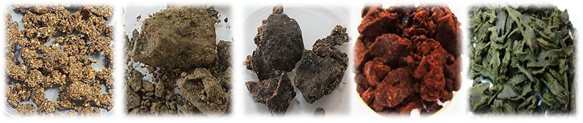
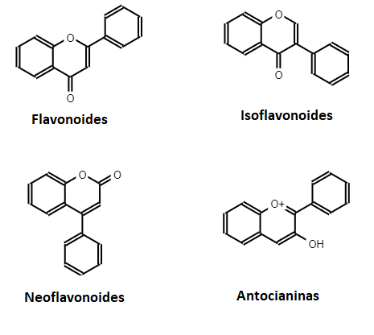
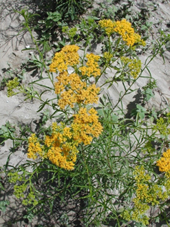
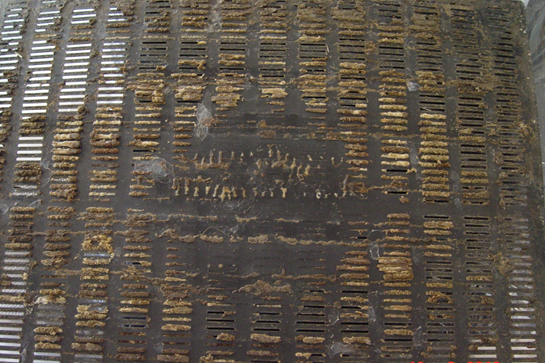
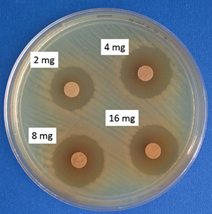
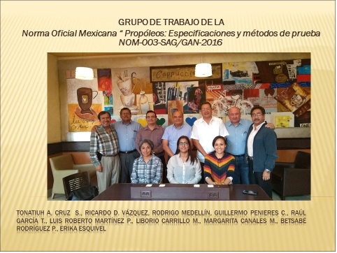
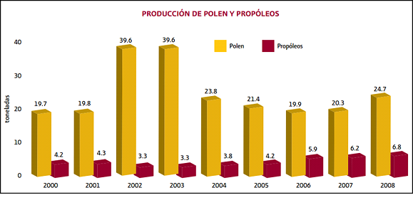
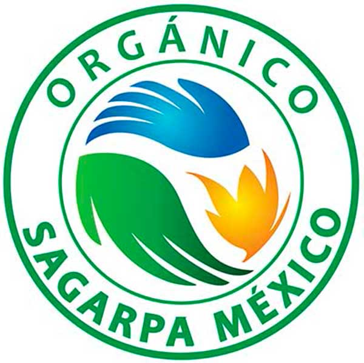

---
title: "**Propóleos**"
--- 

```{r i_3x, fig.align='center', echo=FALSE, cache=TRUE}


```

```{r setup, include=FALSE}
knitr::opts_chunk$set(echo = TRUE)
```

<div class=text-justify>

<br/>

## **Introducción** 
****


Por [Dra. Betsabé Rodríguez Pérez y Dr. Tonatiuh A. Cruz Sánchez](#a002)

Existen alrededor de 20 mil especies de abejas a nivel mundial que están agrupadas en siete familias. Una de éstas se llama *Apidae* y contiene a la subfamilia *Apinae*, en donde se ubican diferentes tribus, como la de las abejas sin aguijón (*Meliponini*), la de los abejorros (*Bombini*), la de las abejas melíferas (*Apini*), la de las abejas de las orquídeas (*Euglossini*) y otras que son menos conocidas.

Entre las abejas sociales destacan dos grupos: las que son primitivamente sociales (como los abejorros) y las altamente sociales, como las abejas melíferas (género *Apis*) y las abejas sin aguijón. 

La abeja melífera (Nombre científico: *Apis mellifera*) presenta en su cuerpo color negro con amarillo y con un aguijón. 

Sólo este último grupo (las que son altamente sociales) forma colonias permanentes en donde almacenan miel y polen en grandes cantidades.

```{r img4_I_1, fig.align='center', fig.cap= "**Figura 4.1. Agrupación jerárquica de las abejas**[^1^]", echo=FALSE, out.width = "60%", cache=TRUE}

knitr::include_graphics("imag/4_I_Fig1.png")

```

<br>

En México se reportan 46 especies de abejas sin aguijón, seis agrupadas en 16 géneros. Los estados que tienen mayor número de especies son: Oaxaca, Chiapas, Veracruz, y Quintana Roo.[^2^]

<br>

**Propóleo**

El término propóleo etimológicamente proviene del griego *pro* “para o en defensa de” y *polis* “ciudad” haciendo referencia a la defensa de la colmena[^3^]. Es una sustancia de composición compleja elaborada por las abejas a partir de resinas de la vegetación de alrededor de las colmenas y que es utilizada en la colmena como material de sellado, agente microbicida y desinfectante, por lo tanto, es el responsable directo de garantizar la asepsia de la colmena, siendo ésta un ambiente prolífero para el desarrollo de microorganismos, debido a sus condiciones de temperatura y humedad[^4^], como se muestra en la figura 4.2.

```{r img4_I_2, fig.align='center', fig.cap= "**Figura 4.2. A: abejas recolectando resinas. B: usos en la colmena[^5^].**", echo=FALSE, out.width = "60%", cache=TRUE}
 #par(mfrow = c(2, 2),
knitr::include_graphics("imag/4_I_Fig2.png")

```

<br>

Las características físicas del propóleo como color, aroma, sabor y consistencia, están relacionadas con la fuente vegetal y clima de la región donde es recolectado. El color puede variar desde rojo, amarillo-rojizo, amarillo oscuro, verde castaño, pardo o negro (figura 4.3); presenta un olor resinoso (madera) o balsámico (cera), sabor suave a picante y consistencia a temperatura ambiente maleable o rígida.[^6^]^,^[^7^]^,^[^8^]

```{r img4_I_3, fig.align='center', fig.cap= "**Figura 4.3. Propóleos en greña[^9^].**", echo=FALSE, out.width = "60%", cache=TRUE}
 #par(mfrow = c(2, 2),


```


<br>

<br/>


**Propóleo de abejas nativas de México**

Ya desde tiempo atrás, por ejemplo en Atzalan, Veracruz, el propóleo de abejas nativas de México, se conoce con el nombre local de tacahuite y se usa para picaduras, heridas infectadas, infecciones en vías respiratorias, “estirón” y golpes internos. En la Sierra Norte de Puebla lo llaman takahuil y es usado como emplasto para curar heridas. Entre los testimonios de uso que se han colectado están el de cicatrizar heridas, curar infecciones en la piel y en los oídos, infecciones respiratorias e intestinales, inflamación de encías, hongos en la piel, así como otros usos no medicinales como los de protector de madera, repelente de plagas en hortalizas y sus aplicaciones en heridas de animales como vacas y gallinas. A pesar del conocimiento que existe sobre sus propiedades medicinales, son pocos los meliponicultores que aprovechan su utilidad, lo que convierte al propóleo en un área potencial de desarrollo[^10^].

<br/>

**Química**

El progreso de la investigación sobre los propóleos ha permitido identificar compuestos como resinas y bálsamos, cera de abeja, aceites esenciales o volátiles, polen y materiales orgánicos y algunos minerales[^11^]^,^[^12^]. La fracción resinosa del propóleo está integrada por compuestos fenólicos y flavonoides, que son muy importantes a nivel terapéutico[^13^]. En el apartado 4.1, se abunda en este tema.

<br/>

**Actividad biológica del propóleo.**

Actualmente, diversos estudios sobre los propóleos han comprobado una amplia gama de actividades biológicas, tanto en humanos como en animales, debida a la cantidad de los bálsamos presentes en su composición. Dentro de las principales actividades del propóleo destacan la antibacteriana, antifúngica, antiparasitaria, antiviral, antioxidante, cicatrizante, antiinflamatoria y antitumoral, como se describirá más adelante. Es por ello que esta resina es de interés en el sector de la industria farmacéutica, la cosmética, la alimentaria y el sector agrícola.

La industria farmacéutica tiene mayor interés, ya que se buscan nuevas alternativas para desarrollar tratamientos contra enfermedades infecciosas provocadas por la multirresistencia de los microorganismos frente a los antibióticos o antifúngicos convencionales, y encontrar soluciones que ofrezcan alternativas terapéuticas a un bajo costo. En los apartados 4.4 a 4.6, se profundiza en estos temas.

<br/>

**Calidad del propóleo**

En México, el apicultor recolecta propóleos y los oferta con fines terapéuticos, por lo que es importante garantizar dicha actividad en relación con su contenido químico, tal como lo establece la [Norma Oficial Mexicana NOM-003-SAG/GAN-2017 “Propóleos, producción y especificaciones para su procesamiento"](http://diariooficial.gob.mx/normasOficiales.php?codp=6794&view=si){target="_blank"}), que indica los valores mínimos de aceptación, en donde cuanto mayor sea el porcentaje de los compuestos bioactivos (compuestos fenólicos y flavonoides), mejor será la actividad biológica del producto y viceversa, es decir, si la actividad biológica es baja o nula, los propóleos serán de baja calidad, teniendo un impacto económico para el productor. 


<br/>
<br/>
<br/>


## **4.1 Composición Química**
****

Por [Dr. José Guillermo Penieres Carrillo](#a002)

<br/>

**Composición general de los propóleos**

Con base en que las abejas forman sus productos aprovechando la vegetación que circunda a la misma, es de esperarse que, debido a la gran diversidad de plantas en el planeta, los constituyentes de esas plantas tendrán que reflejarse en el contenido químico de los productos apícolas, como es el caso de los propóleos, es decir, el origen vegetal de los propóleos determina su diversidad química[^14^]. Por ejemplo, actualmente se conoce muy bien que en las zonas templadas de todo el mundo, la principal fuente de propóleo es el exudado resinoso de los álamos, principalmente el “álamo negro” (*Populus nigra*), árboles que solo son comunes en esas zonas y no crecen en zonas tropicales ni en regiones subtropicales, por lo que en estas últimas las abejas tienen que encontrar otras fuentes vegetales. Como resultado, los propóleos de las regiones tropicales tienen diferente composición química que los propóleos generados de los álamos.

Por esta razón, los propóleos son difíciles de clasificar en un orden específico en cuanto a su contenido químico, ya que su composición química es compleja y depende de varios factores como son la región geográfica[^15^]^,^[^16^], clima, época de recolección[^17^], el relieve, la vegetación natural, y las cuencas hidrográficas, entre otros. Además, la técnica de recolección del propóleo empleada por el apicultor es otro factor que influye en su contenido. Sin embargo, hasta la fecha existen buenos intentos para su clasificación[^18^].

Está comprobado que la distancia de vuelo de las abejas para recolectar miel y polen puede variar entre unos pocos centímetros y hasta más de 10 kilómetros. Esto último sucede cuando hay una extrema escasez de alimentos. Lo normal es que no se alejen más allá de un kilómetro de la colmena, con lo que una colonia explota las 300 hectáreas que hay a su alrededor. Al volar, pueden alcanzar hasta 25 kilómetros por hora, gracias a sus potentes alas, que se mueven a razón de 200 veces por segundo.[^19^]

De manera general, los propóleos están formados por diferentes componentes químicos, que se pueden clasificar como se observa en el cuadro 4.1,[^20^] presentado diferentes valores promedio, aunque también está compuesto de polen, vitaminas y aminoácidos esenciales e impurezas, como restos de abejas y astillas, entre otros.


<br>

<center>

**Cuadro 4.1. Componentes químicos identificados en los propóleos.**

| Clase de componentes | Compuesto   |
|--------------------- | ------------------------------ |
| Resinas/Bálsamos <br> (Solubles en etanol, 40 a 70%) | Compuestos fenólicos[^21^]: fenoles, ácidos fenólicos, ésteres, flavonoides, ácidos alifáticos, alcoholes, aldehídos, cetonas, ácido benzoico y ésteres |
| Ceras <br> (Insolubles en etanol, 20 a 35%) | Palmitato de miricilo (aproximadamente 80%), ácido cerótico (aproximadamente 15%), cerotato de miricilo, ácido lignocérico, ácido montánico, ácido psílico, entre otros[^22^]    |
| Aceites esenciales (7%)   |Monoterpenos y sesquiterpenos     |
| Otros  5% | Minerales, polisacáridos, proteínas, aminoácidos, aminas, amidas, trazas de carbohidratos, lactonas, quinonas, esteroides y vitaminas. |
||

<FONT SIZE=2>**Fuente: S. Bogdanov (2017). *Propolis: Composition, Health, Medicine: A Review*. BeeProduct, Science, 1-44.**</font>

</center>

<br>

Según el diccionario de la Real Academia Española[^23^], la definición de los primeros tres componentes del cuadro 4.1 es:

**Resina**: “Sustancia sólida o de consistencia pastosa, insoluble en el agua, soluble en el alcohol y en los aceites esenciales, y capaz de arder en contacto con el aire, obtenida naturalmente como producto que fluye de varias plantas”. Dentro de las resinas naturales puede hablarse de **bálsamos** (una secreción que se usa como purificador o desodorizador), gomorresinas (emulsiona al mezclarse con agua) y lactorresinas (procedente del látex coagulado), entre otros tipos.

**Cera**: “Sustancia sólida, blanda, amarillenta y fundible que segregan las abejas para formar las celdillas de los panales y que se emplea principalmente para hacer velas. También la fabrican algunos otros insectos”. Las ceras biológicas son ésteres de los ácidos grasos de cadena larga (C~14~ - C~36~) con alcoholes de peso molecular elevado, es decir, de cadena larga (C~16~ - C~30~). Son moléculas que se obtienen por esterificación, reacción química entre un ácido carboxílico y un alcohol.

**Aceite esencial**: “Líquido muy oloroso de algunos vegetales”. Estos aceites están constituidos por compuestos orgánicos volátiles de tipo terpénico presentes en las plantas.

<br>

Algunos de los componentes más significativos en las resinas/bálsamos en este producto apícola son los que se muestran en el cuadro 4.2.

<br>

<center>

**Cuadro 4.2. Componentes químicos del propóleo y algunos ejemplos**.[^24^]^,^[^25^]

<br>

| Componentes | Ejemplos       |
|:---------------|:----------------------------------------- |
|Ácidos orgánicos | [Ácido benzoico (C~6~H~5~-COOH)](imag/acido_benzoico.svg){target="_blank"}, [ácido gálico (C~7~H~6~O~5~)](imag/acido_galico.svg){target="_blank"} |
|Ácidos fenólicos | [Ácido cafeico (C~9~H~8~O~4~)](imag/acido_cafeico.svg){target="_blank"}, [Ácido cinámico (C~9~H~8~O~2~)](imag/acido_cinamico.svg){target="_blank"}, <br> [Ácido(_Z_)-_p_-cumarínico (C~9~H~8~O~3~)](imag/acido_cumarinico.svg){target="_blank"} y [Ácido fenílico (fenol, C~6~H~6~O)](imag/fenol.svg){target="_blank"} |
|Aldehídos aromáticos| [Vainillina (C~8~H~8~O~3~)](imag/vainillina.svg){target="_blank"}, [Isovainillina (C~8~H~8~O~3~)](imag/isovainillina.svg){target="_blank"} |
|Cumarinas| [Esculetol (C~9~H~6~O~4~)](imag/esculetol.svg){target="_blank"}, [Escopoletol (C~10~H~8~O~4~)](imag/escopoletol.svg){target="_blank"} |
|Flavonas| [Crisina (C~15~H~10~O~4~)](imag/crisina.svg){target="_blank"}, [Acacetina (C~16~H~12~O~5~)](imag/acacetina.svg){target="_blank"}, <br> [Pectolinaringenina (C~17~H~14~O~6~)](imag/pectolinaringenina.svg){target="_blank"}, [Tectocrisina (C~16~H~12~O~4~)](imag/tectocrisina.svg){target="_blank"} |
|Flavanonas|[Pinocembrina (C~15~H~12~O~4~)](imag/pinocembrina.svg){target="_blank"}, [Naringenina (C~15~H~12~O~5~)](imag/naringenina.svg){target="_blank"}, <br> [Pinostrobina (C~16~H~14~O~4~)](imag/pinostrobina.svg){target="_blank"}, [Sakuranetina (C~16~H~14~O~5~)](imag/sakuranetina.svg){target="_blank"} |
|Flavonoles|[Quercetina (C~15~H~10~O~7~)](imag/quercetina.svg){target="_blank"}, [Izalpinina (C~16~H~12~O~5~)](imag/izalpinina.svg){target="_blank"}, <br> [Kaempferol (C~15~H~10~O~6~)](imag/kaempferol.svg){target="_blank"}, [Galangina (C~15~H~10~O~5~)](imag/galangina.svg){target="_blank"}, <br> [Fisetina (C~15~H~10~O~8~)](imag/fisetina.svg){target="_blank"}, [Miricetina (C~15~H~10~O~8~)](imag/miricetina.svg){target="_blank"} |
|Flavanoles| [Catequina (C~15~H~14~O~6~)](imag/catequina.svg){target="_blank"}, [Pinobanksina (C~15~H~12~O~5~)](imag/pinobanksina.svg){target="_blank"}, <br> [Epicatequina (C~15~H~14~O~6~)](imag/epicatequina.svg){target="_blank"} |
|Minerales| Aluminio, Plata, Bario, Boro, Cromo, Cobalto, Cobre, Estaño, Hierro,  Magnesio, Manganeso, Molibdeno, Níquel, Plomo, Silicio, Estroncio, Titanio, Vanadio, Zinc, Calcio |
|Vitaminas| [[Provitamina A (β-caroteno, C~40~H~56~)](imag/provitamina_a_beta_caroteno.svg){target="_blank"} y <br> [Vitamina B3 (Niacina, Ácido nicotínico, Vitamina PP, C~6~H~5~NO~2~)](imag/vitamina_b3.svg){target="_blank"} |
| | 


<FONT SIZE=2>**Fuente: Rojas N. M. (2008) ___Viabilidad biológica de los propóleos de Cuba___. Actas del XXII Seminario Americano de Apicultura. Julio 28-31, Mérida, Yucatán, pp. 59-66**</font>

</center>

<br>


En cuanto a las propiedades terapéuticas del propóleo, dependen de la calidad de éste, así como de las proporciones de los elementos que la constituyen, los cuales se relacionan directamente con su origen geográfico, **aunque está reconocido que algunos de sus componentes son los que otorgan principalmente esas propiedades, como los son los flavonoides y otros polifenoles**.

Para conocer el contenido químico de un propóleo, generalmente esto se realiza mediante la obtención de un extracto de él, empleando de manera habitual una mezcla de etanol-agua en una proporción de 70-30%, mediante un proceso de maceración, que puede durar de 1 a 2 días, aunque también se pueden utilizar otros disolventes como etanol, metanol, aceite de cereales comestibles, glicerol y propilenglicol, entre otros[^26^]^,^[^27^], y se ha demostrado que el disolvente empleado para la extracción influye de manera importante en la actividad antimicrobiana de los propóleos. Además, más recientemente se emplea energía de ultrasonido (sonicación) para la obtención de extractos de propóleo, lo que representa un ahorro de tiempo, ya que requiere de menor tiempo de extracción.

Una vez obtenido el extracto disuelto, éste es llevado a un proceso de evaporación de los disolventes, preferentemente a presión reducida o bien mediante el empleo de CO~2~ supercrítico, que en todo caso debería de ser la técnica preferida, ya que requiere de temperaturas de aproximadamente de 30-35 °C, lo que garantiza la no descomposición térmica de las sustancias contenidas en los propóleos, sin embargo, esta técnica representa un gasto económico mucho mayor, sobre todo para poder emplearla a nivel de campo.

Para conocer el contenido químico de los extractos de propóleo, actualmente se emplea la técnica conocida como *Cromatografía de Gases acoplada a Espectrometría de Masas (CG-EM)*[^28^], que de manera simple consiste en:

**Cromatografía de Gases (CG)**. Técnica cromatográfica (de separación) de compuestos químicos mezclados, empleando una cantidad pequeña de muestra líquida (de 1 a 10 μL), en donde, bajo condiciones específicas del equipo, cada compuesto de la mezcla es separado y detectado en un cromatograma, que muestra que cada compuesto presenta un “tiempo de retención” diferente, debido a su estructura y solubilidad en el disolvente empleado en la técnica. En la Figura 4.4 se muestra un ejemplo de un cromatograma de propóleo.[^29^]


<br/>

```{r img4_1_1, fig.align='center', fig.cap= "**Figura 4.4. Cromatograma de gases de un propóleo del Estado de Puebla.**", echo=FALSE, out.width = "80%", cache=TRUE}
 #par(mfrow = c(2, 2),
knitr::include_graphics("imag/4_1_Fig1.png")

```


<br/>

Esta técnica se acopla electrónicamente a la de *Espectrometría de Masas (EM)*, es decir, cada señal del cromatograma indica cada compuesto contenido en la muestra original; así, se puede elegir cada tiempo de retención, de manera independiente, y ésta se envía al equipo de EM acoplado.

**Espectrometría de Masas (EM).** Es una técnica espectrométrica empleada en Química, en donde un compuesto es “bombardeado” por una corriente de electrones, lo que origina su fragmentación. Este rompimiento de las moléculas no es al azar, sino que sigue patrones establecidos conocidos como “patrón de fragmentación”, lo que permite establecer de manera muy precisa la identificación de cada compuesto analizado, mediante la obtención de un “espectro de masas”, que generalmente es único y específico para cada compuesto químico, bajo las condiciones empleadas en el equipo. En la figura 4.5 se muestra un ejemplo de un espectro de masas.[^30^]


<br/>

```{r img4_1_2, fig.align='center', fig.cap= "**Figura 4.5. Espectro de masas de la Eupatorina.**", echo=FALSE, out.width = "50%", cache=TRUE}
 #par(mfrow = c(2, 2),
knitr::include_graphics("imag/4_1_Fig2.png")

```

<br/>

Actualmente, los equipos de CG-EM cuentan con una vasta información de espectros de masas de muchos compuestos químicos, conocida como “biblioteca”, por lo que, con base a cada espectro de masas obtenido para cada sustancia contenida en la mezcla y separada por CG, el equipo correlaciona cada espectro con alguno o algunos de los que contiene en su biblioteca, con diferentes porcentajes de aproximación, es decir, un mismo compuesto puede ser correlacionado con más de uno de los compuestos contenidos en la biblioteca, pero con diferentes grados de aproximación (una aproximación del 100%, indica que el equipo tiene una información que señala que el compuesto analizado realmente es el propuesto). En la siguiente presentación, se muestra el análisis de cromatografía de gases y la asignación del equipo de CG-EM de diferentes propóleos estudiados en la FES Cuautitlán.

<br>

<center> 

**Análisis de Cromatografía de Gases de Propóleos, FES Cuautitlán, UNAM.** <br> **Créditos: M.C. Elisa Gutiérrez Hernández y Dr. José Guillermo Penieres Carrillo.** <br>
*(Use las flechas de dirección de su teclado para visualizar correctamente todos los elementos de la presentación)*.

<iframe src="https://onedrive.live.com/embed?cid=B1C61545BBEEC34C&amp;resid=B1C61545BBEEC34C%21574&amp;authkey=AOnB8gCv80E3R2g&amp;em=2&amp;wdAr=1.3333333333333333&amp;wdEaa=0" width="610px" height="481px" frameborder="0">Esto es un documento de <a target="_blank" href="https://office.com">Microsoft Office</a> incrustado con tecnología de <a target="_blank" href="https://office.com/webapps">Office</a>.</iframe>

</center>

<br>


Aunque hasta la fecha se han identificado más de 300 compuestos en los propóleos, **las propiedades biológicas que ellos presentan principalmente son atribuidas a unos cuantos compuestos, principalmente flavonoides, ácidos fenólicos y algunos de sus ésteres, de los que los primeros son considerados como los mayores contribuyentes.**

<br>

**Flavonoides**

El término genérico flavonoide (del latín *flavus*, "amarillo, dorado") es con el que se identifica a una serie de compuestos polifenólicos presentes en las plantas. Actualmente se conocen más de 5000 flavonoides.[^31^]

Esta familia de compuestos tiene diversas funciones en las plantas que los contienen, como responsables de la resistencia de las plantas a la foto-oxidación por la luz ultravioleta del sol, para la regulación del transporte de auxinas (hormonas), como defensa ante el consumo por los seres herbívoros, como atracción de los animales polinizadores, a través del color o el olor que dan a la planta o a sus flores. Hasta ahora se conoce que, en los frutos, las mayores concentraciones se encuentran en su piel.

En general, la familia de los flavonoides se clasifica como flavonoides, isoflavonoides, neoflavonoides y antocianinas (también llamadas antocianos) y su estructura general se muestra en la Figura 4.6[^32^], en donde los más abundantes e importantes son los primeros.


<br/>

```{r img4_1_3, fig.align='center', fig.cap= "**Figura 4.6. Clasificación general de los flavonoides.**", echo=FALSE, out.width = "50%", cache=TRUE}
 #par(mfrow = c(2, 2),


```

<br/>


Sin embargo, Pérez Trueba[^33^] divide a los flavonoides en 13 diferentes formas estructurales, como se muestra a continuación.

<br/>

```{r img4_1_4, fig.align='center', fig.cap= "**Figura 4.7. Clasificación de los flavonoides por Pérez Trueba.**", echo=FALSE, out.width = "70%", cache=TRUE}
 #par(mfrow = c(2, 2),
knitr::include_graphics("imag/4_1_Fig4.png")

```


<br/>
<br/>
<br/>


## **4.2 Flora propolizadora** 
****

Por [Dra. María Margarita Canales Martínez y Dr. Marco Aurelio Rodríguez Monroy ](#a002)

<br/>

México es considerado un país megadiverso porque forma parte del grupo de las naciones poseedoras de la mayor cantidad y diversidad de animales y plantas, casi el 70% de la diversidad mundial de especies. 

Por lo antes mencionado y teniendo en cuenta que México posee diferentes climas y floras, se consideró dividirlo en cinco regiones apícolas bien definidas: Altiplano, Golfo, Costa del Pacífico, Norte y Península de Yucatán. 

En muchas regiones de México, los apicultores no cuentan con información veraz sobre la flora melífera (que son aquellas especies de plantas que producen néctar, polen) y mucho menos sobre aquellas especies de plantas que componen a la flora propolizadora (plantas que secretan resinas), por lo que no se tiene conocimiento amplio de los recursos apibotánicos que permitan identificar la potencialidad floral de la región. En este documento, nos enfocaremos a mencionar algunas de las especies que son productoras de resinas que las abejas recolectan y con éstas producen el propóleo. 

De esas especies propolizadoras, muchas también son productoras de néctar y polen. En el cuadro 4.3, se concentra la información de las familias y géneros con especies productoras de resinas que se localizan en México. 

<br>

<center>

**Cuadro 4.3. Familias y géneros con especies productoras de resinas presentes en México y áreas circunvecinas (Modificado de Quiroz y Magaña, 2015[^34^]). Con asterisco se marcan las especies que también son productoras de néctar o de propóleo.**


```{r tab4_2, echo=FALSE, warning=FALSE }
library(kableExtra)

c4_2 <- read.csv("tabs/flora.csv", encoding = "utf8")
names(c4_2) <- c( "Familia", "Género")

kableExtra::kable(c4_2) %>%
  kableExtra::kable_styling(c("striped", "bordered")) %>%
  column_spec(1, bold = T , italic = T) %>%
   column_spec(2, italic = T) %>%
  collapse_rows(columns = 1) %>%
  scroll_box(height = "400px")

```

</center>

<br>

A continuación, se describirán algunas especies pertenecientes a los géneros mencionados en el cuadro 4.3, estudios científicos que se han realizados sobre las propiedades medicinales y que son base para validar indirectamente el uso medicinal del propóleo.

De la especie *Amphipterygium adstringens* Schide ex Schlecht (figura 4.8), que recibe el nombre común de cuachalala o cuachalalate y que es un árbol endémico de México, se ha comprobado que extractos obtenidos a partir de su corteza inhiben el crecimiento de bacterias que son de importancia biomédica (*Staphylococcus aureus*, *S. epidermidis*, *Vibrio cholerae* No-01, *Salmonella typhi*). También se ha demostrado que en un modelo murino experimental de colitis (inducida por dextrán sulfato de sodio) disminuyó la inflamación del colon y conservó la longitud del mismo. Los datos también fueron corroborados con un análisis histológico, en donde se observó que hay disminución del daño en la mucosa intestinal y las células secretoras de moco se conservaron. Lo antes mencionado sugiere que el extracto de la corteza de *A. adstringens* podría tener un efecto protector en el modelo murino utilizado. Por otro lado, también se comprobó su actividad antioxidante *in vitro* (utilizando el radical 2,2-difenil-1-picrilhidrazilo DPPH) e *in vivo* en el modelo murino, evaluando la concentración de las enzimas superóxido dismutasa (SOD), catalasa (CAT) y glutation peroxidasa (GPx).[^35^] 

<br>

<center>

```{r img_cuach, fig.align='center', fig.cap= "**Figura 4.8. _Amphipterygium adstringens_, a la izquierda se muestran las ramas del cuachalalate con los frutos. A la derecha, un habitante de San Rafael Coxcatlán, Puebla, obteniendo la corteza del cuachalalate (Fotografía original: Marco Aurelio Rodríguez Monroy).**", echo=FALSE, out.width = "70%", cache=TRUE}

knitr::include_graphics("imag/cuachalalate.png")

```

</center>

<br>

Con respecto al género *Mangifera*, en particular de la especie *M. indica L.*, Orozco (2013)[^36^], realizó una investigación de las propiedades antifúngicas del extracto metanólico del exocarpo del fruto (“cáscara del mango”) y de la semilla (“hueso del mango”) de cinco variedades de mango: Ataúlfo, Criollo, Manila, Niño y Petacón procedentes de Cuetzala del Progreso (Edo. de Guerrero). Se probaron estos extractos sobre 6 cepas de hongos filamentosos (*Aspergillus niger*, *Aspergillus sp.*, *Fusarium moniliforme*, *F. sporotrichioides*, *Rhizoctonia lilacina* y *Trichophyton mentagrophytes*, que son especies de hongos de importancia agrícola y médica.

Todos los extractos presentaron comportamientos diferentes sobre el crecimiento de las seis cepas fúngicas, siendo el extracto de semilla de Ataúlfo el de la actividad más evidente, puesto que tuvo un efecto positivo en la totalidad de cepas.

Se determinó que el extracto de la cáscara del mango Ataúlfo, con una concentración de 4 mg/mL inhibió el 100% del crecimiento de la especie fúngica *T. mentagrophytes* y con una concentración de 0.16 mg/mL inhibió al 50% del crecimiento del micelio de este hongo. Estos resultados son relevantes, ya que *T. mentagrophytes* infecta al hombre y es el responsable de ocasionar por ejemplo la caspa y el pie de atleta. Por otro lado, el extracto de la semilla del mango Ataúlfo, con una concentración de 4 mg/mL también inhibió el 100% del desarrollo del micelio de *T. mentagrophytes*.

El extracto de la cáscara del mango Criollo, sólo tuvo actividad inhibitoria sobre dos cepas de hongos: *T. mentagrophytes* y *F. sporotrichioides*. La actividad que mostró este extracto fue escasa, ya que con 8 mg/mL de extracto sólo inhibió el 73.33% del crecimiento de *T. mentagrophytes* y con esta misma concentración sólo inhibió el 22.26% del crecimiento de *F. sporotrichioides*. El extracto de la semillla con una concentración de 4 mg/mL inhibió el 100% de crecimiento de *T. mentagrophytes*.

El análisis químico de los extractos de la cáscara y semilla del mango, mostró que existen derivados de ácido benzoico, derivados de resorcinol, mangiferina, flavonoles, ácido palmítico etiléster. El extracto de semilla de mango Ataúlfo es el que presentó la mayor concentración de fenoles. De estos compuestos, en la bibliografía, se ha encontrado que tienen actividad antifúngica.

El hecho de que los extractos hayan mostrado su mayor actividad contra un hongo dermatofito, apoya el uso farmacológico del fruto y lo convierte en una fuente interesante de investigación sobre otros dermatofitos como *Trichophyton rubrum*, responsable del 80-93% de las dermatofitosis[^37^].

De la especie *Gymnosperma glutinosum* (Spreng.) Less (figura 4.9). Nombre común tatalencho, pegajosa, pegahuesos, popote, escobilla, que es una planta herbácea con la base leñosa, se han comprobado diferentes actividades. Canales *et al.* (2007)[^38^], realizó un estudio comparativo de los extractos hexánico y metanólico de *G. glutinosum* colectada en dos diferentes localidades: San Rafael (municipio de Coxcatlán, estado de Puebla) y Tepeji del Río (estado de Hidalgo). El extracto metanólico de Tepeji del Río mostró la mayor actividad antibacteriana sobre cepas de interés clínico. Los extractos hexánicos de ambas localidades mostraron actividad sobre cepas de hongos filamentosos que infectan plantas y al hombre, el extracto hexánico de San Rafael mostró mayor actividad antifúngica. Se aislaron dos compuestos de esta especie, un ácido diterpénico y una flavona hexametoxilada[^39^].

<br>

<center>

```{r img_gymnos, fig.align='center', fig.cap= "**Figura 4.9. _Gymnosperma glutinosum_, se puede apreciar la resina en las hojas y flores de esta especie. (Fotografía tomada de CONABIO, Heike Vibrans, 2005).**", echo=FALSE, out.width = "40%", cache=TRUE}



```

</center>

<br>

El género *Bursera*, representa una fuente importante de resinas, medicinas, aceites esenciales y perfumes; 85 de las 100 especies existentes tienen alta incidencia en el país, principalmente en temperaturas cálidas en la costa del Pacífico[^40^]. Diferentes especies de *Bursera* son utilizadas en la medicina tradicional mexicana[^41^] y en algunos estudios se han comprobado las propiedades biológicas de sus aceites esenciales, extractos y/o fracciones como su capacidad antioxidante, antimicrobiana, antiprotozoaria, bioinsecticida, citotóxica y antitumoral.[^42^]

En particular de la especie *B. morelensis* (figura 4.10), conocida como “aceitillo” y que es un organismo endémico de México, sintetiza una mayor cantidad de aceite esencial comparándola con otras especies del género. Infusiones de la corteza de esta especie son usadas para el tratamiento de infecciones en la piel y para cicatrizar heridas[^43^]. Del aceite esencial de esta especie se obtuvo su composición química, registrando la presencia de 28 compuestos de los cuales el de mayor concentración fue el alfa-felandreno. Se demostró que tiene una actividad antiinflamatoria comparable a la dexametasona que es un fármaco esteroideo que desacelera el proceso de inflamación[^44^]. 

Este aceite esencial también tiene actividad antimicrobiana, se demostró que inhibe el crecimiento de bacterias Gram positivas (*Staphylococcus aureus*, *S. epidermidis*, *Streptococcus pneumoniae*, *Enterococcus faecalis*) y Gram negativas (*Vibrio cholerae*, *Escherichia coli*, *Pseudomonas aeruginosa*), además presentó una actividad bactericida, con una concentracción de 125 microgramos por mililitro, sobre una cepa de *V. cholerae* aislada de un caso clínico. Por otro lado, también inhibió el crecimiento de hongos filamentosos de importancia agrícola y médica (*Fusarium moniliforme*, *Aspergillus niger*, *Trichophyton mentagrophytes*)[^45^]. Este aceite esencial de *B. morelensis*, también inhibió el crecimiento de diferentes cepas de *Candida albicans*, que son hongos que cuando infectan al humano ocasionan la enfermedad denominada candidiasis que es un problema de salud pública. Se comprobó que el aceite esencial ocasiona daño a nivel de la membrana, inhibe el desarrollo del tubo germinativo y disminuye la transcripción del gen INT1 que codifica para la síntesis de una adhesina.[^46^]

<br>

<center>

```{r img_bursera, fig.align='center', fig.cap= "**Figura 4.10. Fotografía de _Bursera morelensis_. (Fotografía original, Marco Aurelio Rodríguez Monroy).**", echo=FALSE, out.width = "40%", cache=TRUE}


```

</center>

<br>

En otras investigaciones, se obtuvo el aceite esencial de tres especies de burseras: *B. schlechtendalii*, *B. arida* y *B. aptera*. Del aceite esencial de *B. schlechtendalii* se encontró que su composición química está constituida en una mayor proporción por terpenos como  el alfa-felandreno, canfeno y alfa-pineno; este aceite inhibió el crecimiento de bacterias como por ejemplo *Streptococcus pneumoniae* y *Escherichia coli*. También inhibió el crecimiento de hongos levaduriformes como *C. albicans* y *C. glabrata*.[^47^]

De la especies *B. arida*, se llevó a cabo un estudio de las propiedades medicinales del aceite esencial. En esta investigación se determinó que el aceite esencial estaba compuesto principalmente por los terpenos: canfeno, cariofileno, alfa-pineno, alfa-felandreno, gama-terpineno. También se demostró que inhibe el crecimiento de bacterias como *S. pneumoniae* y *E. coli* y que el aceite inhibe indistintamente el crecimiento de bacterias Gram positivas y negativas. En cuanto a su actividad antifúngica, este aceite inhibió el crecimiento de *C. albicans*.[^48^] 

Continuando con el estudio de las propiedades medicinales de *B. arida*, se realizó la evaluación de la actividad antimicrobiana del extracto metanólico y se determinó que también inhibe el crecimiento de bacterias Gram positivas y Gram negativas. Se determinó que este extracto tiene una actividad bactericida sobre las cepas de *S. aureus* y *V. cholerae*. También inhibe totalmente el crecimiento del hongo filamentoso *T. mentagrophytes*. Por otro lado, este extracto también mostró una actividad antiinflamatoria y antioxidante.[^49^] 

De *Bursera aptera*, se obtuvo el extracto metanólico y de éste se comprobó que con una concentración de 0.408 mg/mL se alcanza la concentración letal media sobre el protozoario *Leishmania mexicana*, que es es el causante de la leishmaniasis cutánea. Este extracto indujo apoptosis en los promastigotes de *L. mexicana*.[^50^]

En otra investigación, se evaluó la actividad antibacteriana del extracto metanólico de 7 especies del género *Bursera*, se determinó que *B. arida* y *B. aptera* son las especies que poseen una mayor actividad (valores de concentración mínima inhibitoria hasta 0.0675 mg/mL y concentración bactericida mínima hasta 0.25 mg/mL), mientras que las especies bacterianas más sensibles fueron *E. coli*, *V. cholerae*, *B. subtilis*, *S. aureus* y *E. faecalis*. Se estableció que *B. arida* posee efecto bacteriostático y finalmente se encontró la presencia de compuestos fenólicos, terpenos y sesquiterpenos, que son probablemente los responsables del efecto antibacteriano.[^51^]

Con respecto a las especies de la familia *Fabaceae*, en particular la *Prosopis laevigata* (figura 4.11) es empleada en la medicina tradicional para aliviar enfermedades del sistema respiratorio e infecciones de la piel. Por lo antes mencionado, se está llevando a cabo un proyecto para determinar las propiedades medicinales del extracto metanólico de las hojas y flores de esta especie de mezquite. Al momento se ha demostrado que estos extractos inhiben el crecimiento de bacterias y hongos que son de importancia médica y agrónoma.[^52^]^,^[^53^]^,^[^54^]

<br>

<center>

```{r img_mezquite, fig.align='center', fig.cap= "**Figura 4.11. _Prosopis laevigata_, se puede apreciar que es el tiempo de floración del mezquite. (Fotografía original: Marco Aurelio Rodríguez Monroy).**", echo=FALSE, out.width = "60%", cache=TRUE}

knitr::include_graphics("imag/mezquite.png")

```

</center>

<br>

En la bibliografía especializada, se pueden encontrar diversos estudios sobre las propiedades medicinales de especies de estas familias que producen resinas, pero para determinar el origen botánico del propóleo, se deben hacer estudios sobre el contenido de polen y las especies de vegetales a las que corresponden. Estos estudios son muy laboriosos e interesantes. Pero una estrategia que marcaría los diferentes orígenes botánicos del propóleo sería que se conservara la vegetación natural de las diferentes regiones apícolas y que a la par se realizaran estudios científicos para corroborar las propiedades medicinales de los propóleos y la flora que está aportando las resinas.


<br/>
<br/>
<br/>

## **4.3 Producción y recolección de propóleo** 
****

Por [M.A. Liborio Carrillo Miranda](#a002)

<br/>

**Introducción** 

El conocimiento y uso de los productos de la colmena, se remonta a tiempos antes de Cristo, el primer registro del aprovechamiento fue encontrado en las pinturas rupestres en la Cueva de la Araña, en España. Así mismo, el primer testimonio apícola se encontró en jeroglíficos egipcios del año 5510 a.C. 

<br/>


```{r img4_3_1, fig.align='center', fig.cap= "**Figura 4.12. Pintura rupestre de más de 8000 años, en la Cueva de la Araña, Valencia, España.**", echo=FALSE, out.width = "80%", cache=TRUE}
 #par(mfrow = c(2, 2),
knitr::include_graphics("imag/cueva.jpg")

```

<br/>

En Mesoamérica, el cuidado de la abeja data desde la época prehispánica, donde los antiguos mayas cuidaban a las abejas nativas (Meliponas y Trigonas), obteniendo sus colonias de los árboles de la selva, mismos que cortaban y trasladaban a sus comunidades ya como jobones (troncos huecos donde se criaban a las abejas), los cuales eran colocados en grupos bajo una palapa de techo de palma; dicha actividad era concebida como algo divino por considerar que los dioses eran los dueños de las abejas. La miel y el cerumen (cera de Campeche), eran utilizados con fines religiosos en la preparación de bebidas, como pago de tributo o trueque con otros grupos étnicos. 

En México, la tecnificación de la apicultura se da a partir de 1920 y con las primeras exportaciones de miel, en 1950, se inicia la modernización de esta actividad con dos regiones principales: una en el altiplano y la otra en la Península de Yucatán. En la actualidad, la apicultura se encuentra distribuida en todo el territorio nacional constituyendo actualmente cinco regiones: Norte, Centro, Altiplano Golfo y Península de Yucatán; más de 230 agrupaciones, con aproximadamente 45,000 apicultores; alrededor de 1,900,000 colmenas y una producción promedio de 57,000 toneladas de miel al año en el país.

A pesar del gran desarrollo que ha alcanzado la apicultura en nuestro país, ésta se basa en su mayoría sólo en el aprovechamiento de la miel y cera, quedando sin explotar plenamente el polen, la jalea real, el veneno de las abejas y el propóleo, de los cuales se desconocen en general sus aplicaciones o usos. En el caso del propóleo, se da incluso el hecho de que los productores lo perciban como algo molesto, pues con frecuencia se les pega a la cuña y guantes durante las visitas de revisión a las colmenas, o durante la extracción de miel, como ejemplo.

La práctica de una apicultura diversificada, en la que se aprovechen al menos los cinco productos de las abejas que en alguna época del año se producirán, puede reflejarse en una mayor rentabilidad de la actividad apícola, pues los ingresos económicos que representa hoy en día explotar sólo la miel, ya no es suficiente para pagar las cuentas.

El propóleo es una mezcla de sustancias resinosas, gomosas y balsámicas, de sabor amargo, y consiste básicamente de exudados de diferentes plantas que las abejas combinan con secreciones mandibulares y ceras[^55^]^,^[^56^]^,^[^57^]^,^[^58^]^,^[^59^]. Esto último es soportado por recientes descubrimientos, en cuanto al contenido de ácidos grasos de origen animal, en muestras de propóleo fresco[^60^]. 

<br/>

**Recolecta del propóleo por las abejas**

La recolecta del propóleo se efectúa por un número reducido de abejas, durante las horas más calientes del día, por lo regular de las 10:00 a las 15:30 horas[^61^]. Cada abeja después de haber localizado con sus antenas la partícula más adecuada de resina en alguna planta, procede a desprenderla valiéndose de sus mandíbulas y del primer par de patas, auxiliándose con la secreción de sus glándulas mandibulares (ácido10-hidroxi-2-decenoico), le permite el ablandamiento de la goma. Posteriormente, la abeja tritura y moldea con sus mandíbulas el pedazo arrancado y utiliza una de las patas del segundo par, para transferirlo a la corbícula del tercer par de patas, esta acción la puede efectuar en el lugar de colecta o en pleno vuelo. Para completar una carga de propóleo llenar las dos cestillas de su tercer par de patas, una abeja puede ocupar de 15 minutos a una hora en realizar dicha labor, dependiendo principalmente de la temperatura ambiente[^62^]^,^[^63^]. Cabe mencionar que Dos Santos (1996)[^64^], señala que temperaturas por abajo de los 21ºC y por arriba de los 28ºC, parecen inhibir este comportamiento. 

<br/>

**Técnicas de recolección**

Las abejas por comportamiento tienden a tapar o disminuir orificios o espacios, y aprovechando este comportamiento, si dejamos rendijas con una apertura de aproximadamente cinco milímetros a dos centímetros, forzamos a que las abejas depositen el propóleo.

Métodos promotores de cortinas de propóleos: Son todos aquellos que crean espacios entre las cámaras de cría, alzas, tapas internas de la colmena y/o en las paredes de las mismas, dichos espacios pueden ser de dos centímetros o menos y sirven para promover la acumulación de propóleos en forma de cortina para bloquear la entrada de aire o intrusos a la colmena. Entre estos métodos se encuentran los brasileños (CPI, pirassununga, bastidores, cuadros móviles, entre otros) y el campechano, de origen mexicano.

<br/>


```{r img4_3_3, fig.align='center', fig.cap= "**Figura 4.13. Campechano de origen mexicano. Fotografía de Luis Roberto Martínez^†^. **", echo=FALSE, out.width = "60%", cache=TRUE}
 #par(mfrow = c(2, 2),
knitr::include_graphics("imag/4_3_Fig3.png")

```

<br/>

```{r img4_3_4, fig.align='center', fig.cap= "**Figura 4.14. Cuadros móviles. Fotografía de Luis Roberto Martínez^†^. **", echo=FALSE, out.width = "60%", cache=TRUE}
 #par(mfrow = c(2, 2),
knitr::include_graphics("imag/4_3_Fig4.png")

```

<br/>


Mallas y Rejillas plásticas: Son dispositivos plásticos que presentan orificios de diferentes tamaños. Las hay matrizadas (que se forma por medio del prensado en un molde caliente), que son de una sola pieza y pueden presentar orificios desde 1.0 por 1.0 mm de luz y un grosor de 1.0 mm; hasta las de 2.0 por 2.0 mm de luz y un grosor de 2.0 mm, y las tipo rejilla con orificios de 2.0 mm por 5.0 cm de largo y un grosor de 2.0 mm, estas mallas y rejillas presentan una forma trapezoidal isósceles.[^65^]


<br/>

```{r img4_3_6, fig.align='center', fig.cap= "**Figura 4.15. Rejillas plásticas. Fotografía de Liborio Carrillo **", echo=FALSE, out.width = "70%", cache=TRUE}
 #par(mfrow = c(2, 2),


```

<br/>
<br/>


**Utilización del propóleo dentro de la colmena**

Las abejas utilizan el propóleo dentro de la colonia con diversos fines, como son: embalsamado de los intrusos muertos dentro de la colmena, tapar grietas o hendiduras de la colonia, disminuir el acceso de la piquera, alisar asperezas dentro de la colmena, esterilización de la colmena y las celdas donde la reina pondrá los huevos, aislante térmico, fijar los panales a los cuadros o ramas de los árboles, evitar la vibración de los panales y darle impermeabilidad a la colmena[^66^]^,^[^67^]^,^[^68^]. 

<br/>

```{r img4_3_8, fig.align='center', fig.cap= "**Figura 4.16. Abejas utilizando propóleo. Fotografía: Liborio Carrillo **", echo=FALSE, out.width = "70%", cache=TRUE}
 #par(mfrow = c(2, 2),
knitr::include_graphics("imag/4_3_Fig8.png")

```

<br/>

**Composición del propóleo.**

Como puede verse en el apartado 4.1, el propóleo está compuesto aproximadamente de la siguiente forma[^69^]: 

*	55% de resinas y bálsamos
*	10% de aceites volátiles, 
*	30% de cera
*	5% de polen 


Algunos autores señalan que el propóleo contiene más de 150 elementos[^70^]^,^[^71^]^,^[^72^], otros mencionan que su contenido está formado por más de 160 constituyentes[^73^]^,^[^74^]. Por último, Sforcin et al. (1995)[^75^] señalan la presencia de más de 180 componentes para esta resina. Cabe señalar que el propóleo se encuentra constituido principalmente por flavonoides, flavonoles, flavononas flavonas y ácidos orgánicos como el ferúlico, cinámico, cafeico y benzoico.[^76^]

<br/>

**Propiedades físico-químicas del propóleo **

El propóleo presenta una densidad mayor que la cera de abeja, se disuelve fácilmente en éter y cloroformo, parcialmente soluble en alcohol, a temperaturas de 15ºC es duro y quebradizo. A temperaturas más elevadas se ablanda y se vuelve pegajoso. Esta resina se funde entre 60º y 69ºC.[^77^]

<br/>

**Bibliografía complementaria.**

* FAO-OMS. (1985). _Anteproyecto de Norma Internacional para la Miel. Comisión del Codex Alimentarius_. pp. 56–60.


<br/>
<br/>
<br/>

## **4.4 Actividad antibacteriana**
****

Por [M.C. Elisa Gutiérrez Hernández](#a002)

<br/>

La actividad antibacteriana del propóleo ha sido reportada por múltiples autores[^78^]^,^[^79^]^,^[^80^], los cuales apuntan que dicha actividad está relacionada directamente con los componentes que constituyen al propóleo por lo que su origen determinará la actividad en contra de los microorganismos.

Los efectos del propóleo sobre agentes bacterianos están mayormente estudiados sobre bacterias del grupo constituido por los gran positivas, siendo _Staphylococcus aureus_ de los agentes más estudiados de este grupo de microorganismos. Así mismo se ha reportado una menor actividad en contra de bacterias gran negativas donde *Escherichia coli* es la más estudiada.

Dentro de sus propiedades bactericidas y bacteriostáticas se ha comprobado que es activo contra _Staphylococcus spp., Streptococcus spp., Pasteurella multocida, Salmonella spp., Bacillus subtilis, Proteus vulgaris, Pseudomona aeruginosa, Klebsiella pneumoniae, Escherichia coli, Helicobacter pilori_.

<br>

```{r img4_4_1, fig.align='center', fig.cap= "**Figura 4.17. Halos de inhibición producida por el propóleo contra _Pasteurella miltocida_, agente productor de neumonías en conejos, a concentraciones de 2, 4, 8 y 16 mg/ml de extracto etanólico de propóleo[^81^]**", echo=FALSE, out.width = "40%", cache=TRUE}



```

<br/>


En cuanto a los mecanismos de acción mediante los cuales el propóleo es capaz de inhibir el crecimiento bacteriano, estos apuntan a que los fenoles y flavonoides presentes en el propóleo, son los responsables de cumplir esta función.

El mecanismo de acción antibacteriana del flavonoide pinocembrina se ha estudiado en bacterias como *Neisseria gonorrhoeae, Escherichia coli, Pseudomonas aeruginosa, Bacillus subtilis, Staphylocccus aureus, Staphylococcus lentus* y *Klebsiella pneumoniae*, donde se han determinado cambios en la composición de la membrana y lisis celular[^82^]. 

En cuanto al mecanismo de acción propio de los propóleos se ha reportado daño de la pared celular, lo que afecta el flujo energético de la membrana causando un daño irreversible en las estructuras, esto reportado en propóleos coreanos sobre el microorganismo _Bacillus cereus_.
 
En los propóleos mexicanos, se ha estudiado el efecto en contra de _Pasteurella multocida_ y se ha observado mediante microscopia electrónica, que se produce daño en la pared celular, observando discontinuidad de la estructura, lo que provoca la salida de contenido intracelular[^83^].

<br>

<center>

**Cuadro 4.4. Propóleos Mexicanos con actividad antibacteriana comprobada[^84^]^,^[^85^]^,^[^86^]**

<br/>

|Microorganismo |Origen del Propóleo |Efecto reportado en:|
|--------------------- | --------------- | --------------- |
|*Bacillus subtilis*	|Campeche 	|Martínez *et al.*, 2010|
|*Enterobacter aerogenes*	|Estado de México	|Londoño *et al.*, 2010|
|*Enterobacter agglomerans*	|Estado de México	|Londoño *et al.*, 2010|
|*Escherichia coli*	|Estado de México, Campeche	|Londoño *et al.*, 2010|
|*Klebsiella pneunomiae*	|Campeche	|Martínez *et al.*, 2010|
|*Pasteurella multocida*	|Guanajuato	|Gutiérrez, 2011|
|*Pasteurella multocida*	|Querétaro	|Gutiérrez, 2011|
|*Pasteurella multocida*	|Estado de México	|Gutiérrez, 2011|
|*Pseudomonas aeruginosa*	|Campeche	|Martínez *et al.*, 2010|
|*Salmonella tiphy*	|Estado de México	|Londoño *et al.*, 2010|
|*Shigella flexneri* 	|Campeche	|Martínez *et al.*,2010|
|*Shigella dysenteriae*	|Estado de México	|Londoño *et al.*, 2010|
|*Staphylococcus aureus*	|Estado de México	|Londoño *et al.*, 2010|
|*Staphylococcus epidermidis*	|Estado de México	|Londoño *et al.*, 2010|
|*Streptpcoccus agalactie*	|Campeche	|Martínez *et al.*,2010|
|*Vibrio cholerae*	|Estado de México	|Londoño *et al.*, 2010|
|*Yersinia enterocolitica*	|Estado de México	|Londoño *et al.*, 2010|
|||

</center>

<br>


**Bibliografía complementaria.**

* Londoño O. A., Penieres J. G., García T. C., Carrillo L., Quintero M. M., García V. S. (2008). *Estudio de la actividad antifúngica de un extracto de propóleo de la abeja _Apis mellifera_ proveniente del Estado de México*. Tecnología en marcha, 21(1): 49-55.


<br/>
<br/>
<br/>

## **4.5 Actividad antimicótica**
****

Por [M. C. Nelly Tovar Betancourt](#a002)

<br>

**Efecto antimicótico del propóleo mexicano**

El propóleo es una sustancia resinosa que recolectan las abejas de los exudados de yemas y cortezas de algunas plantas y árboles; para hacerlo manipulable lo humedecen con su saliva la cual contiene la enzima 13-glicosidasa que provoca la hidrólisis de los flavonoides glicosados provenientes del metabolismo secundario de las plantas en flavonoides agliconas[^87^]. Los flavonoides en las plantas son los responsables de proveer los pigmentos amarillos para la atracción de insectos polinizadores, reconocen el fotoperiodo, filtran rayos UV, regulan el ciclo celular, algunos son cruciales para que en las raíces de algunas plantas se establezcan las microrrizas, además de combatir infecciones causadas por hongos patógenos. Las abejas participan en la elaboración del propóleo y lo utilizan para el control biológico sanitario y sellado de paredes y celdillas en las colmenas. Se le han adjudicado varias propiedades farmacológicas, tales como: bactericida, antiviral, hepatoprotectora, antiinflamatoria, inmunomoduladora, antioxidativa y analgésica.

Se han identificado más de 300 compuestos, de los cuales un alto porcentaje son flavonoides, ácidos fenólicos y sus ésteres (a estos tres en conjunto se les conoce como compuestos fenólicos), aldehídos aromáticos y cumarinas. Los “compuestos fenólicos” contienen un grupo fenol y químicamente están formados por una estructura básica de dos anillos bencénicos en los extremos de la molécula, unidos por un anillo de tres átomos de carbono a la que se le pueden adicionar grupos oxidrilo, metilo y azúcares, generándose de esta manera diferentes tipos de flavonoides como: flavonoles, flavanonas, flavonas, catequinas, antocianinas, chalconas e isoflavonoides[^88^]. En términos de actividad antioxidante y antimicrobiana los compuestos fenólicos son los de mayor importancia.[^89^]^,^[^90^]

Por otro lado, la composición química del propóleo determina la calidad del mismo y los compuestos fenólicos representan más de 50% de su peso total; resaltan la  pinocembrina, quercetina, galangina, pinostrobina, sakuranetina y crisina, también contribuye la presencia de ácidos aromáticos y sus ésteres como el ácido benzoico, ácido cafeico y ácido ferúlico[^91^].

Debido a su actividad antimicrobiana, el propóleo ha sido ampliamente estudiado y en años recientes se ha puesto especial atención en el efecto antimicótico que posee; así pues, Londoño (2010)[^92^], demostró a través de microscopía óptica que el Extracto Etanólico de Propóleo (EEP) causa un importante daño celular en *Candida albicans*, al inhibir la formación del tubo germinativo y causar deformación de algunas levaduras en presencia de 0.25 mg/ml de EEP (figura 4.18).

<br/>


```{r img4_5_1, fig.align='center', fig.cap= "**Figura 4.18. Izq.: Formación de tubo germinativo de _C. albicans_. Der.: Inhibición de la formación del tubo germinativo al ser tratada la levadura con 0.25 mg/mL de EEP[^93^]**", echo=FALSE, out.width = "50%", cache=TRUE}
 #par(mfrow = c(2, 2),
knitr::include_graphics("imag/4_5_Fig1.png")

```

<br/>


En el mismo estudio, al observar micrografías electrónicas de transmisión de secciones ultrafinas de *C. albicans* ATCC 10231, se identificó la formación de gránulos de almacenamiento además de alteración y ruptura de las estructuras de la cubierta externa de la levadura. Por otro lado, la misma autora administró tratamiento con propóleo a *Cryptococcus neoformans*, y observó con Microscopio Electrónico de Transmisión, levaduras degeneradas acompañadas de una pérdida de la integridad de las envolturas externas (figura 4.19)[^94^]^,^[^95^]

<br>

```{r img4_5_2, fig.align='center', fig.cap= "**Figura 4.19. Micrografía electrónica de transmisión (700x) de _C. neoformans_, 24 horas postratamiento con EEP. Se observa pérdida de la integridad de las envolturas externas (flechas)[^96^].**", echo=FALSE, out.width = "40%", cache=TRUE}
 #par(mfrow = c(2, 2),
knitr::include_graphics("imag/4_5_Fig2.png")

```

<br/>


Por su parte, Quintero y col. (2011)[^97^], realizaron despliegues diferenciales en RT-PCR para determinar si el propóleo altera la expresión genética de *C. albicans*, y comprobaron después del tratamiento con EEP la subexpresión de dos genes ADH1 y PIK1, los cuales se cree tienen que ver con la formación del tubo germinativo y pared celular de la levadura (figura 4.20)

<br>

```{r img4_5_3, fig.align='center', fig.cap= "**Figura 4.20. Patrón de bandas representativas del despliegue diferencial.  Los carriles 2 y 5 representan el control negativo (levadura tratada con alcohol al 70%), al compararlos con los carriles 3 y 6 con 1 hora postratamiento; y, 4 y 7 a dos horas del tratamiento con EEP, este último a una dosis de 0.6 mg/mL. Se evidencia la pobre expresión de los genes ADH1 y PIK1[^98^]**", echo=FALSE, out.width = "50%", cache=TRUE}

knitr::include_graphics("imag/4_5_Fig3.png")

```

<br/>


Cabe señalar la importancia de evaluar el efecto antimicótico del propóleo contra *C. albicans* ya que es considerada uno de los agentes de mayor importancia que provoca micosis oportunistas en humanos y animales dañando piel, tracto respiratorio, digestivo, reproductor y urinario.[^99^]

Finalmente, Tovar (2016)[^100^] comprobó a través de la prueba antifúngica *Inhibición de Crecimiento Radial* que el propóleo mexicano proveniente de Cuautitlán, Estado de México a concentraciones de 2, 4, 8 y 16 mg/mL causa inhibición (halos) en el crecimiento de *Malassezia pachydermatis*, principal agente causal de las otitis externas en caninos (figura 4.21). De igual modo, Cruz *et al.* (2015)[^101^] observaron el mismo efecto al evaluar *Microsporum canis* (figura 4.22).

<br>

```{r img4_5_4, fig.align='center', fig.cap= "**Figura 4.21. Prueba de inhibición de crecimiento radial de _Malassezia pachydermatis_, donde se observan halos de inhibición al utilizar discos con EEP (derecha) a concentraciones de 2, 4, 8, y 16 mg/mL (a ,b, c y d). Los resultados se compararon con el efecto de antimicóticos conocidos Ketoconazol (K), Voriconazol (V), Nistatina (N) y Clotrimazol (C), sobre la levadura.**", echo=FALSE, out.width = "50%", cache=TRUE}

knitr::include_graphics("imag/4_5_Fig4.png")

```

<br/>

<br>

```{r img4_5_5, fig.align='center', fig.cap= "**Figura 4.22. Prueba de inhibición de crecimiento radial de _Microsporum canis_, donde se observan halos de inhibición con discos impregnados con EEP a 4, 8, 12, 16 mg/mL. Los resultados fueron comparados con los halos producidos por Ketoconazol y Clotrimazol.**", echo=FALSE, out.width = "50%", cache=TRUE}

knitr::include_graphics("imag/4_5_Fig5.png")

```

<br/>

Otros hongos sobre los cuales se ha evaluado el efecto antimicótico del propóleo mexicano se enlistan en el siguiente cuadro:

<br>

</div>
<div class=text-center>

<br>

<p align="center"> **Cuadro 4.5. Hongos en los que se ha observado el efecto antimicótico del propóleo mexicano en el Laboratorio de Análisis de Propóleos, FES Cuautitlán, UNAM.** </p>

```{r tab_hongos, echo=FALSE, warning=FALSE }
library(kableExtra)
tab_hongos <- read.csv("tabs/hongos.csv", header = F, encoding = "utf8")
names(tab_hongos) <- c("Hongos filamentosos", "Hongos levaduriformes")

kableExtra::kable(tab_hongos) %>%
  kableExtra::kable_styling(bootstrap_options = c("striped", "hover")) %>%
  column_spec(1,  italic = T) %>%
   column_spec(2, italic = T) 

```


</div>

<div class=text-justify>
<br>

El siguiente video del canal de Youtube, *El Botiquín Mágico*, muestra algunas de las propiedades medicinales del propóleo.

<br>

<center>

<iframe width="710" height="430" src="https://www.youtube.com/embed/FgJtpMZFGTo" frameborder="0" allow="accelerometer; encrypted-media; gyroscope; picture-in-picture" allowfullscreen></iframe>

</center>


<br/>
<br/>
<br/>

## **4.6 Actividad antiviral** 
****

Por [Dra. María de Jesús González Búrquez, Dr. Carlos Ignacio Soto Zarate, Dr. Carlos Gerardo García Tovar](#a002)

<br/>

El propóleo es un material resinoso producido por las abejas (*Apis mellifera*) usando cera y exudados de plantas. La palabra propóleos se cree que fue creada por Aristóteles para indicar que el propóleo es utilizado para proteger y defender la colmena. Propóleos significa "antes de la ciudad" o “Defensor de la ciudad” (del griego *pro*: en defensa, y *polis*: ciudad). En los inicios de la civilización griega, Aristóteles observó que el propóleo tenía la capacidad de defender a la colmena de agentes patógenos.

El propóleo fue útil tanto para reparar estructuras como para el mantenimiento de la especie a través de la preparación de lugares asépticos para el depósito de huevos de la abeja reina. El propóleo es importante para las abejas, ya que es un material adhesivo utilizado para sellar aberturas y grietas en la colmena; éste también se usa para alisar las paredes internas protegiendo a la colonia de enfermedades y para cubrir los cadáveres de intrusos que han muerto en la colmena, evitando su descomposición. 

Se ha observado que las abejas recogen la resina protectora de flores, hojas y brotes con sus mandíbulas y posteriormente este material es llevado a la colmena. El color del propóleo varía de verde a marrón rojizo dependiendo de su fuente botánica. El propóleo ha sido ampliamente utilizado desde la antigüedad. Los egipcios aprovecharon las propiedades para embalsamar a los muertos y así evitar la descomposición de estos y los médicos griegos y romanos lo emplearon como antiséptico y remedio curativo. En las últimas décadas, numerosos artículos han sido publicados describiendo diferentes aspectos de las propiedades biológicas del propóleo. Sin embargo, en la mayoría de ellos la información es limitada. Actualmente, el propóleo se usa como remedio popular, encontrándose disponible en diferentes productos farmacéuticos (cápsulas, gel, polvo, enjuague bucal, crema y polvo) y combinaciones. El propóleo se ha convertido en un producto de uso popular que complementa el cuidado de la salud como ingrediente natural en la industria farmacéutica y en la alimentación. El efecto biológico antimicrobiano, antioxidante, antiviral, antifúngico, antiinflamatorio, inmunomodulador y antitumoral está entre las propiedades terapéuticas que poco a poco se han venido estudiando.

Los métodos más comunes para realizar la extracción del propóleo son empleando etanol como solvente. La composición precisa del propóleo es determinada a través de análisis químicos especializados como la *Cromatografía Líquida de Alta Eficacia* (HPLC). Al igual que con la miel, la composición del propóleo varía dependiendo de factores como la fuente de los exudados, el clima y condiciones ambientales. Se han identificado al menos 300 compuestos, entre los cuales encontramos resinas, cera, aceites esenciales, polen y otros compuestos orgánicos. Entre estos compuestos orgánicos es posible encontrar compuestos fenólicos, ésteres y flavonoides (flavonoles, flavonas, flavononas, dihidroflavonoles y chalcones), terpenos, esteroides, beta-aldehídos aromáticos, alcoholes, sesquiterpenos y estilbenos.

El propóleo ha sido utilizado en medicina veterinaria en diferentes especies animales y en diversas formas farmacéuticas, entre las cuales encontramos: soluciones para la prevención y control de enfermedades en ovejas, infusión mamaria para tratar la mastitis, polvos, bolos y soluciones inyectables, en enfermedades genitourinarias como endometritis, como gotas para los ojos y ungüentos para queratitis y queratoconjuntivitis infecciosa; tinturas y pomadas para heridas, soluciones desinfectantes y repelentes como terapia en la onfalitis, y también ha sido utilizado contra infecciones de _Pasteurella multocida_ en conejos.

El propóleo es capaz de inhibir la propagación viral, la mayoría de los estudios publicados describen esta actividad en contra de virus que afectan a humanos. Asimismo, estudios *in vitro* demuestran los efectos del propóleo tanto en virus ADN como ARN. Los efectos observados incluyen reducción en la multiplicación viral e incluso una acción virucida, pero el mecanismo de esta acción antiviral aún no es claro. Las primeras pistas sobre el mecanismo de acción antiviral del propóleo fueron aportadas por Selway en 1986[^102^], al mencionar que los flavonoides pueden estar relacionados con la inhibición de la polimerasa viral y la unión al ácido nucleico viral o a proteínas de la cápside viral. En la actualidad, los hallazgos reportados sobre el mecanismo de acción del propóleo sugieren el bloqueo de receptores de la membrana celular y/o el desarrollo de interacciones con la célula huésped que inducen cambios internos que terminan afectando el ciclo de replicación del virus.

Otros autores afirman que el efecto se debe a los flavonoides y a otros compuestos fenólicos que están presentes en el propóleo que interactúan con proteínas virales, formando complejos inestables y por lo tanto alterando las etapas de adsorción y penetración del virus (véase estudio de [González _et al._ (2017). _In Vitro Activity of Propolis on Domestic Animal Viruses: A review_](pdfs/González et al. 2017.pdf){target="_blank"}).

Los diferentes componentes del propóleo parecen actuar sinérgicamente, lo cual explica el hecho de que la miel y el propóleo poseen una mayor actividad antiviral que sus componentes individuales. La actividad antiviral del propóleo ha sido probada, con resultados prometedores, contra algunos virus patógenos de humanos y animales, tales como el virus del herpes simple tipo 1 (HSV-1) y tipo 2 (HSV-2), virus de inmunodeficiencia humana (VIH) e Influenza aviar. Sin embargo, pocos estudios han sido publicados sobre el uso de propóleo en enfermedades virales de interés veterinario.

En un estudio publicado por González Búrquez, *et al.* (2015)[^103^], desarrollado en la FES Cuautitlán UNAM, se determinó el efecto antiviral del propóleo del Estado de México evaluando su capacidad de ejercer algún efecto antiviral en cultivos celulares infectados con el virus de Aujeszky (virus de pseudorrabia, PRV por sus siglas en inglés). Para esto, se realizó el tratamiento con propóleo en tres momentos diferentes; dos horas antes de la infección con virus de Aujeszky, al mismo tiempo que la infección y dos horas post-infección. El efecto citopático inducido por el virus de Aujeszky en las células fue evaluado mediante el conteo de las placas líticas formadas, encontrándose un promedio de 16.4 unidades formadoras de placas (ufp) en el cultivo infectado y 8.7 ufp en el cultivo tratado dos horas antes de ser infectado. Estos datos permitieron señalar que la aplicación del propóleo dos horas antes de la infección produjo una reducción en el número de placas en contraste con los cultivos que fueron tratados simultáneamente a la infección (16.6 ufp) y aquellos tratados dos horas después de la infección (15.4 ufp).

<br/>

```{r img4_6_1, fig.align='center', fig.cap= "**Figura 4.23. Cultivo de células MDBK teñidas con cristal violeta. A. Cultivo celular sin infección. B. Cultivo celular infectado con virus de Aujeszky. C. Cultivo celular tratado con 0.5 mg/ml de propóleo dos horas antes de la infección con virus. D. Cultivo tratado con 0.5 mg/ml de propóleo simultáneamente a la infección. E. Cultivo tratado con propóleo dos horas después de realizar la infección con virus. 250×.**", echo=FALSE, out.width = "80%", cache=TRUE}

knitr::include_graphics("imag/4_6_Fig1.png")

```

<br/>


```{r img4_6_2, fig.align='center', fig.cap= "**Figura 4.24. Microscopía electronica de células MDBK. A. Presencia de partículas virales (marcas triangulares) en el citoplasma (C) de una célula infectada con virus de Aujeszky sin tratamiento con propóleo. B. Partículas virales (▲) son observadas fuera de la membrana celular y contenidas en una estructura electro (P) que se encuentra fuera de la célula.**", echo=FALSE, out.width = "80%", cache=TRUE}

knitr::include_graphics("imag/4_6_Fig2.png")

```

<br/>

```{r img4_6_3, fig.align='center', fig.cap= "**Figura 4.25. Células tratadas con propóleo (0.5 mg/ml) dos horas antes de la infección con Aujeszky. A. partículas virales (▲) en el citoplasma de la célula (C), también se observó una estructura densa y grumosa ubicada en la membrana celular (M) en la que las partículas virales quedan atrapadas. B. Micrografía amplificada de la figura A en la que se observa posible deterioro en la superficie de una partícula viral de Aujeszky ubicada fuera de la membrana plasmática de la célula infectada.**", echo=FALSE, out.width = "80%", cache=TRUE}

knitr::include_graphics("imag/4_6_Fig3.png")

```

<br/>

En ambos casos el número de placas fue semejante a las encontradas en el cultivo infectado sin tratamiento (16.4 ufp), con lo cual se comprueba la capacidad del uso profiláctico del propóleo en contra de la enfermedad de Aujeszky. Para mayor detalle, véase el trabajo de [González Búrquez _et al._ (2015). _Protective Effect of a Mexican Propolis on MDBK Cells Exposed to Aujeszky Disease Virus (Pseudorabies Virus)_](pdfs/Burquez et al. 2015.pdf){target="_blank"}.

En una segunda investigación, realizada por el mismo grupo de investigadores y publicada en el año 2018, se evaluó la actividad antiviral *in vitro* de un propóleo originario de México (FESC) y de tres flavonoides comerciales (quercetina, naringenina y pinocembrina). Los tratamientos se realizaron en tres momentos diferentes. 1) Tratamiento dos horas antes de la infección, 2) Tratamiento simultáneo a la infección y 3) Tratamiento dos horas después de la infección viral. La actividad antiviral se evaluó como la capacidad de inhibir la expresión relativa del gen de la nucleoproteína del virus de distemper canino (RT-PCR tiempo real) y determinando la viabilidad del cultivo celular (ensayo colorimétrico MTT). El propóleo aplicado al cultivo 2 horas antes de la infección disminuyó la expresión viral y este hallazgo correlacionó con un aumento en la viabilidad celular. Adicionando de forma conjunta los tres flavonoides comerciales dos horas antes de la infección, se observó una disminución de la expresión viral pero no hubo diferencia en la viabilidad celular entre el grupo experimental y el grupo control positivo. La quercetina aplicada simultáneamente a la infección también produjo una disminución de la expresión génica viral. Ninguno de los otros compuestos (pinocembrina y naringenina) tuvieron efecto antiviral a los tiempos evaluados. En conclusión, se demostró la actividad antiviral del propóleo y su relación con la expresión génica viral como un mecanismo de acción. Asimismo, se comprobó la sinergia presente entre los flavonoides estudiados sobre la disminución del efecto citopático y la expresión génica del virus de distemper canino (veáse el detalle de este trabajo en [González _et al._ (2018). _Comparison between in vitro Antiviral Effect of Mexican Propolis and Three Commercial Flavonoids against Canine Distemper Virus_](https://www.hindawi.com/journals/ecam/2018/7092416/){target="_blank"}).

<br>

**Fuentes:**

- Amoros M., Sauvager F., Girre L., Cormier M. (1992). *In vitro antiviral activity of propolis*. Apidologie. 23: 231–240.

- Bedascarrasbure E., Naldonado L., Fierro M., Álvarez A. (2006). *Propóleos*. Ediciones Omega. Argentina.

- Bernal M. (1991). *Circulación de agentes patógenos y usos de propóleo en el tratamiento del síndrome diarreico infeccioso del ternero. Estudio comparativo*. Trabajo presentado en el primer taller Internacional sobre Apiterapéuticos, II Simposio de Apiterapia, II Simposio sobre Propóleos, La Habana, Cuba.

- González Burquez M. J., Juárez Mosqueda M. L., Ramírez Mendoza H., Soto Zárate C. I., Carrillo Miranda L., Cruz Sánchez T. A. (2015). *Protective Effect of a Mexican Propolis on MDBK Cells Exposed to Aujeszky Disease Virus (Pseudorabies Virus)*. Afr. J. Tradit. Complement. Altern. Med. 12(4):106-111

- Carvalho O. V., Botelho C. V., Ferreira C. G. T., Ferreira H. C. C., Santos M. R. (2013). *In vitro inhibition of canine distemper virus by flavonoids and phenolic acids: Implications of structural differences for antiviral design.* Res. Vet. Sci. 95: 717-724.

- Castaldo S., Capassob F. (2002). *Propolis, an old remedy used in modern medicine*. Fitoterapia 73: S1–S6.

- Cueto A. P., Alves H. S., Pilau M., Weiblen R., Felli K. T., Lovato L. T. (2011). *Atividade antiviral do extrato de própolis contra o calicivírus felino, adenovírus canino 2 e vírus da diarréia viral bovina*. Ciência Rural, Santa Maria. 41: 1800-1806.

- Gómez C., Gómez R., Arráez R., Segura C., Fernández G. (2006). *Advances in the analysis of phenolic compounds in products derived from bees*. J. Pharm. Biomed. Anal. 41: 1220–1234.

- González B. M. J., Cruz S. T., Soto Z. C. I., Carrillo M. L., Fonseca C. S. (2017). *In Vitro Activity of Propolis on Domestic Animal Viruses: A Review*. Revista Interciencia. 42: 272-276.

- [González B. M., González D. R., García T. C., Carrillo M. L., Soto Z. C., Canales M. M., Penieres C. J., Cruz S. T., Fonseca C. S. (2018). *Comparison between In Vitro Antiviral Effect of Mexican Propolis and Three Commercial Flavonoids against Canine Distemper Virus*. Evid-Based Compl and Alt Med.](https://doi.org/10.1155/2018/7092416){target='_blank'}

- [Gutiérrez H. E. (2011). *Actividad antibacteriana y perfil químico de propóleos mexicanos sobre cepas de Pasteurella multocida aisladas de conejos*. Tesis de Maestría. Universidad Nacional Autónoma de México. Facultad de Estudios Superiores Cuautitlán.](http://132.248.9.195/ptb2011/septiembre/0672994/Index.html){target='_blank'}

- Hegazi G. A., Abd El Hady K. F. (2002). *Egyptian Propolis: 2. Chemical Composition, Antiviral and Antimicrobial Activities of East Nile Delta Propolis*. Z. Naturforsch. 57: 386-394.

- Hegazi G. A., Farghaly A. A., Abd El Hady K. F. (2001). *Antiviral activity and chemical composition of european and egyptian propolis*. Proc. 37th Int. Apic. Congr., 28 Oct – 1 Nov 2001, Durban, South Africa.

- Keivan Z., Boon T., Sing-Sin S., Pooi-Fong W., Mohd Rais M., Sazaly A. (2011). *Antiviral activity of four types of bioflavonoid against dengue virus type-2*. Virol. J. 8: 560.

- Kim Y., Narayanan S., Chang K. (2010). *Inhibition of influenza virus replication by plant-derived isoquercetin*. Antiviral Res. 88: 227–235.

- Kong X. F., Hu L., Yin L., Wu G., Rui R., Wang Y., Yang B. (2006). *Chinese Herbal Ingredients Are Effective Immune Stimulators for Chickens Infected with the Newcastle Disease Virus*. Poultry Sci. 85: 2169–2175. 

- [Kumar S., Pandey A. (2013). *Chemistry and Biological Activities of Flavonoids: An Overview*. Hindawi Publishing Corporation.](http://dx.doi.org/10.1155/2013/162750){target='_blank'}

- Kujumgiev A., Tsvetkova I., Serkedjieva Y., Bankova V., Christov R., Popov S. (1999). *Antibacterial, antifungical and antiviral activity of propolis of different geographic origin*. J Ethnopharmacol. 64: 235-240.

- [Kuropatnicki K., Andrzej S., Krol W. (2013). *Historical Aspects of Propolis Research in Modern Times. Review Article*. Hindawi Publishing Corporation. J Evid Based Complementary Altern Med.](http://dx.doi.org/10.1155/2013/964149){target='_blank'}

- Livak K., Schmittgen T. (2001). *Analysis of Relative Gene Expression Data Using Real-Time Quantitative PCR and the 2-CT Method*. Methods 25: 402–408.

- Lyu S. Y., Rhim J. Y., Park W. B. (2005). *Antiherpetic activities of flavonoids against herpes simplex virus type 1 (HSV-1) and type 2 (HSV-2) in vitro*. Arch. Pharm. Research. 28: 1293-301.

- Mahmoud H., Isanu V. (2002). *Anti-herpes Simplex Virus Effect of an Aqueous Extract of Propolis*. Mahmoud Israel medical Association Journal 4: 923-927. 

- Murphy F. (2000). *Veterinary virology*. 2nd. edition, Academic Press, Argentina. 411-416.

- Monzote L., Cuesta-Rubio O., Campo F. M., Márquez H. I., Fraga J., Pérez K., Kerstens M., Maes L., Cos P. (2012). *In vitro antimicrobial assessment of Cuban propolis extracts*. Mem. Inst. Oswaldo Cruz 107: 978-984.

- Muhamad M., Kee L. Y., Rahman N. A., Yusof R. (2010). *Antiviral actions of flavanoid-derived compounds on dengue virus type-2*. Int. J. Biol. Sci. 6: 294-302.

- Orhan D., Özc-elik B., Özgen S., Ergun F. (2010). *Antibacterial, antifungal and antiviral activities of some flavonoids*. Microbiol. Res. 165: 496—504.

- Rasul A., Millimouno F., Ali Eltayb W., Ali M., Li j., Li X. (2013). *Pinocembrin: A Novel Natural Compound with versatile pharmacological and biological activities*. Biomed Res Int. 2013:379850. doi: 10.1155/2013/379850.

- Rodríguez P. B. (2015). *Perfil químico de propóleos mexicanos para su aplicación en medicina veterinaria*. Tesis de Maestría. Universidad Nacional Autónoma de México. Facultad de Estudios Superiores Cuautitlán.

- Roman A., Madras B., Popiela E. (2011). *Comparative study of selected toxic elements in propolis and honey*. J. Apic. Sci. 55: 97-105.

- Rotelli A., Guardia T., Juárez A., De la Rocha N., Pelzer L. (2003). *Comparative study of flavonoids in experimental models of inflammation*. Pharmacol. Res. 48: 601–606.

- Schnitzler P., Neuner A., Nolkemper S., Zundel C., Nowack H., Heinz S., Reichling J. (2010). *Antiviral Activity and Mode of Action of Propolis Extracts and Selected Compounds*. Phytother. Res. 24: 20–28. DOI: 10.1002/ptr.2868.


<br/>
<br/>
<br/>

## **4.7 Norma Oficial Mexicana de Propóleos**
****

Tomada del [Boletín UNAM-DGCS-810. 3 de diciembre de 2017.](https://www.dgcs.unam.mx/boletin/bdboletin/2017_810.html){target='_blank'}

<br/>

En México, la apicultura es una de las actividades pecuarias de mayor relevancia. Se estima que anualmente la producción de miel supera las 58 mil toneladas y que el aprovechamiento integral de los productos de la colmena deriva en un notable impacto económico para el país.

Uno de los productos con mayor posicionamiento es el propóleos, que entre sus componentes cuenta con más de 300 fenoles y flavonoides, a los cuales se atribuyen propiedades antimicrobianas, cicatrizantes, antioxidantes y antiinflamatorias, entre otras, que lo convierten en un importante elemento terapéutico.

Con el objetivo de establecer estándares de calidad para esa resina apícola, un grupo de académicos de las Facultades de Estudios Superiores (FES) Cuautitlán e Iztacala de la UNAM, así como de la Universidad Autónoma de Campeche, liderados por Tonatiuh Cruz Sánchez, impulsó la Norma Oficial Mexicana para la Producción y Especificaciones de Propóleos, recientemente aprobada por la Comisión Federal de Mejora Regulatoria (COFEMER) y publicada en el Diario Oficial de la Federación (9 de octubre de 2017) bajo el registro: [NOM-003-SAG/GAN-2017 “Propóleos, producción y especificaciones para su procesamiento"](http://diariooficial.gob.mx/normasOficiales.php?codp=6794&view=si){target="_blank"}).

Esta propuesta surgió a raíz de la falta de regulación de este producto que es comercializado principalmente en tiendas naturistas. En su tesis de maestría, la docente de la FES Cuautitlán, Betsabé Rodríguez Pérez, expuso el establecimiento de pruebas de control de calidad que deben cumplir los propóleos mexicanos para su uso en la salud humana y animal, lineamientos que sirvieron como fundamento para el proyecto de la norma oficial.

A partir de este trabajo y como un requisito estipulado por la Secretaría de Agricultura, Ganadería, Desarrollo Rural, Pesca y Alimentación (SAGARPA), meses atrás los investigadores inauguraron el Primer Laboratorio de Análisis de Propóleos, espacio donde ponen al servicio de apicultores estudios en los que se evalúa la calidad física y química del producto, con el fin de determinar su calidad.

La regulación comprende aspectos fundamentales como la instrucción sobre el proceso e instrumentos de recolección, especificaciones físicas, químicas y microbiológicas que debiera cumplir cada cosecha, y los métodos de prueba relacionados con el acondicionamiento de las muestras, la preparación de reactivos y otros estudios de laboratorio.

Debido a las propiedades biológicas y microbiológicas que otorgan numerosos beneficios a la salud animal y humana, así como en la inocuidad agroalimentaria, se espera que dicha estandarización impacte directamente en la producción de propóleos, brindando alternativas económicas relevantes al apicultor. Además, se pretende que se creen oportunidades en el mercado nacional e internacional.

Según datos de la SADER, es posible que con la norma se permita al productor vender su producto a un precio similar al del mercado internacional, aproximado a los dos mil pesos por kilogramo.

La creación de la NOM también fue impulsada por Guillermo Penieres Carrillo, Raúl García, Betsabé Rodríguez y Liborio Carrillo Miranda, de Cuautitlán, en colaboración con Margarita Canales Martínez, de la FES Iztacala, y Roberto Martínez^†^, de la Universidad Autónoma de Campeche.

<br/>

```{r img4_7_1, fig.align='center', fig.cap= "**Grupo de trabajo de la NOM-003-SAG/GAN-2017, Propóleos, producción y especificaciones para su procesamiento.**", echo=FALSE, out.width = "80%", cache=TRUE}



```

<br/>

La Norma Oficial Mexicana para la Producción y Especificaciones de Propóleos, fue aprobada por la Comisión Federal de Mejora Regulatoria y publicada en el Diario Oficial de la Federación (7 de octubre de 2017) bajo el registro NOM-003-SAG/GAN-2017

<br/>
<br/>
<br/>

## **4.8 Beneficios Económicos de la Producción de Propóleo**
****

Por [Dr. Tonatiuh Cruz Sánchez, M.C. Betsabe Rodríguez Pérez, Dra. Margarita Canales-Martínez, Dr. Guillermo Penieres Carrillo, Dr. Luis Roberto Martínez Pérez de Ayala^†^, M.V.Z. Raúl García Tinajero, M.A. Liborio Carrillo Miranda, M.V.Z. Erika Esquivel Núñez, M.V.Z. Rodrigo Medellín Pico, M.V.Z. Ricardo D. Vázquez Castillo](#a002)

<br/>

**Consideraciones generales**

La Organización de las Naciones Unidas para la Agricultura y la Alimentación (FAO), define la apicultura como la ciencia, arte y cría de las abejas en México, la explotación de las abejas se da principalmente en el sureste del país en entidades como Yucatán, Campeche, Quintana Roo y Chiapas, caracterizándose como una actividad de suma importancia en el subsector pecuario, toda vez, que para el año 2016 su volumen de producción y nivel de productividad la ubicaron en el sexto lugar mundial. 

En este sentido, a nivel nacional la apicultura también tiene una gran importancia socioeconómica y ecológica, ya que es considerada como una de las principales actividades pecuarias generadora de divisas (alrededor de 9 millones de dólares para el año 2015). Respecto a lo anterior, dentro del sector apícola, la miel es el principal producto por peso y valor que se obtiene de las colmenas, su destino es tanto la venta como el autoconsumo de la familia y se obtiene de procesos que se diferencian por los insumos utilizados y por las formas de manejo de la Colonia. El segundo producto apícola de importancia es la cera y los otros productos con menor importancia relativa por cantidad son el polen, propóleos y la jalea real.

Asimismo, cabe señalar que la producción apícola en México es una actividad que genera una producción anual que supera los 58 mil toneladas de miel y la obtención de los diferentes productos de la colonia de abejas permite incrementar los ingresos económicos del productor y adicionalmente beneficia en forma directa e indirecta a los demás integrantes de la cadena apícola. Particularmente, uno de los productos importantes de las colonias son los propóleos, estos han presentado un alto crecimiento tanto en producción como en comercialización a nivel mundial.

Al respecto, en la Manifestación de Impacto Regulatorio integrada durante el proceso de elaboración de la Norma, la SADER señaló que en el 44° Congreso Mundial de Apicultura celebrado en Corea del Sur en el año 2015, se expuso que en 2013 a nivel mundial se produjeron más de  2 mil toneladas de propóleos, con un valor de 459 millones de dólares y la tendencia de crecimiento permite estimar que para 2018 la producción será de 3.5 mil toneladas con un valor superior de los 800 millones de dólares; ello, debido a las propiedades biológicas y microbiológicas reportadas a nivel mundial, que proporciona grandes beneficios en salud animal, como lo muestran diversas investigaciones y creciente demanda en diversos países.

Al respecto, a la producción agrícola se ha transformado en los últimos años, con el crecimiento de aprovechamiento integral de los productos de la colmena, tales como jalea real, polen, propóleos, lo cual en años anteriores permitió revertir el efecto negativo de las bajas en los precios internacionales de la miel, generando un aumento de los productores que se dedican a dicha actividad alcanzando alrededor de 43 mil productores para el año 2016, de los cuales, 35,500 estaban inscritos en el Programa de Producción Pecuaria Sustentable y Ordenamiento Ganadero y Apícola (PROGAN) de la SAGARPA recibiendo incentivos por más de 191 millones de pesos.

<br/>

**Comercialización del Propóleo**

Los productos desarrollados a base de propóleo se encuentran en el mercado, ya que existen industrias dedicadas a la elaboración de productos naturales y con beneficios para los consumidores. Es así, que las industrias como la farmacéutica, alimenticia y cosmética suelen ocupar este y otros productos provenientes de la abeja. En países como: Dinamarca, Francia, Alemania, Hungría, Ucrania y Estados Unidos de América son los principales consumidores de propóleo, aunque cabe señalar que este número va en aumento.

El 6.2% de las patentes corresponden a productos para tratamientos odontológicos. Japón tuvo un crecimiento de 66% en la década de los años 80 a 90 en la productividad del propóleo. De igual modo el precio ascendió de 5 a 200 dólares por kilogramo, para productos de Brasil, los que además de una mejor calidad tendrían menor contenido de metales pesados que el propóleos de otros proveedores. 

Los países que destacan en la producción mundial de propóleo son China, Argentina, Brasil, Cuba, Chile, Uruguay y Canadá. En México la situación es distinta, ocupa el sexto lugar de producción de miel, pero no se tiene un mercado de propóleo de peso.

<br/>

**Producción nacional de propóleo**

El manejo del propóleo es artesanal, por tanto, requiere de una amplia difusión de las diferentes propiedades de este producto, para interesar a los productores y empresarios a incursionar en un rubro no tradicional dentro de la actividad apícola. Se considera necesario poner especial énfasis en el manejo y explotación de la colmena, optimizando la producción, para lograr insertar el propóleos mexicano en el mercado nacional e internacional 

Actualmente, existen en el mercado gran variedad de productos con base de propóleo que se comercializan en tiendas y farmacias. Su accesible disponibilidad hace que usar el propóleo sea más fácil. Con el objetivo de establecer los estándares de calidad pertinentes para dicha resina apícola, se estableció la Norma Oficial Mexicana para la Producción y Especificaciones de Propóleos, la cual fue publicada en el Diario Oficial de la Federación el 6 de octubre de 2017 bajo el registro NOM-003-SAG/GAN-2017.

La NOM-003-SAG/GAN-2017 en donde se establecen las especificaciones de producción, las características físicas, químicas y antimicrobianas, que deben cumplir los propóleos y sus extractos para su procesamiento y comercialización en el país.

<br/>


```{r img4_26, fig.align='center', fig.cap= "**Figura 4.26. Volumen de la Producción de polen y propóleos en México durante el periodo 2000-2008. <br> Fuente: Coordinación General de Ganadería, SADER.**", echo=FALSE, out.width = "90%", cache=TRUE}



```

<br/>

<br/>

**Potencial de producción de propóleo mexicano**

Es de suma importancia la diversificación del sector apícola, toda vez que la obtención de diferentes productos de las colmenas puede realizarse a la par que la obtención de miel, ya que es posible producir dichos productos y podría permitir el incremento sustancial de los recursos económicos en los 43 mil productores, generando beneficios a los integrantes de la cadena apícola en nuestro país. Particularmente, existe un amplio potencial de producción de propóleos considerando que el stock de colmenas que se estima que existe en nuestro país es de 2.7 millones de unidades y una producción nacional, la cual se estima en 7 toneladas al año, con un valor comercial de 3.5 millones de pesos.

Asimismo, la producción de propóleos podría brindar a la apicultura alternativas económicas importantes, debido a las propiedades biológicas y microbiológicas que proporcionan grandes beneficios a la salud animal, la inocuidad agroalimentaria y a su vez podría fomentar la creación de nuevos nichos en el mercado nacional e internacional, al implementar los propóleos como materia prima y, tomando en cuenta el stock de colmenas en nuestro país, así como el número de productores apícolas, es posible determinar que existe un alto potencial de producción de propóleo, con base en las siguientes premisas:

1. En México existe un alto potencial de producción de propóleo dada la diversidad en clima, flora apícola y tipos de abejas utilizadas, lo que además sugiere una composición variable de este producto, con amplias posibilidades de mercado; no obstante, existe capacidad ociosa de la producción de propóleos en nuestro país, toda vez que, pese a contar con más de 43,000 productores y alrededor de 2.7 millones de colmenas la producción es limitada y en la gran mayoría de los casos, se obtiene con metodología como el raspado del material apícola, con el cual se contamina fácilmente poniendo en riesgo su contenido, además de alterar la actividad normal de las abejas; en consecuencia, estos propóleos alcanzan muy bajos precios y solo aspiran a comercializarse en el mercado nacional, creándose un círculo vicioso (sistemas deficientes de producción, propóleos con características no favorables, bajo precio y dependencia de importaciones de este productos).

2. Los métodos de prueba reconocidos oficialmente, y homologados de los sistemas de otros países, facilita la comercialización adecuada de los propóleos; con la norma existente, posibilita el análisis de los propóleos de importación, desconociéndose si estos cuentan con los contenidos químicos con los que se sustentan, dicha situación pone en desventaja los propóleos nacionales, aún si estos fueran producidos con los métodos señalados en la NOM-003-SAG/GAN-2017.

3. La creciente demanda de propóleos en México y el mundo, posibilita la adulteración o distribución de propóleos de dudosa composición, representando un riesgo para quien los emplea y desprestigio para los productores apícolas; conforme a lo contenido en la Norma, se permitirá a los apicultores obtener un producto altamente competitivo en el mercado nacional e internacional, y por consiguiente, generar mayores ingresos económicos en beneficio de sus familias.

<br/>

**Beneficios de la Norma Oficial Mexicana de Propóleos**

Tomando en cuenta lo anterior, la SADER ha señalado  que la Norma propone _“establecer las especificaciones de producción, características físicas, químicas y antimicrobianas, que deben evaluarse en los propóleos para su procesamiento y comercialización en el país; aplicable a las unidades económicas pecuarias dedicadas a la producción importancia, condicionamiento y almacenamiento con fines de distribución y comercialización de propóleos y sus extractos en el territorio nacional”_, al tiempo que tienen diversos objetivos específicos los cuales pesan sobre lo siguiente:

* Establecer el proceso que debe llevar a cabo en la unidad económica pecuaria para la recolección de propóleo.
  
*	Establecer las especificaciones físicas, químicas y microbiológicas que deberá cumplir cada cosecha.
  
* Establecer los métodos de prueba para los propóleos, tales como; acondicionamiento de las muestras preparación de reactivos y realización de diversas pruebas de laboratorio.

Así mismo, la SADER ha determinado que la Norma, representa la mejor opción para atender la problemática existente; lo anterior toda vez que permite estandarizar los sistemas de producción para garantizar las características físicas, químicas y antimicrobianas de los propóleos así, como la metodología para evaluar estas, lo que fomenta la productividad de los propóleos ya que representa una excelente alternativa de ingresos por su comercialización a nivel nacional e internacional.

Los métodos de recolección adecuados permitirá incrementar el rendimiento del producto de 8 a 17 veces más, mientras que con el análisis de laboratorio se garantiza que las características y propiedades más representativas de los propóleos cumplen con lo establecido en la NOM, permitiendo con ello que se promueva la competitividad del producto dentro del esquema de un mercado eficiente, ya que el productor contará con datos de propóleo, avalando su producto ante el mercado internacional, como en el resto de los países que lo exportan.

<br/>

**Beneficios de la recolección de propóleos**

En este sentido, al adoptar cualquiera de las metodologías de recolecta de propóleos propuestas en la NOM que mejor se adapte a las condiciones de la región donde se ubica el apiario, el productor podrá obtener los siguientes beneficios específicos 

1.   Mediante mallas plásticas o rejillas matrizadas plásticas los apicultores recolectarán un promedio de 80 gramos por mes por trampa, 960 gramos por colmena al año, es decir, **749% más que con el método actual de raspado, el cual tiene un rendimiento de 113 gramos por colmena al año**.

2.  Mediante la recolecta de propóleo mediante métodos promotores de cortinas, el apicultor tendrá una producción promedio por colonia, **con una sola trampa de 1920 gramos por colmena al año, es decir, arriba de 1,500% con respecto al método actual de raspado**.

En este sentido, la SADER, señaló que **con la obtención de propóleo conforme a la Norma se permitirá al productor comercializar su producto a un precio similar al del mercado internacional, aproximadamente a los $2000 por kilogramo, es decir, 300% arriba del precio actual ($500 por kilo)**, por lo cual es posible advertir que, con la emisión de la propuesta regulatoria, los apicultores obtendrán mayores beneficios económicos, tal y como se muestra en el siguiente cuadro.

<br>

<center>

**Cuadro 4.6. Volumen de producción anual de propóleos, utilidades y relación costo-beneficio contemplando los análisis de laboratorio**


| Método de produción | Kilos de propóleos producidos por apiario | Precio por kilo | Ingreso bruto (Pesos MXN) | Costos (Pesos MXN) | Unidad (Pesos MXN) | Relación costo-beneficio |
| ----------- | ----------: | -----------: | ---------: | ----------: | ----------: | ---------: |
| Raspado |	2.8 |	$500 |	$1,412 |	$186 |	$1,226	| 6.6 |
| Malla plástica |	24	|$2,000	|$48,000	|$2,755	|$45,245|	16.4 |
| Rejilla matrizada	|24	|$2,000	|$48,000	|$3,480	|$44,520|	12.8 |
| Promotor de cortinas	| 48 |	$2,000	| $96,000	| $2,730	| $93,270	| 34.2 |
||||||||

</center>

<br>
 
Al respecto, de acuerdo con la información proporcionada por la SADER, es posible advertir que, considerando los costos máximos a los que se podrían invertir serian del orden de \$3,480 MXN y que **los beneficios derivados de la mejora de los métodos de producción son de \$44,520 MXN**.
 
En este tenor, considerando los 43 mil apicultores que existen en nuestro país, es posible advertir que los costos totales se encontrarían en el orden de los 150 millones de pesos, mientras que **los beneficios totales ascenderían a $1,914,360,000 MXN, es decir, los beneficios serían de 12.8 veces mayores a los costos de inversión**. A nivel nacional la apicultura tiene una gran importancia socioeconómica y ecológica, ya que es considerada como una de las principales actividades pecuarias ganadoras de divisas (alrededor de 9 millones de USD para el año 2015).

<br>

**Conclusiones**

En el 2015, se expuso en el 44° Congreso Mundial de Apicultura, que a nivel mundial se produjeron más de 2 mil toneladas de propóleos, con un valor de 459.3 millones de USD y la tendencia para el 2018 sería de 3.5 mil toneladas con un valor superior a los 800 millones de USD, debido a sus propiedades biológicas y microbiológicas reportadas a nivel mundial.

Existe un potencial de producción de propóleos en México considerando que el stock de colmenas que se estima es de 2.7 millones de unidades y una producción nacional estimada en 7 toneladas al año, con un valor comercial de 3.5 millones de pesos. 

La producción de propóleos podría brindar al apicultor alternativas económicas por sus propiedades biológicas que proporcionan grandes beneficios en la salud animal, la inocuidad alimentaria y fomentar la creación de nuevos nichos en el mercado nacional e internacional al implementar los propóleos como materia prima.

Que la SADER promoviera la emisión de una NOM-003-SAG/GAN-2017, fue para que se garantizara la producción nacional de propóleos con la máxima calidad e inocuidad, incentivando la competitividad y diversificación del sector apícola en México.

Con la emisión de la Norma, se resolvió la inexistencia de un instrumento que tuviera las especificaciones físicas, químicas y antimicrobianas que garantizaran la máxima calidad e inocuidad de los procesos de producción y comercialización de propóleos en nuestro país.

Con los métodos de recolección, **se permitirá incrementar el rendimiento del producto de 8 a 17 veces más**, mientras que con el análisis de laboratorio, se garantizará que las características y propiedades más representativas de los propóleos cumplen con lo establecido en la Norma, permitiendo con ello que se promueva la competitividad del producto dentro del esquema de un mercado eficiente, ya que el productor contará con datos de los propóleos, avalando su producto frente al mercado nacional e internacional, como el resto de los países que lo exportan.

Con la evaluación de propóleos conforme a la NOM-003-SAG/GAN-2017, **se permitirá al productor comercializar su propóleo a un precio similar al mercado internacional, aproximado a los $2,000 MXN por kilogramo, es decir, 300% arriba del precio actual ($500 MXN por kilogramo).**

**Considerando los 43 mil apicultores que existen en el país, es posible advertir que los costos totales de inversión se encontrarían en el orden de los $149,640,000 MXN, mientras que las ganancias para el país ascenderían a $1,914,360,000 MXN, es decir, los beneficios económicos serían 12.8 veces mayores a los costos de inversión.**

<br>

**Fuentes:**

1. Martínez Pérez de Ayala L. R., Llanes Chiquini C. M., Cruz Sánchez T., Canales Martínez M. M., Penieres Castillo J. G., Rodríguez Pérez B., y Casillas Peñuelas R. A. (2019).  *Recolección, manejo y procesamiento del propóleo, una alternativa para reactivar la economía de las familias de los apicultores mexicanos apegándonos a la NOM-003-SAG/GAN-2017*. 5to. Encuentro Apícola del Altiplano Mexicano, Aguascalientes 2019. p 31-43.

2. SAGARPA. (2010). *El propóleo y las técnicas para su colecta*. 

3. SAGARPA. (2010). *Situación actual y perspectiva de la Apicultura en México*. Claridades Agropecuarias (199), 3-34.

4. SAGARPA, (2017), *NOM-003-SAG/GAN-2017, Propóleos, producción y especificaciones para su procesamiento*. Diario Oficial de la Federación. Tomo DCCLXIX No. 6 :27-35.
 

<br/>
<br/>
<br/>

## **4.9 Etiquetado**
****

Por [M.V.Z. Elizabeth Bacilio López y M.C. Patxi Machín Munguía Villavicencio](#a002)  

<br/>

#### **Introducción**

La apicultura es una actividad que ha representado y representa un papel fundamental dentro de la ganadería del país, tanto por la generación de un importante número de empleos, como por constituirse como la tercera fuente captadora de divisas del subsector ganadero.[^104^]

Además de la polinización y la producción de miel, existen otros productos que se pueden obtener de la apicultura, como son los propóleos, la cera, la jalea real, el polen y la apitoxina. A su vez, derivado de estos se puede obtener una gran variedad de subproductos, los cuales permiten diversificar la fuente de ingresos y al mismo tiempo cubrir las necesidades y exigencias de los consumidores.

Ante la situación actual del mercado nacional de la miel, y los precios bajos a los que se les paga a los productores, los apicultores deben unirse para innovar y lograr entrar directamente en el mercado, sin intermediarios, por lo que es importante ofrecer productos atractivos para el consumidor que satisfagan sus expectativas en cuanto a calidad comercial y sanitaria.

Uno de los elementos básicos para darle al consumidor la seguridad de la calidad es la etiqueta, misma que funge como tarjeta de presentación de la cuál puede estar basada directamente la decisión del consumidor de adquirir o no algún producto.


<br/>

**Ideas generales**

De forma pragmática el consumidor puede dedicar unos minutos de manera habitual a leer el etiquetado, el cual ayudará a seleccionar mejor los productos que se consuman. Así mismo, el etiquetado constituye el principal medio de comunicación entre los productores y vendedores de alimentos, por una parte, y por otra, entre sus compradores y/o consumidores favoreciendo el comercio y evitando fraudes.[^105^]

El diseño de una etiqueta para cualquier producto se divide en dos etapas, la primera de ellas consiste en la parte estética o mercadotécnica, la cual se deja a criterio de los diseñadores, así como de los estudios de mercado o de imagen que se quieran ofrecer, resaltar o con los que se quiera atraer al consumidor. La segunda parte va de la mano de la primera, que es el contenido mínimo de información en la etiqueta, dando cumplimiento a las disposiciones legales en cuanto al contenido de la misma.

El contenido mínimo de información y el cómo debe ser presentado al consumidor está regulado en México por algunas Normas Oficiales Mexicanas, las cuales tienen por objetivo, establecer las reglas, especificaciones, atributos, directrices, características o prescripciones aplicables a un producto, proceso, instalación, sistema, actividad, servicio o método de producción u operación, así como aquellas relativas a terminología, simbología, embalaje, marcado o etiquetado y las que se refieran a su cumplimiento o aplicación (véase la [Ley Federal Sobre Metrología y Normalización](http://www.diputados.gob.mx/LeyesBiblio/pdf/130_150618.pdf){target='_blank'}).

Así entonces, la etiqueta es definida por la normatividad mexicana como cualquier rótulo, marbete, inscripción, imagen u otra materia descriptiva o gráfica, escrita, impresa, estarcida, marcada, grabada en alto o bajo relieve, adherida, precintado o anexado al envase primario o secundario del producto, sobrepuesta o fijada al envase del producto preenvasado o, cuando no sea posible por las características del producto, al embalaje.[^106^]^,^[^107^]

La normatividad mexicana especifica el contenido mínimo de información que debe estar presente en el etiquetado, la forma en la que debe presentarse al consumidor, el tamaño de la letra o de símbolos específicos, así como de algunas prohibiciones o restricciones.

Para sentar las bases del etiquetado de los productos de la colmena, estos serán clasificados de la siguiente manera:  
    A. Alimentos y suplementos alimenticios  
    B. Bebidas alcohólicas  
    C. Cosméticos  
    D. Extractos de propóleos  

Cada apartado incluirá un glosario de términos que facilitará el entendimiento de las especificaciones de las Normas Oficiales Mexicanas ([Modificación a la NOM-051-SCFI/SSA1-2010](https://www.dof.gob.mx/2020/SEECO/NOM_051.pdf){target="_blank"}, [NOM-002-SCFI-2011](https://www.dof.gob.mx/nota_detalle.php?codigo=5263188&fecha=10/08/2012){target="_blank"}, [NOM-003-SAG/GAN-2017](http://www.dof.gob.mx/normasOficiales/6794/sagarpa11_C/sagarpa11_C.html){target="_blank"}, [NOM-008-SCFI-2002](http://legismex.mty.itesm.mx/normas/scfi/scfi008-02.pdf){target="_blank"}, [NOM-030-SCFI-2006](http://intranet.dif.cdmx.gob.mx/transparencia/new/art_121/52/_anexos/normaoficialmexicanainformacioncomercialdeclaracionetiqueta.pdf){target="_blank"}, [NOM-141-SSA1/SCFI-2012](http://www.canipec.org.mx/woo/xtras/marcolegal/cosmeticos/normas/nom141-1.pdf){target="_blank"}, [NOM-142-SSA1/SCFI-2014](https://www.dof.gob.mx/nota_detalle.php?codigo=5386313&fecha=23/03/2015){target="_blank"}, [NOM-145-SCFI-2001](http://www.colpos.mx/bancodenormas/noficiales/NOM-145-SCFI-2001.PDF){target="_blank"}, [NOM-199-SCFI-2017](http://www.dof.gob.mx/nota_detalle.php?codigo=5502882&fecha=30/10/2017){target="_blank"}).

<br>

**Unidades de Medida.**

Sin embargo hay disposiciones comunes a todos estos productos, la primera de ellas es que el contenido del producto debe de describirse con base en el sistema general de Unidades de Medida ([NOM-008-SCFI-2002](http://legismex.mty.itesm.mx/normas/scfi/scfi008-02.pdf){target="_blank"}) el cual especifica las unidades en las que se representarán volumen, masa o piezas, entre otras. Así queda determinado el uso del sistema internacional (SI) para usar el litro o el kilogramo en la determinación del contenido de un producto o elemento (incluidos sus múltiplos y submúltiplos).

<br>

**Declaración del contenido en la etiqueta.**

La segunda disposición corresponde al tipo y tamaño de la letra de la declaración del contenido, en la misma normatividad ([NOM-030-SCFI-2006](http://intranet.dif.cdmx.gob.mx/transparencia/new/art_121/52/_anexos/normaoficialmexicanainformacioncomercialdeclaracionetiqueta.pdf){target="_blank"}) se especifica qué tipo de unidades se debe usar dependiendo de la naturaleza del contenido, incluso si se trata de contenido con masa en un sobrenadante o líquido de cobertura.

Un grave error que se comete es el denominar el contenido de miel en litros, cuando la norma específica que al tratarse de sólidos (la miel es 80% azúcares) se debe de hacer con base en la masa y por tanto, lo correcto es denominar a la miel en kilogramos y sus submúltiplos. En cuanto al tamaño de la letra de la declaración será con base en el mismo contenido.

<br>

**Otras generalidades.**

Al ser productos consumidos o vendidos en el territorio nacional, otra de las características que tienen en común es el idioma en el que debe de estar escrita la etiqueta, el español, si se trata de productos de importación en los que la información se encuentre en otro idioma diferente al español deberá tener una etiqueta adicional o sobrepuesta con la traducción de todo su contenido.

Así mismo es premisa fundamental no engañar o intentar sobresaltar características o propiedades que no se le pueden atribuir o que pueden crear falsas esperanzas de su uso para el consumidor.

<br>

#### **Especificaciones del Etiquetado de Alimentos** 

La Ley general de Salud define los siguientes conceptos:

**Alimento**: Cualquier substancia o producto, sólido o semisólido, natural o transformado, que proporcione al organismo elementos para su nutrición y

**Suplementos alimenticios**: Productos a base de hierbas, extractos vegetales, alimentos tradicionales, deshidratados o concentrados de frutas, adicionados o no, de vitaminas o minerales, que se puedan presentar en forma farmacéutica y cuya finalidad de uso sea incrementar la ingesta dietética total, complementarla o suplir alguno de sus componentes ([Ley General de Salud](http://www.salud.gob.mx/cnts/pdfs/LEY_GENERAL_DE_SALUD.pdf){target="_blank"}).

En el caso del consumidor, el análisis habitual del etiquetado de alimentos permitiría[^108^]:

* Mejorar la seguridad alimentaria de la dieta.  
* Conocer la fecha de caducidad del producto a consumir.  
* Saber las condiciones de conservación y utilización del alimento.  
* Identificar los conservadores y aditivos que se han utilizado.  
* En personas alérgicas o intolerantes a algún nutriente, detectar ingredientes que puedan afectar a su salud.  
* Contribuir a la economía familiar.  
* Tener una idea aproximada de la relación entre el precio, cantidad y calidad del alimento.  
* Mejorar nuestros hábitos alimentarios.  
* Conocer con seguridad los ingredientes que contienen los alimentos.  
* Conocer las características nutricionales de los alimentos. 

Por lo tanto, la verificación del etiquetado de los alimentos debe ser una actividad complementaria en los aspectos de calidad sanitaria y comercial, las cuáles deben estar basadas en las especificaciones de la [Modificación a la  NOM-051-SCFI/SSA1-2010 Especificaciones generales de etiquetado para alimentos y bebidas no alcohólicas preenvasados-Información comercial y sanitaria](https://www.dof.gob.mx/2020/SEECO/NOM_051.pdf){target="_blank"}.

Sin embargo, la misma Norma aclara que se excluyen de esta normatividad los siguientes productos:

a.	Los productos a granel.  
b.	Los alimentos y bebidas no alcohólicas envasados en punto de venta y  
c.	Las que otras disposiciones legales lo especifiquen.  

Para poder proceder a verificar que el etiquetado cumpla con la normatividad es importante tener presentes algunas definiciones con la finalidad de no confundir ciertas cuestiones que se promueven en la etiqueta.

- *Aditivo*: Cualquier substancia permitida que, sin tener propiedades nutritivas, se incluya en la formulación de los productos y que actúe como estabilizante, conservador o modificador de sus características organolépticas, para favorecer ya sea su estabilidad, conservación, apariencia o aceptabilidad.

- *Alimento*: Cualquier sustancia o producto, sólido, semisólido, natural o transformado, que proporciona al organismo elementos para su nutrición.

- *Contenido*: Cantidad de producto preenvasado que por su naturaleza puede cuantificarse para su comercialización, por cuenta numérica de unidades de producto.

- *Contenido Neto*: Cantidad de producto preenvasado que permanece después de que se han hecho todas las deducciones de tara cuando sea el caso.

*Declaración de Propiedades*: Cualquier texto o representación que afirme, sugiera o implique que un alimento o bebida no alcohólica preenvasado tiene cualidades especiales por su origen, propiedades nutrimentales, naturaleza, elaboración, composición u otra cualidad cualquiera, excepto la marca del producto y el nombre de los ingredientes.

- *Fecha de Caducidad*: Fecha límite en que se considera que las características sanitarias y de calidad que debe reunir para su consumo un producto preenvasado, almacenado en las condiciones sugeridas por el responsable del producto, se reducen o eliminan de tal manera que después de esta fecha no debe comercializarse ni consumirse.

- *Fecha de Consumo Preferente*: Fecha en que, bajo determinadas condiciones de almacenamiento, expira el periodo durante el cual el producto preenvasado es comercializable y mantiene las cualidades específicas que se le atribuyen tácita o explícitamente, pero después de la cual el producto preenvasado puede ser consumido.

- *Lote*: La cantidad de un producto elaborado en un mismo ciclo, integrado por unidades homogéneas e identificado con un código específico.

- *Masa Drenada*: Cantidad de producto sólido o semisólido que representa el contenido de un envase, después de que el líquido ha sido removido por un método previamente establecido.

Como se ha mencionado, de forma general el etiquetado de todos los productos debe ser tal que no induzca al error o confunda al consumidor con respecto a la naturaleza y características del producto. 

Para evaluar de forma ágil el cumplimiento de la normatividad correspondiente, es importante recordar que en la [Modificación a la NOM-051-SCFI/SSA1-2010](https://www.dof.gob.mx/2020/SEECO/NOM_051.pdf){target="_blank"} existen aclaraciones y especificaciones más detalladas para cada uno de los puntos antes mencionados, y por lo tanto durante una verificación exhaustiva se debe consultar para determinar el cumplimiento preciso de la misma para cada uno de los productos evaluados, tales como el tamaño mínimo de letra, y de los símbolos empleados.


<br/>

#### **Especificaciones del Etiquetado en Extractos de Propóleos**

Existe un gran vacío legal para poder etiquetar los propóleos, sus extractos etanólicos o productos que contengan sus principios activos. Si bien, como ya se mencionó, existe la [NOM-003-SAG/GAN-2017](http://www.dof.gob.mx/normasOficiales/6794/sagarpa11_C/sagarpa11_C.html){target="_blank"} en la que se regula su producción y especificaciones para su procesamiento y el avance en el conocimiento y usos medicinales de propóleos a nivel nacional e internacional, ha generado un incremento en su consumo y como consiguiente una mayor demanda por la sociedad el usuario debe ser cuidadoso al determinar el uso de los propóleos obtenidos.

Los propóleos se pueden vender como extractos etanólicos, como parte de la formulación de cosméticos, productos de la confitería o suplementos alimenticios. Claro, para cada uno de estos subproductos se deberá usar la información de los apartados anteriores para dar cumplimiento a la normatividad vigente.

Cuando se le quiera atribuir su presencia a un efecto antimicrobiano se debe de cumplir con las pruebas de calidad mencionadas en la [NOM-003-SAG/GAN-2017](http://www.dof.gob.mx/normasOficiales/6794/sagarpa11_C/sagarpa11_C.html){target="_blank"}, evaluando y cumpliendo las concentraciones mínimas de flavonoides, fenoles, índice de oxidación y las pruebas de desafío antimicrobiano contra *Staphylococcus aureus*, *Escherichia coli* y *Candida albicans*. Mismas pruebas que se realizan en el laboratorio autorizado por SADER en la Facultad de Estudios Superiores Cuautitlán de la UNAM.

Sin embargo **no** existe una ventana de oportunidad para poder registrarlo como medicamento y venderlo como tal, ya que la [Ley General de Salud](http://www.salud.gob.mx/cnts/pdfs/LEY_GENERAL_DE_SALUD.pdf){target='_blank'} define a los medicamentos como “toda substancia o mezcla de substancias de origen natural o sintético que tenga efecto terapéutico, preventivo o rehabilitatorio, que se presente en forma farmacéutica y se identifique como tal por su actividad farmacológica, características físicas, químicas y biológicas” y aunque eso lo ampara la misma NOM-003-SAG/GAN-2017, los principios activos de los propóleos son tantos que no se encuentran en una forma de fármaco y que bajo ninguna de las clasificaciones de la misma ley y de la [NOM-072-SSA1-2012, Etiquetado de medicamentos y de remedios herbolarios](https://www.dof.gob.mx/nota_detalle.php?codigo=5278341&fecha=21/11/2012){target='_blank'}, se puede clasificar a los propóleos como medicamentos ni alópatas, ni homeópatas, ni herbolarios, ni como remedios herbolarios.

Como consecuencia, solo se podrá vender y recomendar su uso antimicrobiano en forma de extracto etanólico o blando de propóleos si se cuenta con el análisis de la NOM-003-SAG/GAN-2017.

<br>

**Especificaciones del etiquetado en productos veterinarios**

Sin embargo, si los productos que contengan propóleos serán destinados para uso Veterinario, es necesario que se cumpla con la [NOM-012-ZOO-1993, Especificaciones para la regulación de productos químicos, farmacéuticos, biológicos y alimenticios para uso en animales o consumo por éstos](http://legismex.mty.itesm.mx/normas/zoo/zoo012.pdf){target='_blank'}, en materia de su etiquetado.

<br>

**Fuentes:**

- Fundación para la Innovación Agraria. (2010). *Implementación de una planta procesadora de miel para pequeños apicultores*. Serie Experiencias de Innovación para el emprendimiento agrario. Editorial Amblos Ltda. 

- Secretaria de Agricultura, Ganadería, Desarrollo Rural, Pesca y Alimentación. (2008). *Manual de Buenas Practicas de Producción de Miel*. México. 

- Secretaria de Agricultura, Ganadería, Desarrollo Rural, Pesca y Alimentación. (2017). [*Hidromiel, la bebida	de los dioses*](https://www.gob.mx/agricultura/es/articulos/hidromiel-la-bebida-de-los-dioses){target='_blank'}.	México. 
 
- [Norma Oficial Mexicana NOM-003-SAG/GAN-2017, Propóleos, producción y especificaciones para su procesamiento](http://www.dof.gob.mx/normasOficiales/6794/sagarpa11_C/sagarpa11_C.html){target="_blank"}.

- [Norma Oficial Mexicana NOM-002-SCFI-2011,	Productos	preenvasados. Contenido	neto. Tolerancias	y	métodos	de verificación](https://www.dof.gob.mx/nota_detalle.php?codigo=5263188&fecha=10/08/2012){target="_blank"}.

- [Norma Oficial Mexicana NOM-008-SCFI-2002. Sistema General de Unidades de Medida](http://legismex.mty.itesm.mx/normas/scfi/scfi008-02.pdf){target="_blank"}.

- [Norma Oficial Mexicana NOM-030-SCFI-2006.	Información	comercial. Declaración	de	cantidad en la etiqueta. Especificaciones](http://intranet.dif.cdmx.gob.mx/transparencia/new/art_121/52/_anexos/normaoficialmexicanainformacioncomercialdeclaracionetiqueta.pdf){target="_blank"}.

- [Modificación a la Norma Oficial Mexicana NOM-051-SCFI/SSA1-2010. Especificaciones generales de etiquetado para alimentos y bebidas no alcohólicas preenvasados. Información comercial y sanitaria](https://www.dof.gob.mx/2020/SEECO/NOM_051.pdf){target="_blank"}.

- [Norma Oficial Mexicana NOM-141-SSA1/SCFI-2012. Etiquetado para productos cosméticos preenvasados. Etiquetado sanitario y comercial](http://www.canipec.org.mx/woo/xtras/marcolegal/cosmeticos/normas/nom141-1.pdf){target="_blank"}.

- [Norma Oficial Mexicana NOM-142-SSA1/SCFI-2014. Bebidas alcohólicas. Especificaciones sanitarias. Etiquetado sanitario y comercial](https://www.dof.gob.mx/nota_detalle.php?codigo=5386313&fecha=23/03/2015){target="_blank"}.

- [Norma Oficial Mexicana NOM-145-SCFI-2001. Información comercial. Etiquetado de miel en sus diferentes presentaciones](http://www.colpos.mx/bancodenormas/noficiales/NOM-145-SCFI-2001.PDF){target="_blank"}.

- [Norma Oficial Mexicana NOM-199-SCFI-2017. Bebidas alcohólicas. Denominación, especificaciones fisicoquímicas, información comercial y métodos de prueba](http://www.dof.gob.mx/nota_detalle.php?codigo=5502882&fecha=30/10/2017){target="_blank"}.

- [Norma Oficial Mexicana NOM-004-SAG/GAN-2018, Producción de miel y especificaciones](https://www.dof.gob.mx/nota_detalle.php?codigo=5592435&fecha=29/04/2020){target="_blank"}.

- [Acuerdo por el que se determinan los aditivos y coadyuvantes en alimentos, bebidas y suplementos alimenticios, su uso y disposiciones sanitarias](http://www.salud.gob.mx/cdi/nom/compi/Acuerdo_aditivos_160712.pdf){target="_blank"}.

- [Acuerdo por el que se determinan las plantas prohibidas o permitidas para tés, infusiones, aceites vegetales comestibles y suplementos alimenticios](http://www.salud.gob.mx/unidades/cdi/nom/compi/a1512993.html){target="_blank"}.

- [Acuerdo por el que se determinan las sustancias prohibidas y restringidas en la elaboración de productos de perfumería y belleza](http://dof.gob.mx/nota_detalle.php?codigo=5143790&fecha=21/05/2010){target="_blank"}.

- [Ley General de Salud](http://www.salud.gob.mx/cnts/pdfs/LEY_GENERAL_DE_SALUD.pdf){target="_blank"}.

- [OMS-FAO. (2007). *Codex Alimentarius. Etiquetado de los Alimentos.* 5a. ed. Roma.](http://www.fao.org/3/a-a1390s.pdf){target="_blank"}.


<br/>
<br/>
<br/>

## **4.10 Normalización**
****

Por [M.C. Patxi Machín Munguía Villavicencio](#a002)

<br/>

En general se entiende por Derecho al conjunto de normas jurídicas, creadas por el estado para regular la conducta externa de los hombres y en caso de incumplimiento esta prevista de una sanción judicial.[^109^]

Así entonces, participar en cualquiera de las aristas de la apicultura conlleva acatar las normas jurídicas que se hayan creado para su regulación, sin embargo, antes de analizar estos preceptos legales es necesario que el ciudadano interesado conozca lo esencial en cuanto a normalización en el país.


Lo primero que se debe conocer es que “**La ignorancia de las leyes no excusa su cumplimiento**; pero los jueces teniendo en cuenta el **notorio atraso intelectual** de algunos individuos, su **apartamiento de las vías de comunicación** o su **miserable situación económica**, podrán, si está de acuerdo el ministerio público, eximirlos de las sanciones en que hubieren incurrido por la falta de cumplimiento de la ley que ignoraban, o de ser posible, concederles un plazo para que la cumplan; siempre que no se trate de leyes que afecten directamente al interés público” (Artículo 21 del Código Civil Federal), así que el desconocimiento de las leyes no nos exime de su cumplimiento.

En México los preceptos legales tienen jerarquías y existe un orden de supra y subordinación que a continuación se describen en orden jerárquico de importancia[^110^]:

1.	Constitución Política de los Estados Unidos Mexicanos y Tratados Internacionales en materia de Derechos Humanos.
2.	Leyes Federales, Leyes Orgánicas y Tratados Internacionales
3.	Leyes Estatales u Ordinarias
4.	Decretos
5.	Acuerdos
6.	Reglamentos
7.	Normas Individualizadas (NOM)
8.	Códigos
9.	Normas Individualizadas Voluntarias (NMX)
10.	Otros Lineamientos

A pesar de este orden jerárquico, no en todos los niveles encontramos preceptos legales aplicables a la apicultura, sin embargo, existen en las áreas de producción, sanidad y protección apícola, protección al medio ambiente, comercialización nacional y protección al consumidor y comercio internacional.

A nivel federal, actualmente no existe ninguna ley que regule la actividad apícola, sin embargo han existido iniciativas de ley que hasta la fecha no han progresado

Debido a que los estados de la República Mexicana son autónomos, libres y soberanos, algunos de ellos han legislado en materia apícola a lo largo de los últimos 20 años, lo cual ha derivado en la existencia al día de hoy de 20 disposiciones legales (leyes estatales) en las que abordan temas tan diversos como:

*	Derechos y obligaciones de los apicultores
* De las Organizaciones apícolas
*	Movilización de colmenas
*	Protección y Sanidad Apícola
*	Inspección Apícola
*	Criaderos de reinas y abejorros
*	Control de la abeja Africanizada
*	Calidad de Productos y subproductos
*	Comités estatales o consejos estatales o Sistema Producto apícola
*	Sanciones

Cabe aclarar que son leyes específicas en materia apícola, aunque otros más en sus leyes ganaderas tienen apartados para la apicultura.

Tras una búsqueda exhaustiva en las legislaturas estatales se pudo concentrar en el siguiente cuadro una comparación entre los estados y algunas de las especificaciones en función de la ubicación con relación de otros apiarios, zonas habitadas, caminos vecinales, otras especificaciones, así como la fecha en la que se promulgó.


<br/>

<p align="center"> **Cuadro 4.7. Comparación entre algunas de las especificaciones en función de la ubicación con relación de otros apiarios, de las entidades federativas.** </p>

<br/>
<center>

```{r tab4101, echo=FALSE, fig.align='left', warning=FALSE}

library(DT)
tab4101 <- read.csv("tabs/4_10_Tab1.csv", encoding = 'utf-8')
names(tab4101) <- c("Estado", "Distancia de Otros apiarios", "Distancia de Zonas habitadas", "Distancia de Caminos Vecinales", "Otras observaciones", "Promulgación")

DT::datatable(tab4101, filter = 'top', options = list(
  pageLength = 5, autoWidth = TRUE, scrollX = TRUE,
  fixedColumns = TRUE, language = list(
    info = "Mostrando registros del _START_ al _END_ de un total de _TOTAL_ registros",
    paginate = list(previous = 'Anterior', `next` = 'Siguiente'),
    search =  "Buscar:", lengthMenu = "Mostrar _MENU_ registros" )
  ))

```

</center>

<br/>

En función de los aspectos de protección al medio ambiente, se considera en algunas de las leyes estatales antes descritas cosas como:

* Uso de pesticidas o insecticidas, avisar al apicultor con 72 horas de anticipación,  
*	Mantener las zonas de chamusca a 400 o 500 metros de los apiarios, y  
*	No introducirlas a cultivos transgénicos.  


A pesar de lo anterior, es necesario aclarar que la [Ley General de Equilibrio Ecológico y Protección al Medio Ambiente](http://biblioteca.semarnat.gob.mx/janium/Documentos/Ciga/agenda/DOFsr/148.pdf){target='_blank'} considera áreas naturales protegidas a: reservas de la biósfera; parques nacionales; monumentos naturales; áreas de protección de recursos naturales; áreas de protección de flora y fauna; santuarios; parques y reservas estatales, zonas de conservación ecológica municipales y áreas destinadas voluntariamente a la conservación en las que según el reglamento de la ley (RLGEEyPMA), “Sólo se podrán realizar aprovechamientos de recursos naturales que generen beneficios a los pobladores que ahí habiten […] siempre y cuando: a) no se introduzcan especies silvestres exóticas diferentes a las ya existentes o transgénicas […]”. Por lo que la introducción de la abeja (*Apis mellifera*) está prohibida.

Otras disposiciones aplicables a la apicultura, en particular a la sanidad de la especie son la [Norma Oficial Mexicana NOM-002-SAG/GAN-2016, Actividades técnicas y operativas aplicables al Programa Nacional para el Control de la Abeja Africana](http://dof.gob.mx/nota_detalle.php?codigo=5455751&fecha=05/10/2016){target='_blank'},donde entre otras cosas se prohíbe la instalación de apiarios en zonas urbanas, descartando a la apicultura urbana como una actividad legal en México.

Existe la [Norma Oficial Mexicana NOM-001-1994, Campaña Nacional contra la Varroasis de las Abejas](https://www.gob.mx/cms/uploads/attachment/file/202251/NOM-001-ZOO-1194_28abril94.pdf){target='_blank'}, que aborda temas como: zonas de campaña, diagnóstico, cuarentenas, eliminación, tratamiento, constatación, movilización, vigilancia epizootiológica e importación.

La [Norma Oficial Mexicana NOM-001-SAG/GAN-2015, Sistema Nacional de Identificación Animal para Bovinos y Colmenas](https://www.dof.gob.mx/nota_detalle.php?codigo=5394324&fecha=29/05/2015){target='_blank'}, especifica que es obligación del apicultor iniciar con la cadena de identificación y trazabilidad.

Uno de los subproductos de la colmena son los propóleos, para lo cual existe la [Norma Oficial Mexicana NOM-003-SAG/GAN-2017, Propóleos, producción y especificaciones para su procesamiento](http://www.dof.gob.mx/nota_detalle.php?codigo=5500103&fecha=06/10/2017){target="_blank"}. Misma que permite establecer a este subproducto con uso terapéutico para combatir a varias bacterias y levaduras, dándole así valor agregado al producto.

En el caso de los productos como la miel, la [Norma Oficial Mexicana NOM-145-SCFI-2001, Información comercial. Etiquetado de miel en sus diferentes presentaciones](http://www.colpos.mx/bancodenormas/noficiales/NOM-145-SCFI-2001.PDF){target="_blank"}, junto con la [Modificación a la Norma Oficial Mexicana NOM-051-SCFI/SSA1-2010, Especificaciones generales de etiquetado para alimentos y bebidas no alcohólicas preenvasados-Información comercial y sanitaria](https://www.dof.gob.mx/2020/SEECO/NOM_051.pdf){target="_blank"}, establecen lo necesario para el etiquetado de miel o productos que puedan considerarse alimentos.

No se debe olvidar que las prácticas de higiene en la preparación de alimentos se ven reguladas por la [Norma Oficial Mexicana NOM-251-SSA1-2009, Prácticas de higiene para el proceso de alimentos, bebidas o suplementos alimenticios](https://www.dof.gob.mx/normasOficiales/3980/salud/salud.htm){target="_blank"}, que se debe cumplir para reducir los riegos para el consumidor.

Hace poco se publicó también la [Norma Oficial Mexicana NOM-004-SAG/GAN-2018, Producción de miel y especificaciones](https://www.dof.gob.mx/nota_detalle.php?codigo=5592435&fecha=29/04/2020){target="_blank"}, que especifica las características que debe cumplir la miel.

Así mismo en el [Programa Nacional de Normalización de 2020](https://www.dof.gob.mx/nota_detalle.php?codigo=5586639&fecha=17/02/2020){target="_blank"} se incluyó el tema a ser iniciado: Proyecto de Norma Oficial Mexicana, Miel de abejas meliponas, especificaciones para su producción, por el subcomité especializado en competitividad del Comité Consultivo Nacional de Normalización Agroalimentaria de la Secretaria de Agricultura y Desarrollo Rural.

Es importante recordar que existe el [Acuerdo mediante el cual se dan a conocer en los Estados Unidos Mexicanos las enfermedades y plagas exóticas y endémicas de notificación obligatoria de los animales terrestres y acuáticos](https://dof.gob.mx/nota_detalle.php?codigo=5545304&fecha=29/11/2018){target="_blank"}, en el que se enlistan para las abejas, las enfermedades exóticas y endémicas que las aquejan.

Falta aclarar todo el esquema legal que regula a las plantas Tipo Inspección Federal (TIF) extractoras, homogeneizadoras y envasadoras de miel, mismo que parte de la [Ley Federal de Sanidad Animal](http://www.diputados.gob.mx/LeyesBiblio/pdf/LFSA_160218.pdf){target="_blank"} y su Reglamento, que permiten obtener la certificación TIF.

Otros lineamientos que jurídicamente no son instrumentos válidos, pero que son publicados por la autoridad como documentos técnicos y guías para el cumplimiento de las disposiciones jurídicas son:

-	Manual Básico de Apicultura. Coordinación General de Ganadería de SAGARPA-México.

-	[Manual de Patología Apícola](http://www.bio-nica.info/Biblioteca/AnonimoManualPatologiaApicola.pdf){target="_blank"}. Coordinación General de Ganadería de SAGARPA-México.

-	[Manual de Polinización Apícola](https://es.scribd.com/document/363592952/Manual-de-Polinizacion-Apicola-pdf){target="_blank"}. Coordinación General de Ganadería de SAGARPA-México.

-	[Manual de Cría de Abejas Reina](https://drive.google.com/file/d/1vvoJZHh8WEu6RJpNvGEk0_GwliGHroo7/view){target="_blank"}. Coordinación General de Ganadería de SAGARPA-México.

-	[Manual de Producción de miel Orgánica](https://coba.com.gt/wp-content/uploads/2015/07/MANUAL-DE-PRODUCCION-DE-MIEL-ORGANICA.pdf){target="_blank"}. Coordinación General de Ganadería de SAGARPA-México.

-	[Manual de Buenas Prácticas Pecuarias en la Producción Primaria de Miel](pdfs/Manual_BPP_en_la_Producci_n_primaria_de_Miel_octubre_2018.pdf){target="_blank"}. Coordinación General de Ganadería de SAGARPA-México (2018).


Y sin embargo el tema de la apicultura orgánica es un tema que concierne a muchos sectores, entre los que se encuentran las disposiciones aplicables a otros países, tal y como se muestra a continuación en siguiente cuadro:

<br>

<center>

**Cuadro 4.8. Disposiciones aplicables en otros países**

<br>

| País / Mercado | Norma / Reglamento     | Sello |
|:------------ | :------------------------ | :---------------:|
| México | Acuerdo por el que se dan a conocer los lineamientos para la operación orgánica de las actividades |  |
| Estados Unidos | NOP - USDA <br> National Organic Program |  |
| Canadá | COR <br> Canadian Organic Regime |  |
| Unión Europea | Norma CERTIMEX 01-2014 equivalente a los reglamentos CE No. 834/2007 y CE No. 889/2008 |  |
| Japón | JAS <br> Japanese Agricultural Standard |  |
||||


</center>

<br/>


Se sugiere conocer las disposiciones que los demás países sugieren para que la miel sea considerada orgánica.

Una de las regulaciones pendientes es la que omite a la Hidromiel dentro de la [Norma Oficial Mexicana NOM-199-SCFI-2017. Bebidas alcohólicas. Denominación, especificaciones fisicoquímicas, información comercial y métodos de prueba](http://www.dof.gob.mx/nota_detalle.php?codigo=5502882&fecha=30/10/2017){target="_blank"}. Ya que este subproducto genera un ingreso extraordinario que es ilegal su venta en México.

<br>

**Fuentes:**

- [Código Civil Federal](http://www.diputados.gob.mx/LeyesBiblio/pdf/2_270320.pdf){target="_blank"}

- [Poder legislativo del estado de Baja California Sur. *Trabajos legislativos del Estado de Baja California Sur*.](https://www.cbcs.gob.mx/index.php/trabajos-legislativos/leyes){target="_blank"} Consultado el 09/03/2020 a las 23:10 h.

- [Poder legislativo del estado de Campeche. Portal de Legislación del Estado de Campeche.](https://legislacion.congresocam.gob.mx/){target="_blank"} Consultado el 09/03/2020 a las 21:25 h.

- [Congreso del Estado de Coahuila. Leyes Estatales.](http://congresocoahuila.gob.mx/portal/leyes-estatales){target="_blank"} Consultado el 09/03/2020 a las 21:45 h.

- [Congreso del Estado de Colima. Leyes estatales.](https://www.congresocol.gob.mx/web/Pagina/index.php/c_biblioteca/constitucion){target="_blank"} Consultado el 09/03/2020 a las 22:32 h.

- [Congreso del Estado Libre y Soberano de Guerrero. Leyes Ordinarias.](http://congresogro.gob.mx/61/index.php/2017-05-01-16-02-43/ordinarias){target="_blank"} Consultado el 09/03/2020, a las 23:26 h.

- [Congreso del Estado Libre y Soberano de Hidalgo. Biblioteca legislativa.](http://www.congreso-hidalgo.gob.mx/LXIV%20LEGISLATURA/integrantes-lxiv-legislatura.html){target="_blank"} Consultado el 09/03/2020, a las 23:32 h.

- [Congreso del Estado de Guanajuato. Legislación.](https://www.congresogto.gob.mx/legislacion#reformas){target="_blank"} Consultado el 09/03/2020, a las 22:42 h.

- [Poder Legislativo del Estado de Jalisco. Biblioteca Virtual.](https://congresoweb.congresojal.gob.mx/BibliotecaVirtual/busquedasleyes/Listado.cfm#Leyes){target="_blank"} Consultado el 09/03/2020, a las 23:49 h.

- [Poder Legislativo del Estado de México. Biblioteca.](http://bibliolex.gob.mx/leyes/){target="_blank"} Consultado el 09/03/2020, a las 23:53 h.

- [Congreso del Estado de Michoacán. Marco Normativo.](http://congresomich.gob.mx/trabajo-legislativo/marco-normativo/){target="_blank"} Consultado el 09/03/2020, a las 23:56 h.

- [H. Congreso del Estado de Nuevo León. Leyes.](http://www.hcnl.gob.mx/trabajo_legislativo/leyes/){target="_blank"} Consultado el 10/03/2020 a las 00:02 h.

- [Poder Legislativo del Estado de Querétaro. Leyes.](http://legislaturaqueretaro.gob.mx/leyes/){target="_blank"} Consultado el 10/03/2020 a las 00:08 h.

- [Legislatura del Estado de Quintana Roo. Leyes.](https://www.congresoqroo.gob.mx/leyes/){target="_blank"} Consultado el 10/03/2020 a las 00:11 h.

- [Legislatura del Estado de San Luis Potosí. Leyes.](https://congresosanluis.gob.mx/legislacion/leyes?page=5){target="_blank"} Consultado el 10/03/2020 a las 00:19 h.

- [Congreso del Estado de Tamaulipas. Legislación Vigente.](https://www.congresotamaulipas.gob.mx/LegislacionEstatal/LegislacionVigente/Vigente.asp?idtipoArchivo=1){target="_blank"} Consultado el 10/03/2020 a las 00:21 h.

- [Congreso del Estado de Tlaxcala. Legislación.](https://congresodetlaxcala.gob.mx/legislacion/){target="_blank"} Consultado el 10/03/2020 a las 00:22 h.

- [Congreso del Estado de Veracruz. Leyes y Códigos.](https://www.legisver.gob.mx/Inicio.php?p=le){target="_blank"} Consultado el 10/03/2020 a las 00:27 h.

- [Poder Legislativo del Estado de Yucatán. Leyes.](http://www.congresoyucatan.gob.mx/gacetaParlamentaria/index.php?page=bGV5ZXM=){target="_blank"} Consultado el 10/03/2020, a las 00:29 h.

- [Poder legislativo del Estado de Zacatecas. Sistema Estatal Normativo.](https://www.congresozac.gob.mx/f/todojuridico&cat=LEY){target="_blank"} Consultado el 10/03/2020 a las 00:35 h.


<br/>
<br/>

<a name=a002></a> 

## **Colaboradores:**

<br/>


**Dr. Tonatiuh A. Cruz Sánchez.** *Facultad de Estudios Superiores Cuautitlán. UNAM.*

**Dra. Betsabé Rodríguez Pérez.** *Facultad de Estudios Superiores Cuautitlán. UNAM.*

**Dra. María Margarita Canales Martínez** *Facultad de Estudios Superiores Iztacala. UNAM.*

**Dr. Marco Aurelio Rodríguez Monroy** *Facultad de Estudios Superiores Iztacala. UNAM.*

**Dr. José Guillermo Penieres Carrillo.** *Facultad de Estudios Superiores Cuautitlán. UNAM.*

**M.A. Liborio Carrillo Miranda.** *Facultad de Estudios Superiores Cuautitlán. UNAM.*

**M.C. Elisa Gutiérrez Hernández.** *Facultad de Estudios Superiores Cuautitlán. UNAM.*

**M.C. Nelly Tovar Betancourt.** *Facultad de Estudios Superiores Cuautitlán. UNAM.*

**Dra. María de Jesús González Búrquez.** *Facultad de Estudios Superiores Cuautitlán. UNAM.*

**Dr. Carlos Ignacio Soto Zarate.** *Facultad de Estudios Superiores Cuautitlán. UNAM.*

**Dr. Carlos Gerardo García Tovar.** *Facultad de Estudios Superiores Cuautitlán. UNAM.*

**Dr. Luis Roberto Martínez Pérez de Ayala^†^.** *Universidad Autónoma de Campeche. Unidad de Posgrado.*

**M.V.Z. Raúl García Tinajero.** *Facultad de Estudios Superiores Cuautitlán. UNAM.*

**M.V.Z. Erika Esquivel Núñez.** *Secretaría de Agricultura y Desarrollo Rural (SADER), México.*

**M.V.Z. Rodrigo  Medellín Pico.** *Secretaría de Agricultura y Desarrollo Rural (SADER), México.*

**M.V.Z. Ricardo  D. Vázquez Castillo.** *Secretaría de Agricultura y Desarrollo Rural (SADER), México.*

**M.V.Z. Elizabeth Bacilio López.** *Facultad de Estudios Superiores Cuautitlán. UNAM.*

**M.C. Patxi Machín Munguía Villavicencio.** *Facultad de Estudios Superiores Cuautitlán. UNAM.*


<br/>
<br/>

## ***Referencias:***

[^1^]: Arnold N., Zepeda R., Vásquez M. y Aldasoro M.  (2018). *Las abejas sin aguijón y su cultivo en Oaxaca, México. El Colegio de la Frontera Sur y Comisión Nacional para el Conocimiento y Uso de la Biodiversidad*. 1a. ed. [http://bioteca.biodiversidad.gob.mx/janium/Documentos/14197.pdf](http://bioteca.biodiversidad.gob.mx/janium/Documentos/14197.pdf){target="_blank"}

[^2^]: *Ídem*.

[^3^]: Bedascarrasbure E. (2006). *Propóleos. Caracterización y normalización de propóleos argentinos. Revisión y actualización de componentes y propiedades químicas*. Magna, Argentina.

[^4^]: Palomino L., Martínez J., García C., Gil J. y Durango D. (2010). *Caracterización fisicoquímica y actividad antimicrobiana del propóleos en el Municipio de La Unión (Antioquia, Colombia)*. Revista de la Facultad Nacional de Agronomía. Medellín, Colombia. 63(1): 5373-5383.

[^5^]: Rodríguez Pérez, B. (2019). *Potencialización antimicrobiana de dos propóleos mexicanos para su aplicación en casos de Medicina Veterinaria*. Tesis de Doctorado. Universidad Nacional Autónoma de México.

[^6^]: González G. A. (1997). *Propóleos: un camino hacia la salud*. 1ª Ed., Pablo de la Torriente, La Habana, Cuba.

[^7^]: Kuropatnicki A., Szliszka E. & Król W. (2013). *Historical Aspects of Propolis Research in Modern Times*. Evidence-based complementary and alternative medicine: eCAM. 2013. 964149. 10.1155/2013/964149. 

[^8^]: Diario Oficial de la Federación. (2017). *Norma Oficial Mexicana: Propóleos, producción y especificaciones para su procesamiento.NOM-003-SAG/GAN-2017*. Tomo DCCLXIX (6), 27-35.

[^9^]: Rodríguez (2019), *op. cit.*

[^10^]: Arnold *et al.* (2018), *op. cit.*

[^11^]: Alves F. E., Guzmán D., Figueroa J., Tello J. y De Oliveira D. (2011). *Caracterización antimicrobiana y fisicoquímica de propóleos de Apis mellifera_ L. (Hymenoptera: apidae) de la región Andina Colombiana*. Acta Biológica Colombiana, 16, 175-184.

[^12^]: Tovalino M., Sacsaquispe S., Ceccarelli J. y Alania-Mallqui J. (2012). *Propóleo Peruano: Una nueva alternativa terapéutica antimicrobiana en Estomatología*. Revista Estomatológica Herediana. 22: 50-58.

[^13^]: Sosa-López Á., Cabrera M. y Álvarez M. (2017). *Vegetación de origen como parámetro de caracterización microbiana de los propóleos*. Journal of the Selva Andina Biosphere. 4(1): 3-23.

[^14^]: Bankova V. (2015). *Evidence-Based Complementary and Alternative Medicine*, 2, Article ID 108379, 29-32, doi: 10.1093/ecam/neh059.

[^15^]: Sforcina J. M., Bankova V. (2011). *Propolis: Is there a potential for the development of new drugs?*. Journal of Ethnopharmacology, 133, 253–260, doi: 10.1016/j.jep.2010.10.032.

[^16^]: Hegazi A., Abdou A. M., Allah F. A. (2014). *Egyptian Propolis 11: Its antimicrobial activity with comparison with different localities*. Int. J. Curr. Microbiol. App. Sci., 3(9), 530-538.

[^17^]: Valencia D., Alday E., Robles R., Garibay A., Gálvez J. C., Salas M., Jiménez M., Velázquez E., Hernández J., Velázquez C. (2012). *Seasonal effect on chemical composition and biological activities of Sonoran propolis*. Food Chemistry, 131, 645–651, doi: 10.1016/j.foodchem.2011.08.086.

[^18^]: Popova M., Trusheva B., Antonova D., Cutajar S., Mifsud D., Farrugia C., Tsvetkova I., Najdenski H., Bankova V. (2011). *The specific chemical profile of Mediterranean propolis from Malta*. Food Chemistry, 126, 1431–1435, doi: 10.1016/j.foodchem.2010.11.130.

[^19^]: [Miel de Granada. Sitio Web. ](http://www.mieldegranada.com/Miel_de_Granada/MM_abeja_3.html){target="_blank"} (Consultado el 19 de febrero de 2020).

[^20^]: Bogdanov S. (2017). *Propolis: Composition, Health, Medicine: A Review*. BeeProduct, Science, 1-44. 

[^21^]: Gimeno E. (2004). *Compuestos fenólicos. Un análisis de sus beneficios para la salud*. OFFARM, 23(6), 80-84.

[^22^]: [Composición química de la cera de abejas](http://es.toppollen.com/news/beeswax-chemical-composition-18810369.html){target="_blank"}. Sitio web de Multi-sweet Group. (consultado el 30 de junio de 2020).

[^23^]: [Diccionario RAE. ](https://dle.rae.es/diccionario){target="_blank"} (consultado el 19 de febrero de 2020).

[^24^]: Castaldo S., Capasso F. (2002). *Propolis, an old remedy used in modern medicine*. Fitoterapia 73(1), S1–S6.

[^25^]: [*Propóleo: Antibiótico Natural, Antiinflamatorio, Cicatrizante, Inmunestimulante y mucho más*.  ](https://hi-in.facebook.com/notes/lux-vitae-luz-de-vida-terapias-naturales-alternativas-y-salud-integral/prop%C3%B3leo-antibi%C3%B3tico-natural-antiinflamatorio-cicatrizante-inmunoestimulante-y-m/174465298734/?comment_id=10150889223073735&comment_tracking=%7B%22tn%22%3A%22R%22%7D){target="_blank"} (Consultado el 20 de febrero de 2020).

[^26^]: Silva J. C. , Rodrigues S., Feás X., Estevinho L. M. (2012). *Antimicrobial activity, phenolic profile and role in the inflammation of propolis*. Food and Chemical Toxicology, 50, 1790–1795, doi:10.1016/j.fct.2012.02.097.

[^27^]: Tosi B., Donini A., Romagnoli C., Bruni A. (1996). *Antimicrobial Activity of Some CommercialExtracts of Propolis Prepared with Different Solvents*. Phytotherapy Research, 10, 335-336.

[^28^]: UPC. TV. [La cromatografía (II): cromatografía de gases / espectrometría de masas. ](https://tv.upc.edu/contenidos/cromatografia-de-gases-espectrometria-de-masas){target="_blank"} (Consultado el 21 de febrero de 2020.)

[^29^]: Rodríguez Pérez B. (2015). *Perfil Químico de Propóleos Mexicanos para su aplicación en Medicina Veterinaria*. Tesis de Maestría del Posgrado en Ciencias de la Producción y Salud Animal-UNAM. TESIUNAM. (Disponible en: [http://132.248.9.195/ptd2015/abril/0727687/Index.html](http://132.248.9.195/ptd2015/abril/0727687/Index.html){target="_blank"}).

[^30^]: Cañigueral Folcará S. [*Contribución al Estudio de los Polifenoles de especies del género Salvia L*](https://www.tesisenred.net/bitstream/handle/10803/1648/02.SCF_2de2.pdf?sequence=2&isAllowed=y]){target="_blank"}. Universidad de Barcelona, Septiembre de 1986.   

[^31^]: Martínez S., González J., Culebras J. M., Tuñón M. J. (2002). *Los flavonoides: propiedades y acciones antioxidantes*. Nutrición Hospitalaria, XVII (6), 271-278.

[^32^]: Fundación CANNA. Sitio Web. [Flavonoides.](https://www.fundacion-canna.es/flavonoides){target="_blank"} (Consultado el 21 de febrero de 2020).

[^33^]: Pérez Trueba G. (2003). *Los flavonoides: Antioxidantes o Prooxidantes*. Revista Cubana de Investigación Biomédica, 22(1), 48-57.

[^34^]: Quiroz C. J. A. y Magaña, A. M. A. (2015). *Resinas naturales de especies vegetales mexicanas: usos actuales y potenciales*. Maderas y Bosques, 21 (3), 171-183.

[^35^]: Rodríguez Canales M., Jiménez Rivas R., Canales Martínez M. M., García López A. J., Rivera Yáñez N., Nieto Yáñez O., Ledesma Soto Y., Sánchez Torres L. E., Rodríguez Sosa M., Terrazas L. I., Rodríguez Monroy M. A. (2016). *Protective effect of Amphipterygium adstringens extract on dextran sulphate sodium-induced ulcerative colitis in mice*. Mediators of Inflammation. doi: 10.1155/ 2016/85543561.

[^36^]: Orozco A. A. (2013). *Estudio sobre la actividad antifúngica de Mangifera indica L.* Tesis de Licenciatura. UNAM. México. 160 pp.

[^37^]: *Ídem*.

[^38^]: Canales M., Hernández T., Serrano R., Hernández L.B., Duran A., Ríos V., Sigrist S., Hernández H. L. H., García A. M., Ángeles López O., Fernández Araiza M. A., Ávila G. (2007). *Antimicrobial and general toxicity activities of Gymnosperma glutinosum: A comparative study*. Journal of Ethnopharmacology. 110, 343-347.

[^39^]: *Ídem*.

[^40^]: Rzedowski J. y Kruse H. (1979). *Algunas  tendencias  evolutivas en Bursera (Burseraceae). Taxón 28 (1, 2/3), 103-116*. Tesis Licenciatura. UNAM. Facultad de Estudios Superiores Iztacala. México. 79 pp.

[^41^]: Canales M., Hernández T., Caballero J., Romo de Vivar A., Ávila G., Durán A. y Lira R. (2005). *Informant consensus factor and antibacterial activity of the medicinal plants used by the people of San Rafael Coxcatlan Puebla, México*. Journal of Ethnopharmacology 97, 426-439.

[^42^]: Mora L. M. E. (2009). *Género Bursera usos y metabolitos secundarios*. Tesina Licenciatura. UNAM. Facultad de Estudios Superiores Iztacala. México. 13 pp.

[^43^]: Canales *et al.* (2007), *op. cit.*

[^44^]: Carrera Martínez C. A., Rosas López R., Rodríguez Monroy M. A., Canales Martínez M., Román Guerrero A., Jiménez Alvarado R. (2014). *Chemical composition and in vivo antiinflamatory activity of Bursera morelensis Ramirez essential oil*. J. Essent Oil Bear Plants. 17(5): 758-768.

[^45^]: Canales Martínez M., Rivera Yáñez C. R., Salas Oropeza J., López H. R., Jiménez Estrada M., Rosas López R., Durán D. A., Flores C., Hernández L. B., Rodríguez Monroy M. A. (2017). *Antimicrobial activity of Bursera morelensis essential oil*. African Journal of Traditional, Complementary and Alternative Medicines. 14 (3), 74-82.

[^46^]: Rivera Yáñez C. R., Terrazas L. I., Jiménez Estrada M., Campos J. E., Flores Ortíz C. M., Hernández L. B., Cruz Sánchez T., Garrido Fariña G. I., Rodríguez Monroy M. A., Canales Martínez M. M. (2017). *Anti-Candida activity of Bursera morelensis Ramirez essential oil and two compounds, α-pinene and γ-terpinene. An in vitro study*. 22, 2095; doi: 10.3390/molecules22122095.

[^47^]: Espinosa E. L. (2012). *Estudio comparativo de la composición química y actividad antimicrobiana del aceite esencial de Bursera schlechtendalli Engler*. Tesis Licenciatura. UNAM. Facultad de Estudios Superiores Iztacala. México. 71 pp.

[^48^]: Rojas S. B. (2012). *Variación temporal en la composición química del aceite esencial de Bursera arida (Rose) Standl., y validación de su actividad antimicrobiana*. Tesis Licenciatura. UNAM. Facultad de Estudios Superiores Iztacala. México.

[^49^]: Espinosa E. L. (2014). *Evaluación de algunas propiedades medicinales del extracto de las ramas de Bursera arida (Rose) Standl*. Tesis de Maestría. IPN. Escuela Superior de Medicina. México. 162 pp.

[^50^]: Nieto Yáñez O. J., Reséndiz Albor A. A., Ruiz Hurtado P. A., Rivera Yáñez N., Rodríguez Canales M., Rodríguez Sosa M., Juárez Avelar I., Rodríguez López M. G., Canales Martínez M. M., Rodríguez Monroy M. A. (2017). *In vivo and in vitro antileishmanial effects of methanolic extract from bark of Bursera aptera*. African Journal of Traditional, Complementary and Alternative Medicines. 14 (2), 188-197.

[^51^]:	Vásquez V. M. (2012). *Estudio preliminar de la actividad antibacteriana del extracto de la parte aérea de algunas especies del género Bursera*. Tesis de Licenciatura. UNAM. 

[^52^]:	Castro T. A. T. J. (2016). *Estudio Preliminar de la actividad antibacteriana de Prosopis laevigata (Humb. Et Bonpl. ex Willd) M.C. Johnst*. Tesis de Licenciatura. UNAM. Facultad de Estudios Superiores Iztacala. México. 117 pp.

[^53^]:	Moreno G. B. P. (2019). *Evaluación de la actividad anti-Candida del extracto metanólico de las hojas de Prosopis laevigata*. Tesis de Licenciatura. UNAM. Facultad de Estudios Superiores Iztacala. México. 67 pp.

[^54^]:	Nava S. U. (2017). *Estudio comparativo de la actividad antimicrobiana de las flores de Prosopis laevigata (Humb. Et Bonpl. ex Willd) M.C. Johnst*. Tesis de Licenciatura. UNAM. Facultad de Estudios Superiores Iztacala. México. 145 pp.

[^55^]: Franco T. T., Kurebayashi A. K. (1986). _Isolamento de principios ativos da própolis por cromatografía em papel bidimensional e dosamento espectrofotometrico_. Revista del Instituto Adolfo Lutz 46: 81–86.

[^56^]: Aga H., Shibuya T., Sugimoto T., Kurimoto M., Nakajima S. (1994). _Isolation and identification of antimicrobial compounds in Brasilian Propolis._ Bioscience, Biotechnology and Biochemistry. 58: 945–946.

[^57^]: Meda C., De Mattos-Meda P. (1994). _Coleta, preparo e comercilizaçâo de própolis passado, presente e futuro_. In: Egea-Soares AE, De Jong D. (eds.), Anais do X Congresso Brasileiro de Apicultura, Pousada do Rio Quente-Goiás. pp. 103–107.

[^58^]: Bracho J. C, Tabio C., Valdés G., Gil J. B., Domínguez A., Mendoza L. (1996). _Control de calidad de propóleos (características cualitativas y cuantitativas)_. Apitec 4: 15–16.

[^59^]: Malaspina O., Palma M. S. (1998). _Propolis: Qualidade da producao ao consumidor_. Anais do XII Congresso Brasileiro de Apicultura. Bahia. pp. 137–139

[^60^]: Palma M. S., Malaspina O. (1999). _El propóleo_. Apitec 17: 6–10.

[^61^]: Dos Santos M. A. (1996). _Coleta de propólis en abelhas africanizadas_. Anais do II encontro sobre abelhas, Riberao Preto, S.P., Brasil. 298 p

[^62^]: Donadieu Y. (1980). _La Propolis: Terapeutica Natural_. Maloine, S. A. Editeur, París. 46 p.

[^63^]: Machado de Morales R., Marques F., Alves M. L. T., Pessotti O. (1995). _Propolis: Composicao: propiedades e usos_. Asociacao Modelo de Apicultura, Brasil. 22 p.

[^64^]: Dos Santos (1996), *op. cit.*

[^65^]: Norma Oficial Mexicana NOM-003-SAG/GAN-2017. Propóleos, producción y especificaciones para su procesamiento. DOF: 06/10/2017

[^66^]: Asís M. (1989). _Propóleos: el oro púrpura de las abejas_. Centro de Información y Documentación Agropecuaria. Editorial CIDA. La Habana. Cuba.

[^67^]: De la Cuétara K., Rojas N., Cuéllar A. (1988). _Estudio de la efectividad antimicrobiana de un extracto de propóleo y de un producto puro aislado_. Universidad de la Habana, Habana, Cuba. 92 p.

[^68^]: Negri G., Marcucci M. C., Salatino A., Faria-Salatino M. L. (1998). _Hydrocarbons and monoesters of propolis waxes from Brazil_. Apidologie 29: 305–314.

[^69^]: Borcic I., Radonic A., Grzunov K. (1996). _Comparison of the volatile constituents of propolis gathered in diferent regions of Croatia_. Flavour and Fragrance Journal, 11: 311–313.

[^70^]: Bankova V., Popov S., Bocari G., Haxhialushi E. (1993). _Phenolic composition of Albanian propolis; Chim._ Comptes Rendus de l'Academie Bulgare des Sciences, 46: 33–35.

[^71^]: Basnet P., Matsushige K., Hase K., Kadota S., Namba T. (1996). _Four di-O-caffeoyl quinic acid derivatives from propolis. Potent hepatoprotective activity in experimental liver injury models_. Biological and Pharmaceutical Bulletin, 19: 1479–1484.

[^72^]: Matsushige K., Basnet P., Hase K., Kadota S., Tanaka K., Namba T.. (1996). _Propolis protects pancreatic-cells against toxicity of streptozotocin_ (STZ). Phytomedicine 3: 203–209.

[^73^]: Bankova V., Christov R., Kujumgiev A., Marcucci M.C., Popov S. (1995). _Chemical composition and antibacterial activity of Brasilian propolis_. Zeitschrift für Naturforschung C. 50: 167–172.

[^74^]: Cunha I. B. S., Oliveira A. C. C., Bretz W. A., Valente P., Marcucci M. C. R., Caetano F. M. (1998). _Avaliacao de diferentes extracoes etanolicas de propolis provenientes de Abelhas Jatai X Apis melifera_. Anais do XII Congreso Brasileiro de Apicultura, Bahia. 200p.

[^75^]: Sforcin J. M., Funari S. R. C., Novelli E. L. B. (1995). _Serum biochemical determinations of propolis-treated rats_. Journal of Venomous Animals and Toxins, 1: 31–37.

[^76^]: Rojas N. M., De la Cuétara A., Vázquez N. M. (1990). _Actividad antimicrobiana de una nueva estructura química aislada de una muestra de propóleo cubano_. Revista Biología (La Habana) 4: 47–56.

[^77^]: Bojñansky V, Kosljarova V. (1975). _Efectos inhibitorios del propóleo en algunos virus de las plantas_. Citado en: Harnaj V., Serban M. Graceanu R, Fernandes Arroyo M.P., Aguar Monterde O (eds.), *Propóleos: Investigaciones científicas y opiniones acerca de su composición, caracterización y utilización con fines terapéuticos*. Apimondia, Bucarest. pp. 54-59.

[^78^]: Fernández J. A., Balestrin E., Betoni J., Olivera O., De Souza D. A. C., Montelli A. C. (2005). _Propolis: anti-Staphylococcus aureus activity and synergism with antimicrobial drugs_. Mem Inst Oswaldo Cruz., 100: 563-566.

[^79^]: Gutiérrez H. E. (2011). *Actividad antibacteriana y perfil químico de propóleos mexicanos sobre Pasteurella multocida aislada de conejos*. Tesis de Maestría. Facultad de Estudios Superiores Cuautitlán. UNAM.

[^80^]: Rasul T., Milimouno W., Etayb M., Ali Jli, X. L. (2013). *Pinocembrin: a ovel natural compound with versatile pharmacological and biological activities*. Hindawi Publishing Corporation, BioMed Research International, V. 2013.

[^81^]: Gutiérrez (2011), *op. cit.*

[^82^]: Rasul *et al.* (2013), *op. cit.*

[^83^]: Pérez T. X. B. (2016). *Estudio de la actividad antimicrobiana in vitro de propóleos mexicanos contra cepas de Pasteurella multocida de origen porcino*. Tesis de Maestría. Facultad de Estudios Superiores Cuautitlán. UNAM.

[^84^]: Martínez L., Rojas N., Zetina T. R., Casillas P. R. (2010). *Propóleo oscuro del Estado de Campeche, México.* Memorias del XXIV seminario americano de apicultura Julio 28-30 Cuernavaca, Morelos, p.10-23.

[^85^]: Londoño A. O., Ávila A. J., Canales M. M,, Hernández D. C., Serrano P., Flores O. C. (2010).  *Antibacterial comparative study extracts of Mexican propolis and of three plants which use Apis mellifera for its production*. Journal of Animal and Veterinary Advances, 9(8): 1250-1254.

[^86^]: Gutiérrez H. E. (2011). *Actividad antibacteriana y perfil químico de propóleos mexicanos sobre Pasteurella multocida aislada de conejos*. Tesis de Maestría. Facultad de Estudios Superiores Cuautitlán. UNAM.

[^87^]: Lozina L., Boehringer S. I., D’Aquino M., Acosta O. (2006). *Eficacia del propóleo sobre _Malassezia pachydermatis_. Correlación de distintas técnicas in vitro*. Acta Farm. Bonaerense 25 (4): 560-3.

[^88^]: Bogdanov S., Bankova V. (2016). _The propolis book_, Bee Product Science, 7-10.

[^89^]: Noriega S. V. (2014). *El propóleo otro recurso terapéutico en la práctica clínica*. Curso de adaptación al grado, Departamento de enfermería, Universidad de Cantabria, Programa educativo de Química industrial.

[^90^]: Cardoso R. L., Maboni F., Machado G., Hartz Alves S., Agueda C. V. (2010). _Antimicrobial activity of propolis extract against Staphylococcus coagulase positive and Malassezia pachydermatis of canine otitis, Veterinary microbiology_. 142, 342-434.

[^91^]: Bogdanov *et al*. (2016), *op. cit.*

[^92^]: Londoño Orozco A. (2010). *Estudio comparativo de la actividad antifúngica de un extracto mexicano de propóleo y de tres plantas que la Apis mellifera usa para su producción.* Tesis doctoral. UNAM.

[^93^]: *Ídem.*

[^94^]: Londoño Orozco A., Penieres Carrillo J. G., García Tovar C. G., Carrillo Miranda L., Quintero Mora M. L., García Vázquez S. E., Mendoza Saavedra M. A., Cruz Sánchez T. A. (2008). *Estudio de la actividad antifúngica de un extracto de propóleo de la abeja Apis mellifera proveniente del Estado de México*. Tecnología en marcha, 21 (1): 49-55.

[^95^]: Londoño (2010), *op. cit.*

[^96^]: *Ídem.*

[^97^]: Quintero Mora M. L. (2011). *Structural and genetic alterations of fungal cells caused by Mexican propoli*. Formatex, 1068-1073.

[^98^]: *Ídem.*

[^99^]: Bonifaz Trujillo J. A. (2015). _Micología médica básica_. México, Mc Graw Hill.

[^100^]: Tovar Betancourt N. (2017). *Evaluación antimicótica in vitro del propóleo mexicano sobre Malassezia pachydermatis*. Tesis de Maestría. UNAM.

[^101^]: Cruz Sánchez T. A., Tovar Betancourt N., García Contreras L.  (2015). *Propolis in dog: Clinical Experiences and perspectives (A brief review).* Open Journal of Veterinary Medicine, 5: 11-17.

[^102^]: Selway J. W. T. (1986). *Antiviral activity of flavones and flavans*. Citado en: Cody V., Middleton E., Harborne J. B. (Eds.). *Plant Flavonoids in Biology and Medicine: Biochemical, Pharmacological and Structure Activity Relationships*. Alan Liss. New York, USA. pp. 75-125.

[^103^]: González Burquez M. J., Juárez Mosqueda M. L., Ramírez Mendoza H., Soto Zárate C. I., Carrillo Miranda L., Cruz Sánchez T. A. (2015). *Protective Effect of a Mexican Propolis on MDBK Cells Exposed to Aujeszky Disease Virus (Pseudorabies Virus)*. Afr. J. Tradit. Complement. Altern. Med. 12(4):106-111

[^104^]: Lastra M. I. J., Peralta A. M. A. (2000). *Situación actual y perspectiva de la Apicultura en México*. SAGARPA.

[^105^]: FAO. (2007). *Codex Alimentarius*. 5a ed. Roma. Disponible en: [http://www.fao.org/3/a-a1390s.pdf](http://www.fao.org/3/a-a1390s.pdf){target="_blank"}

[^106^]: [Modificación a la Norma Oficial Mexicana NOM-051-SCFI/SSA1-2010. Especificaciones generales de etiquetado para alimentos y bebidas no alcohólicas preenvasados-Información comercial y sanitaria.](https://www.dof.gob.mx/2020/SEECO/NOM_051.pdf){target='_blank'}

[^107^]: [Norma Oficial Mexicana NOM-141-SSA1/SCFI-2012, Etiquetado para productos cosméticos preenvasados. Etiquetado sanitario y comercial.](http://dof.gob.mx/nota_detalle.php?codigo=5269348&fecha=19/09/2012){target='_blank'}

[^108^]: [Confederación de Consumidores y Usuarios, España. (2007). *¿Qué nos dice el etiquetado de alimentos? Guía para su mejor comprensión.* Folleto Informativo.](https://cecu.es/campanas/alimentacion/Guia%20etquetado.pdf){target='_blank'}

[^109^]: Flores Gomes G., Fernando y Carvajal Moreno, G. (1986). *Nociones de Derecho Positivo Mexicano.* Ed. Porrúa, 25a. ed., México, p.50.

[^110^]: Arvizu Tovar L. O. (2016). *Bienestar animal en México: un panorama normativo*, Colección Libros Euroganadería Actualidad. Facultad de Medicina Veterinaria y Zootecnia. UNAM.


</div>


