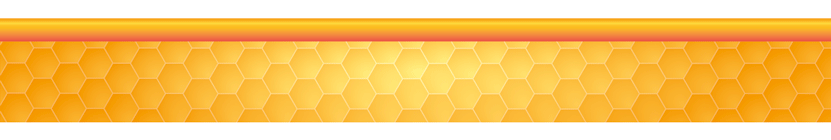

---
title: "**Estadísticas**"
---   


```{r i_4x, fig.align='center', echo=FALSE, cache=TRUE}



```

```{r setup, include=FALSE}
knitr::opts_chunk$set(echo = TRUE)
```


<div class=text-justify>


<br/>

## **5.1 Número de colmenas en México**
****

<br/>

La División Estadística de la FAO (FAOSTAT) tiene publicada información sobre el número de colmenas por país desde el año 1961 y hasta el 2017, la cual se resume para nuestro país, en la tabla y gráfica siguientes: 

<br/>

<p align="center"> **Cuadro 5.1. Colmenas en México, 1961-2017.** </p>


```{r tab01 , echo=FALSE,warning=FALSE }
library(DT)
bhvs <- read.csv("tabs/BeehivesMX.csv", encoding = "utf8")
names(bhvs) <- c("Año", "Colmenas en México")

DT::datatable(bhvs,filter = 'top', options = list(
   autoWidth = TRUE,pageLength = 5, language = list(
    info = "Mostrando registros del _START_ al _END_ de un total de _TOTAL_ registros",
    paginate = list(previous = 'Anterior', `next` = 'Siguiente'),
    search =  "Buscar:", lengthMenu = "Mostrar _MENU_ registros" )))
```

[*(Descargar datos)*](tabs/BeehivesMX.csv) 

<br/>


<br/>
<br/>

<p align="center"> **Gráfica 5.1. Colmenas en México, 1961-2017 (millones)** </p>

<br/>

```{r beehives , echo = FALSE, message = FALSE, warning = FALSE, fig.align='center',fig.height= 6, fig.width= 10,  out.width = "100%" }

library(dygraphs)
bhvs <- read.csv("tabs/BeehivesMX2.csv", encoding = "utf8")
Colmenas <- bhvs$Colmenas
p_anual_colmenas <- ts(Colmenas, start= 1961, end= 2017 , frequency=1)

dygraph(p_anual_colmenas, xlab ="Año") %>% 
  dySeries(c("V1"), label = "Número de Colmenas (millones)") %>%
  dyRangeSelector(dateWindow = c("1960-01-01", "2018-01-01"))


```


***Fuente:***

[FAOSTAT. (2017). *Datos sobre animales vivos.*](http://www.fao.org/faostat/en/#data/QA){target="_blank"}

<br/>
<br/>
<br/>


## **5.2 Producción de Miel por Entidad de 2003 a 2019** 
****

<br/>

En este punto se construyó un gráfico que concentra la producción de miel de las  entidades federativas con mayor producción durante el periodo del 2003 al 2019, para ello se consideraron los datos de producción en toneladas de miel anual, publicados por el SIAP, denominados [*Avance mensual de la producción pecuaria*.](http://infosiap.siap.gob.mx/repoAvance_siap_gb/pecAvanceProd.jsp){target="_blank"}

Cabe señalar que en el periodo de 2003 a 2019, las entidades con mayor producción de miel fueron Yucatán, Campeche, Jalisco, Veracruz y Chiapas.

<br/>

```{r graficamiel04, echo = FALSE, message = FALSE, fig.height= 8, fig.width= 10, warning = FALSE, cache=F}

library(plotly)

bx <- read.csv("tabs/ent_ton_miel_03_19.csv", encoding = "utf8")
bx2 <- bx[1:32,-1]
bx3 <- as.data.frame(t(bx2))
estados <- c("AGS","BCN","BCS","CAM","COA","COL","CHIS","CHI","CDMX","DGO","GTO","GRO",
             "HGO","JAL","MEX","MICH","MOR","NAY","NL","OAX","PUE","QUE","QROO","SLP",
             "SIN","SON","TAB","TAM","TLAX","VER","YUC","ZAC")
names(bx3) <- estados
bx3$years <- c("2003","2004","2005","2006","2007","2008","2009","2010","2011","2012","2013","2014","2015","2016","2017","2018", "2019")

bx3$years <- factor(bx3$years, levels = bx3[["years"]])

p1 <- plot_ly(bx3, x = ~years, y = ~YUC, name = 'Yucatán', type = 'scatter', mode = 'lines',line = list(color = 'violetred', width = 4, dash = NULL)) %>%
 # add_trace(y = ~BCN, name = 'Baja California', line = list(color = 'black', width = 4, dash = 'dashdot')) %>%
 # add_trace(y = ~BCS, name = 'Baja California Sur', line = list(color = 'darkblue', width = 4, dash = NULL)) %>%
  add_trace(y = ~CAM, name = 'Campeche', line = list(color = 'green', width = 4, dash = NULL)) %>%
 # add_trace(y = ~COA, name = 'Coahuila', line = list(color = 'rgb(205, 132, 84)', width = 4, dash = 'dot')) %>%
 # add_trace(y = ~COL, name = 'Colima', line = list(color = 'dodgerblue', width = 4, dash = 'dot')) %>%
  add_trace(y = ~CHIS, name = 'Chiapas', line = list(color = 'cyan', width = 4, dash = NULL)) %>%
 # add_trace(y = ~CHI, name = 'Chihuahua', line = list(color = 'darkorchid', width = 4, dash = 'dot')) %>%
 # add_trace(y = ~CDMX, name = 'Ciudad de México', line = list(color = 'green', width = 4, dash = 'dot')) %>%
 # add_trace(y = ~DGO, name = 'Durango', line = list(color = 'tan2', width = 4, dash = NULL)) %>%
# add_trace(y = ~GTO, name = 'Guanajuato', line = list(color = 'gold4', width = 4, dash = 'dashdot')) %>%
  add_trace(y = ~GRO, name = 'Guerrero', line = list(color = 'magenta', width = 4, dash = 'dot')) %>%
#  add_trace(y = ~HGO, name = 'Hidalgo', line = list(color = 'blueviolet', width = 4, dash = 'dashdot')) %>%
  add_trace(y = ~JAL, name = 'Jalisco', line = list(color = 'chartreuse', width = 4, dash = NULL)) %>%
 # add_trace(y = ~MEX, name = 'Estado de México', line = list(color = 'red', width = 4, dash = 'dashdot')) %>%
  add_trace(y = ~MICH, name = 'Michoacán', line = list(color = 'gold4', width = 4, dash = 'dashdot')) %>%
#  add_trace(y = ~MOR, name = 'Morelos', line = list(color = "cyan", width = 4, dash = 'dot')) %>%
 # add_trace(y = ~NAY, name = 'Nayarit', line = list(color = 'purple', width = 4, dash = NULL)) %>%
#  add_trace(y = ~NL, name = 'Nuevo León', line = list(color = 'chartreuse', width = 4, dash = 'dot')) %>%
  add_trace(y = ~OAX, name = 'Oaxaca', line = list(color = 'orange', width = 4, dash = NULL)) %>% 
  add_trace(y = ~PUE, name = 'Puebla', line = list(color = 'pink', width = 4, dash = NULL)) %>%
 # add_trace(y = ~QUE, name = 'Querétaro', line = list(color = 'grey', width = 4, dash = 'dot')) %>% 
  add_trace(y = ~QROO, name = 'Quintana Roo', line = list(color = 'magenta', width = 4, dash = NULL)) %>% 
 # add_trace(y = ~SLP, name = 'San Luis Potosí', line = list(color = 'orange', width = 4, dash = 'dashdot')) %>%
 # add_trace(y = ~SIN, name = 'Sinaloa', line = list(color = 'pink', width = 4, dash = 'dashdot')) %>%
#  add_trace(y = ~SON, name = 'Sonora', line = list(color = 'darkslategray', width = 4, dash = "dot")) %>% 
 # add_trace(y = ~TAB, name = 'Tabasco', line = list(color = 'gold', width = 4, dash = NULL)) %>% 
 # add_trace(y = ~TAM, name = 'Tamaulipas', line = list(color = 'slateblue', width = 4, dash = NULL)) %>%
 # add_trace(y = ~TLAX, name = 'Tlaxcala', line = list(color = 'turquoise', width = 4, dash = 'dashdot')) %>%
  add_trace(y = ~VER, name = 'Veracruz', line = list(color = 'springgreen', width = 4, dash = 'dashdot')) %>%
 # add_trace(y = ~YUC, name = 'Yucatán', line = list(color = 'violetred', width = 4, dash = NULL)) %>%
  add_trace(y = ~ZAC, name = 'Zacatecas', line = list(color = 'sienna', width = 4, dash = NULL)) %>%
  layout(title = "Gráfica 5.2. Producción de Miel de las Entidades Federativas más productoras, 2003-2019",
         xaxis = list(title = "Año"),
         yaxis = list (title = "Toneladas producidas"))
p1


```
 
Nota: Información del año 2019, son cifras preliminares a diciembre 2019.
<br/>
*(Dar doble clic en la entidad federativa de interés para visualizarla de forma aislada).* 
[*(Descargar datos)*](tabs/ent_ton_miel_03_19.csv)

<br/>
<br/>

Los datos completos de todas los estados pueden consultarse en la siguiente tabla:

<br>

<p align="center"> **Cuadro 5.2. Producción de Miel por Entidad Federativa, 2003-2019 (Toneladas)** </p>
<br/>

```{r tab5_2, echo=FALSE, fig.align='left', warning=FALSE}
library(DT)
tab5_2 <- read.csv("tabs/ent_ton_miel_03_19_2.csv", encoding = "utf8")
names(tab5_2) <- c("Estado","2003","2004","2005","2006","2007","2008","2009","2010","2011","2012","2013","2014","2015","2016","2017","2018","2019")

DT::datatable(tab5_2, filter = 'top', options = list(
  pageLength = 5, autoWidth = TRUE, scrollX = TRUE,
  fixedColumns = TRUE, language = list(
    info = "Mostrando registros del _START_ al _END_ de un total de _TOTAL_ registros",
    paginate = list(previous = 'Anterior', `next` = 'Siguiente'),
    search =  "Buscar:", lengthMenu = "Mostrar _MENU_ registros" )
  ))

```
<br/>

***Fuente:***

SADER (2019).

[*(Descargar datos)*](tabs/export_ton.csv) 

<br/>
<br/>
<br/>


## **5.3 Producción de Miel por municipio 2018**
****
<br/>

A continuación, se presentan datos sobre la producción de miel a nivel municipio, del 2018

<br/>
<p align="center"> **Cuadro 5.3. Producción de Miel por municipio, 2018** </p>
<br/>

```{r tabmun18, echo=FALSE }

tabmun_18 <- read.csv("tabs/Prodmiel2018muni.csv", encoding = "utf8")
names(tabmun_18) <- c( "ESTADO","MUNICIPIO", "VOLUMEN  (litros)", "VALOR  (pesos)")

DT::datatable(tabmun_18,filter = 'top', options = list(
  pageLength = 5, autoWidth = TRUE, language = list(
    info = "Mostrando registros del _START_ al _END_ de un total de _TOTAL_ registros",
    paginate = list(previous = 'Anterior', `next` = 'Siguiente'),
    search =  "Buscar:", lengthMenu = "Mostrar _MENU_ registros" )
  ))

```


[*Descargar datos*](tabs/Prodmiel2018muni.csv) 

<br/>
<br/>
<br/>

## **5.4 Otras Estadísticas por Entidad Federativa**
****
<br/>

Los poco más de 43,000 apicultores que hay en México se encuentran registrados en 508 asociaciones ganaderas especializadas en apicultura, conforme a la [Ley de Organizaciones Ganaderas](http://www.diputados.gob.mx/LeyesBiblio/pdf/57.pdf){target="_blank"}, y 110 de otros tipos. 

<br/>

```{r graf_b1, fig.align='center', fig.height= 6, fig.width= 10, echo=FALSE, out.width = "100%", cache=TRUE, warning=FALSE}

asoc_ent_2 <- read.csv("tabs/estadisticas.csv", encoding="utf8")

asoc_ent_2a <- asoc_ent_2
asoc_ent_2a$orga_asoc_apic <- asoc_ent_2a$ASOCIACIONES_APICOLAS + asoc_ent_2a$OTRAS_ORGANIZACIONES
asoc_ent_2a <- subset(asoc_ent_2a, orga_asoc_apic>0)
orden_asoc2 <-order(asoc_ent_2a$orga_asoc_apic, decreasing = T)
asoc_ent_2a <- asoc_ent_2a[orden_asoc2,]

datos2a <- data.frame(asoc_ent_2a$Entidad, asoc_ent_2a$orga_asoc_apic)   
datos2a$Entidad <- factor(datos2a$asoc_ent_2a.Entidad, levels = datos2a[["asoc_ent_2a.Entidad"]])


library(plotly)

p2 <- plot_ly(datos2a, x = ~datos2a$Entidad, y = ~datos2a$asoc_ent_2a.orga_asoc_apic, type = 'bar',
             marker = list(color = 'rgb(49,130,189)')) %>%
  layout(title = ("Gráfica 5.3. Asociaciones Apícolas por Entidad Federativa, 2017"),
         xaxis = list(title = "Año", tickangle =-45),
         yaxis = list(title = "Número de Asociaciones"),
         margin = list(b = 100),
         barmode = 'group')
p2 


```
<p align="center"> *Fuente: Sistema de Información Agroalimentaria de Consulta (SIACON), 2017.* </p>


<br/>
<br/>
<br/>

En lo referente a actividades específicas de la cadena productiva apícola, se encuentran datos sobre acopiadores de miel por entidad.

<br/>

```{r graf_b2, fig.align='center', fig.height= 6, fig.width= 10, echo=FALSE, out.width = "100%", cache=TRUE, warning=FALSE, message=FALSE}

estadisticas_t1 <- read.csv("tabs/estadisticas.csv", encoding="utf8")

acopiador1<- estadisticas_t1[estadisticas_t1[,5]>0,c(1,5)]
orden_acopiador1<-order(acopiador1 $ACOPIADORES_DE_MIEL, decreasing = T)
estadisticas_t1_3<-acopiador1[orden_acopiador1,]
xestados_t1<-(estadisticas_t1_3)[,1]
yacopiador_t1<-(estadisticas_t1_3)[,2]
datos1 <- data.frame(xestados_t1, yacopiador_t1)   #data <- data.frame(x, y1, y2)
datos1$xestados_t1 <- factor(datos1$xestados_t1, levels = datos1[["xestados_t1"]]) 

grafica1 <- plot_ly(datos1, x = ~xestados_t1, y = ~yacopiador_t1, type = 'bar', marker = list(color = 'deepskyblue2'),
                                                                                          line= list(color = 'rgb(8,48,107)', width = 1)) %>%
  layout(title = ("Gráfica 5.4. Unidades Económicas Acopiadoras de Miel por Entidad Federativa, 2017"),
         xaxis = list(title = "", tickangle = -50),  
         size = 16,
         yaxis = list(title = ""),
         margin = list(b = 100),
         barmode = 'group')
grafica1


```
<p align="center"> *Fuente: Sistema de Información Agroalimentaria de Consulta (SIACON), 2017.* </p>

<br/>
<br/>
<br/>

No obstante, al observar la cantidad de unidades económicas exportadoras de miel en el país, se hace notorio que es necesario impulsar esta actividad, ya que los exportadores representan un porcentaje muy pequeño respecto al número de productores en el país.

<br/>

```{r graf_b3, fig.align='center',fig.height= 6, fig.width= 10, echo=FALSE, out.width = "100%", cache=TRUE, warning=FALSE, message=FALSE}

estadisticas_t2 <- read.csv("tabs/estadisticas.csv", encoding="utf8")

exportador2<- estadisticas_t2[estadisticas_t2[,6]>0,c(1,6)]
orden_exportador2<-order(exportador2$EXPORTADORES, decreasing = T)
estadisticas_t2_4<-exportador2[orden_exportador2,]
xestados_t2<-(estadisticas_t2_4)[,1]
yexportador_t2<-(estadisticas_t2_4)[,2]

datos2 <- data.frame(xestados_t2, yexportador_t2)   #data <- data.frame(x, y1, y2)
datos2$xestados_t2 <- factor(datos2$xestados_t2, levels = datos2[["xestados_t2"]]) 

grafica2 <- plot_ly(datos2, x = ~xestados_t2, y = ~yexportador_t2, type = 'bar', marker = list(color = 'deepskyblue2')) %>%
  layout(title = ("Gráfica 5.5. Unidades Económicas Exportadoras de Miel por Entidad Federativa, 2017"),
         xaxis = list(title = "", tickangle = 45),  
         size = 16,
         yaxis = list(title = ""),
         margin = list(b = 100),
         barmode = 'group')
grafica2


```
<p align="center"> *Fuente: Sistema de Información Agroalimentaria de Consulta (SIACON), 2017.*  </p>

<br/>
<br/>
<br/>

Con respecto a la crianza de abejas reina y producción de núcleos, también existen pocas unidades económicas dedicadas a estas actividades. Los siguientes cuadros muestran estos datos.

<br/>

<p align="center"> **Cuadro 5.4. Criaderos certificados de abejas reina por entidad federativa, 2017-2019** </p>

<br/>

```{r tab5_6_1, echo=FALSE }

tab5_6_1 <- read.csv("tabs/Criadores_Tabla_a1.csv", encoding="utf8")
names(tab5_6_1) <- c( "Entidad", "Criaderos de Abejas Reinas Certificados durante 2017", "Criaderos de Abejas Reinas Certificados durante 2018", "Criaderos de Abejas Reinas Certificados durante 2019", "Capacidad de Criaderos de Abejas Reinas Certificados durante 2017", "Capacidad de Criaderos de Abejas Reinas Certificados durante 2018",  "Capacidad de Criaderos de Abejas Reinas Certificados durante 2019")

DT::datatable(tab5_6_1,filter = 'top', options = list(
  pageLength = 5, autoWidth = TRUE, language = list(
    info = "Mostrando registros del _START_ al _END_ de un total de _TOTAL_ registros",
    paginate = list(previous = 'Anterior', `next` = 'Siguiente'),
    search =  "Buscar:", lengthMenu = "Mostrar _MENU_ registros" )
  ))

```
<br/>
<br/>

<p align="center"> **Cuadro 5.5. Criaderos certificados de abejas reina progenitoras por entidad federativa, 2017-2019** </p>

<br/>

```{r tab5_6_2, echo=FALSE }

tab5_6_2 <- read.csv("tabs/Criadores_Tabla_a2.csv", encoding="utf8")
names(tab5_6_2) <- c( "Entidad", "Criaderos de Abejas Reina Progenitoras Certificados durante 2017", "Criaderos de Abejas Reina Progenitoras Certificados durante 2018", "Criaderos de Abejas Reina Progenitoras Certificados durante 2019", "Capacidad de Criaderos de Abejas Reina Progenitoras Certificados durante 2017",  "Capacidad de Criaderos de Abejas Reina Progenitoras Certificados durante 201",  "Capacidad de Criaderos de Abejas Reina Progenitoras Certificados durante 2019")

DT::datatable(tab5_6_2,filter = 'top', options = list(
  pageLength = 5, autoWidth = TRUE, language = list(
    info = "Mostrando registros del _START_ al _END_ de un total de _TOTAL_ registros",
    paginate = list(previous = 'Anterior', `next` = 'Siguiente'),
    search =  "Buscar:", lengthMenu = "Mostrar _MENU_ registros" )
  ))

```

<br/>
<br/>

<p align="center"> **Cuadro 5.6. Criaderos certificados de núcleos de abejas por entidad federativa, 2017-2019** </p>

<br/>

```{r tab5_6_3, echo=FALSE }

tab5_6_3 <- read.csv("tabs/Criadores_Tabla_a3.csv", encoding="utf8")
names(tab5_6_3) <- c( "Entidad", "Criaderos de núcleos de abejas Certificados durante 2017", "Criaderos de núcleos de abejas Certificados durante 2018", "Criaderos de núcleos de abejas Certificados durante 2019", "Capacidad de Criaderos de núcleos de abejas Certificados durante 2017",  "Capacidad de Criaderos de núcleos de abejas Certificados durante 2018", "Capacidad de Criaderos de núcleos de abejas Certificados durante 2019")

DT::datatable(tab5_6_3,filter = 'top', options = list(
  pageLength = 5, autoWidth = TRUE, language = list(
    info = "Mostrando registros del _START_ al _END_ de un total de _TOTAL_ registros",
    paginate = list(previous = 'Anterior', `next` = 'Siguiente'),
    search =  "Buscar:", lengthMenu = "Mostrar _MENU_ registros" )
  ))

```


<p align="center"> *Fuente: SADER.* </p>

<br/>
<br/>
<br/>

Por otra parte, la certificación de abejas reina garantiza a los productores la calidad genética y sanitaria de las abejas reina que comercializan, evitando con ello la movilización de abejas reina sin control, a efecto de disminuir la transmisión de enfermedades de las abejas. 

<br/>

Además de la miel, se producen otros derivados apícolas. El principal subproducto en cuanto a volumen, es la cera. Sus principales usos son en las industrias farmacéutica y cosmética. Yucatán se destaca como el principal productor de cera de abeja a nivel nacional.

<br/>

```{r graf_b6, fig.align='center', fig.height= 6, fig.width= 10, echo=FALSE, out.width = "100%", cache=TRUE, warning=FALSE, message=FALSE}

library(plotly)

estadisticas_t1 <- read.csv("tabs/estadisticas.csv", encoding="utf8")
peso <- estadisticas_t1[estadisticas_t1[,14]>0,c(1,14)]
orden_peso<-order(peso$cera_ton_2018, decreasing = T)
estadisticas_t1_2<-peso[orden_peso,]
xestados_t<-(estadisticas_t1_2)[,1]
ypeso_cera_t<-(estadisticas_t1_2)[,2]
datos3 <- data.frame(xestados_t, ypeso_cera_t)   
datos3$xestados_t <- factor(datos3$xestados_t, levels = datos3[["xestados_t"]]) 

grafica3 <- plot_ly(datos3, x = ~xestados_t, y = ~ypeso_cera_t, type = 'bar',
                   marker = list(color = 'deepskyblue2')) %>%
  layout(title = ("Gráfica 5.6. Producción de Cera por Entidad Federativa, 2017 (ton)"),
         xaxis = list(title = "", tickangle = -45),  
         size = 16,
         yaxis = list(title = "ton"),
         margin = list(b = 100),
         barmode = 'group')
grafica3

```
<p align="center"> *Fuente: Sistema de Información Agroalimentaria de Consulta (SIACON), 2018.* </p>

<br/>
<br/>
<br/>

En los últimos años, ha venido creciendo la producción de miel orgánica y de otros derivados apícolas. Este tipo de subproductos tienen mayor valor en el mercado, si bien su producción requiere cierto grado de especialización técnica por parte del apicultor. La siguente gráfica muestra los volúmenes de producción de miel orgánica por estado.
<br/>
<br/>

```{r graf_b7, fig.align='center', fig.height= 6, fig.width= 10, echo=FALSE, out.width = "100%", cache=TRUE, warning=FALSE}

miel_org <- read.csv("tabs/estadisticas.csv", encoding="utf8")
miel_org1<- subset(miel_org, miel_org[,13]>0)
ord_mielorg <- order(miel_org1[,13], decreasing = T)
miel_org2 <- miel_org1[ord_mielorg,]

miel_org2$x<- factor(miel_org2$Entidad, levels = miel_org2[["Entidad"]])

library(plotly)

p5 <- plot_ly(miel_org2, x = ~miel_org2$x, y = ~miel_org2[,13], type = 'bar',
              name = '', marker = list(color = 'rgb(49,130,189)')) %>%
  layout(title = ("Gráfica 5.7. Producción de Miel Orgánica por Entidad Federativa, 2017 (Ton)"),
         xaxis = list(title = "", tickangle =-45),
         yaxis = list(title = "toneladas"),
         margin = list(b = 100),
         barmode = 'group')
p5

```
<p align="center"> *Fuente: Sistema de Información Agroalimentaria de Consulta (SIACON), 2017.* </p>

<br/>
<br/>
<br/>

Los subproductos mencionados son los propóleos, la jalea real, y el polen. El precio de estos suele ser mucho mayor que el de la miel, dada la dificultad de su obtención. Por ello, se trata de un mercado en el que muchos apicultores aún no incursionan.

<br/>

```{r graf_b7a, fig.align='center', fig.height= 6, fig.width= 10, echo=FALSE, out.width = "100%", cache=TRUE, warning=FALSE}

derivados <- read.csv("tabs/estadisticas.csv", encoding="utf8")
derivados1<- subset(derivados, derivados[,15]>0 | derivados[,16]>0 | derivados[,17]>0 )
derivados2 <- data.frame(derivados1$Entidad, derivados1[,15], derivados1[,16], derivados1[,17])   
derivados2$x<- factor(derivados2$derivados1.Entidad, levels = derivados2[["derivados1.Entidad"]])

library(plotly)

p6 <- plot_ly(derivados2, x = ~derivados2[,5], y = ~derivados2[,2], type = 'bar',
              name = 'Jalea Real', marker = list(color = 'rgb(49,130,189)')) %>%
  add_trace(y = ~derivados2[,3], name = 'Polen', 
            marker = list(color = 'green')) %>% 
  add_trace(y = ~derivados2[,4], name = 'Propóleos', 
            marker = list(color = 'red')) %>% 
  layout(title = ("Gráfica 5.8. Producción de Derivados Apícolas por Entidad Federativa, 2017"),
         xaxis = list(title = "", tickangle =-45),
         yaxis = list(title = "kg"),
         margin = list(b = 100),
         barmode = 'group')
p6

```
<p align="center"> *Fuente: Sistema de Información Agroalimentaria de Consulta (SIACON), 2017.* </p>

<br/>
<br/>
<br/>

En lo referente a la superficie y número de terrenos dedicados a las actividades apícolas, existe una difereciación entre terrenos de tipo ejidal, comunal y privado. Más del 85% de los terrenos apícolas corresponden al tipo de ganadería ejidal. 

<br/>
```{r graf_b8, fig.align='center', fig.height= 6, fig.width= 12, echo=FALSE, out.width = "100%", cache=TRUE, warning=FALSE}

terr <- read.csv("tabs/superficie_apicola.csv", encoding = "utf8")
terr1 <- subset(terr, terr[,2]>0 | terr[,4]>0 | terr[,6]>0 )
terr2 <- data.frame(terr1$entidad, terr1[,2], terr1[,4], terr1[,6])
terr2$x<- factor(terr2$terr1.entidad, levels = terr2[["terr1.entidad"]])

library(plotly)

p7 <- plot_ly(terr2, x = ~terr2[,5], y = ~terr2[,2], type = 'bar',
              name = 'Terrenos Ejidales', marker = list(color = 'rgb(49,130,189)')) %>%
  add_trace(y = ~terr2[,3], name = 'Terrenos Comunales', 
            marker = list(color = 'green')) %>% 
  add_trace(y = ~terr2[,4], name = 'Terrenos Privados', 
            marker = list(color = 'red')) %>% 
  layout(title = ("Gráfica 5.9. Terrenos Dedicados a Actividades Apícolas, por Entidad Federativa (2017)"),
         xaxis = list(title = "", tickangle =-45),
         yaxis = list(title = "Número de terrenos"),
         margin = list(b = 100),
         barmode = 'group')
p7 

```
<p align="center"> *Fuente: Secretaría de Agricultura y Desarrollo Rural (SADER), 2017.* </p>

<br/>
<br/>
<br/>

Que expresados en hectáreas se distribuyen según la siguiente gráfica. Predomina la superficie ejidal dedicada a la apicultura en los estados de Yucatán, Campeche y Quintana Roo. 

<br/>
```{r graf_b9, fig.align='center', fig.height= 6, fig.width= 12, echo=FALSE, out.width = "100%", cache=TRUE, warning=FALSE}

hect <- read.csv("tabs/superficie_apicola.csv", encoding = "utf8")
hect1 <- subset(hect, hect[,3]>0 | hect[,5]>0 | hect[,7]>0 )
hect2 <- data.frame(hect1$entidad, hect1[,3], hect1[,5], hect1[,7])
hect2$x<- factor(hect2$hect1.entidad, levels = hect2[["hect1.entidad"]])

library(plotly)

p8 <- plot_ly(hect2, x = ~hect2[,5], y = ~hect2[,2], type = 'bar',
              name = 'Terrenos Ejidales', marker = list(color = 'rgb(49,130,189)')) %>%
  add_trace(y = ~hect2[,3], name = 'Terrenos Comunales', 
            marker = list(color = 'green')) %>% 
  add_trace(y = ~hect2[,4], name = 'Terrenos Privados', 
            marker = list(color = 'red')) %>% 
  layout(title = ('Gráfica 5.10. Superficie Dedicada a Actividades Apícolas, por Entidad Federativa, 2017'),
         xaxis = list(title = "", tickangle =-45),
         yaxis = list(title = "Hectáreas"),
         margin = list(b = 100),
         barmode = 'group')
p8 


```
<p align="center"> *Fuente: Secretaría de Agricultura y Desarrollo Rural (SADER), 2017.* </p>

<br/>
<br/>
<br/>

##  **5.5. Balanza Comercial de México. Importación y Exportación**   
****

<br/>

La exportación de miel mexicana se incrementó en 11.73% en el primer semestre de 2018 en comparación con el periodo homólogo anterior al alcanzar, en valor, 71 millones de dólares (MDD), mientras que en enero-junio del año pasado se contabilizaron 63 MDD.  
Lo anterior, gracias a las políticas públicas, destinadas a incentivar esta actividad, que puso en práctica la SADER, así como al esfuerzo de los productores apícolas nacionales.  

Según estimaciones de la dependencia, con datos del Banco de México, la miel es uno de los principales productos pecuarios de nuestro país que se venden en el extranjero y durante el 2017 se consiguieron ventas por 105 MDD.  

En este caso, se informó que el Servicio Nacional de Sanidad, Inocuidad y Calidad Agroalimentaria (SENASICA) cuenta con el Programa de Monitoreo de Residuos Tóxicos y Contaminantes para certificar que la miel de abeja no contenga contaminantes físicos, químicos o microbiológicos, que pudieran afectar la salud de los consumidores y la calidad del producto.  

Personal del organismo de la SADER recolecta muestras aleatoriamente en las unidades de producción de miel orgánica o convencional del país y las canaliza al Centro Nacional de Servicios de Constatación en Salud Animal (CENAPA) para su análisis.  

En los laboratorios del CENAPA, los técnicos realizan pruebas con equipo moderno para constatar que la miel cumple con los estándares más altos de inocuidad que demandan los mercados de México y el mundo.  

Los análisis que se practican están basados en los lineamientos establecidos en las regulaciones del *Codex Alimentarius* de la FAO y la Unión Europea, relacionados con los Límites Máximos de Residuos para asegurar la inocuidad y calidad del producto.  

La apicultura mexicana produce, además de miel, otros productos como polen, jalea real, propóleos e incluso su apitoxina o veneno, el cual resulta benéfico para la población, por sus propiedades nutricionales y terapéuticas.  

Esta actividad constituye una importante fuente de empleos e ingresos, se ubica entre los tres primeros lugares en el subsector pecuario como generadora de divisas por concepto de la exportación de miel.  

México es hábitat de una amplia variedad de abejas, calculada en cerca de dos mil especies, lo que es muy benéfico ya que estos insectos realizan la polinización del 87% de las 352 mil especies de plantas con flor que existen en nuestro planeta; entre ellas un tercio de las especies agrícolas.  

En los últimos 10 años México ha registrado una producción promedio de 57 mil toneladas del producto; hasta mayo de 2018 se reportan 28.7 mil toneladas, 34 por ciento más de lo reportado en mayo del 2017.  

Es por ello, que el SENASICA, la Secretaría de Medio Ambiente y Recursos Naturales (SEMARNAT) y la Universidad Nacional Autónoma de México (UNAM), llevan a cabo acciones para proteger la actividad apícola, en coordinación con autoridades homólogas de Estados Unidos y Canadá.  

***Fuente:***

[SADER. (2018). *Nota de Prensa.* Agosto.](https://www.gob.mx/sader/prensa/se-incrementa-en-el-primer-semestre-del-ano-la-exportacion-de-miel-mexicana-en-mas-de-11-por-ciento?idiom=es){target="_blank"}


<br/>

A continuación, se presentan algunos datos sobre el valor de las exportaciones de miel mexicana en los últimos años:

<br/>

<p align="center"> **Cuadro 5.7. Valor de Exportaciones Mensuales de Miel, 1993-2018** </p>

<br/>

```{r tab3_16_1, echo=FALSE }

tab3_16 <- read.csv("tabs/3_16_1_exportamiel.csv", encoding = "utf8")
names(tab3_16) <- c( "AÑO","MES", "Exportación Miel (miles de dolares)")

DT::datatable(tab3_16,filter = 'top', options = list(
  pageLength = 5, autoWidth = TRUE, language = list(
    info = "Mostrando registros del _START_ al _END_ de un total de _TOTAL_ registros",
    paginate = list(previous = 'Anterior', `next` = 'Siguiente'),
    search =  "Buscar:", lengthMenu = "Mostrar _MENU_ registros" )
  ))

```

[*Descargar datos*](tabs/3_16_1_exportamiel.csv)


<br/>

Por otra parte, si se analiza el comportamiento de las exportaciones mensuales de miel en México mediante un gráfico historico o serie de tiempo, puede observarse la tendencia cíclica del volumen de ventas en dólares, mostrando picos entre los meses de abril-julio de cada año, y marcados descensos en las exportaciones en los meses de agosto-noviembre, que refleja las épocas de mayor floración y el periodo inmediato a la mayor produción y extracción de miel (en el que las colmenas apenas comienzan a recuperarse), respectivamente:

<br/>

<p align="center"> **Gráfica 5.11. Exportaciones Mensuales de Miel, 1993-2018** </p>

<br/>


```{r exportaMiel , echo = FALSE, message = FALSE, warning = FALSE, fig.align='center',fig.height= 6, fig.width= 10,  out.width = "100%" }

library(dygraphs)

exmiel <- read.csv("tabs/3_16_1_exportamiel.csv", encoding = "utf8")
exmildls <- exmiel$SE32403
exmildlsxmes <- ts(exmildls, start= c(1993,1) , end= c(2018,12) , frequency=12)

dygraphs::dygraph(exmildlsxmes) %>% 
dygraphs::dySeries(c("V1"), label = "Miles de dolares") %>%
dygraphs::dyRangeSelector()

```

<br/>


***Fuente:***

[BANXICO. Sistema de Información Económica. (2018). *Exportación de Productos Agropecuarios (Miel).*](http://www.banxico.org.mx/SieInternet/consultarDirectorioInternetAction.do?accion=consultarCuadro&idCuadro=CE122&locale=es){target="_blank"}

<br/>
<br/>

Los principales destinos de las exportaciones pueden apreciarse en la siguiente gráfica:

<br/>

```{r graficaexport, echo = FALSE, message = FALSE, fig.height= 6, fig.width= 10, warning = FALSE, cache=F}

library(plotly)

dest <- read.csv("tabs/destinos.csv", encoding = "utf8")
dest2 <- (dest[1:6,-1])/1000000
dest3 <- as.data.frame(t(dest2))
paises <- c("ALEM","USA","UK","ARAB_SAUD","SUIZA","BELG")
names(dest3) <- paises
dest3$years <- c("2002","2003","2004","2005","2006","2007","2008","2009","2010","2011","2012","2013","2014","2015","2016","2017","2018","2019")
dest3$years <- factor(dest3$years, levels = dest3[["years"]])

pexp <- plot_ly(dest3, x = ~years, y = ~ALEM, name = 'Alemania', type = 'scatter', mode = 'lines',
              line = list(color = 'rgb(205, 12, 24)', width = 4)) %>%
  add_trace(y = ~USA, name = 'Estados Unidos', line = list(color = 'darkblue', width = 4, dash = NULL)) %>%
  add_trace(y = ~UK, name = 'Reino Unido', line = list(color = 'green', width = 4, dash = NULL)) %>%
  add_trace(y = ~ARAB_SAUD, name = 'Arabia Saudita', line = list(color = 'cyan', width = 4, dash = NULL)) %>%
  add_trace(y = ~SUIZA, name = 'Suiza', line = list(color = 'darkorchid', width = 4, dash = NULL)) %>%
  add_trace(y = ~BELG, name = 'Bélgica', line = list(color = 'dodgerblue', width = 4, dash = NULL))  %>%
  layout(title = "Gráfica 5.12. Valor de las exportaciones a los principales países de destino, 2002-2019*",
         xaxis = list(title = "Año"),
         yaxis = list (title = "Millones de dólares"))
pexp 

```

<br/>


***Fuente:***

[INEGI. (2019) *Estadísticas de Comercio Exterior* (\*Las cifras de 2019 son preliminares). ](https://www.inegi.org.mx/datos/?t=0030000000000000){target="_blank"}

<br/>

[*Descargar datos*](tabs/import_export.xlsx)

<br/>
<br/>

En términos de volúmenes, la siguiente tabla concentra las exportaciones por país de destino del 2002 al 2019. 


<br/>

<p align="center"> **Cuadro 5.8. Volumen de Exportaciones Mensuales de Miel (Toneladas), 2002-2019** </p>
<br/>

```{r tab00030, echo=FALSE, fig.align='left', warning=FALSE}
library(DT)
tab0030 <- read.csv("tabs/export_ton.csv", encoding = "utf8")
names(tab0030) <- c("País","2002","2003","2004","2005","2006","2007","2008","2009","2010","2011","2012","2013","2014","2015","2016","2017","2018","2019")

DT::datatable(tab0030,filter = 'top', options = list(
  pageLength = 5, autoWidth = TRUE, scrollX = TRUE,
  fixedColumns = TRUE, language = list(
    info = "Mostrando registros del _START_ al _END_ de un total de _TOTAL_ registros",
    paginate = list(previous = 'Anterior', `next` = 'Siguiente'),
    search =  "Buscar:", lengthMenu = "Mostrar _MENU_ registros" )
  ))

```
<br/>

***Fuente:***

[INEGI. (2019) *Estadísticas de Comercio Exterior* (\*Las cifras de 2019 son preliminares). ](https://www.inegi.org.mx/datos/?t=0030000000000000){target="_blank"}

<br/>


[*Descargar datos*](tabs/export_ton.csv)

<br/>
<br/>

En contraste, la importación de miel es mucho menor en comparación con las exportaciones. En los últimos 15 años, sólo en 2010 se registró un máximo en este rubro.

<br/>

```{r importaMiel , echo = FALSE, message = FALSE, warning = FALSE, fig.align='center',fig.height= 6, fig.width= 10,  out.width = "100%" }

library(plotly)

immiel <- read.csv("tabs/import_2004_2019.csv", encoding = "utf8")

importac <- plot_ly(immiel, x = ~anio, y = ~(dolares), type = 'scatter', 
              mode = 'lines', line = list(color = 'darkblue', 
                                          width = 4))  %>%
  layout(title = "Gráfica 5.13. Importaciones Anuales de Miel, 2004-2019",
         xaxis = list(title = "Año"),
         yaxis = list (title = "Miles de Dólares"))
importac


```

<br/>

<p align="center"> [*Descargar datos*](tabs/import_export.xlsx) </p>

<br/>


***Fuente:***

[INEGI. (2018). *Estadísticas de Comercio Exterior* (Los datos de 2019 son preliminares).](https://www.inegi.org.mx/datos/?t=0030000000000000){target="_blank"}

<br/>

</div>
