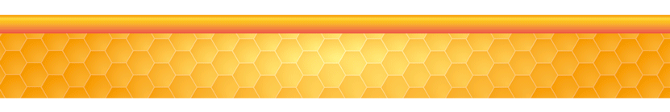

---
title: "**Mapas**"
--- 


```{r i_5x, fig.align='center', echo=FALSE, cache=TRUE}



```

```{r setup, include=FALSE}
knitr::opts_chunk$set(echo = TRUE)
```


<div class=text-justify>
<br/>

## **6.1 Producción de Miel y Apicultores en México (Sector Primario)**
****

<br>

### 6.1.1 Producción de miel por Entidad Federativa

**En el siguiente mapa se muestra la producción en toneladas de miel de 2018, por entidad federativa.** 

<br/>

```{r mapaleaflet1, echo=FALSE, message=FALSE, warning=FALSE, fig.height=6, cache =TRUE, out.width = "100%"}

knitr::opts_chunk$set(echo=FALSE, message = FALSE, warning = FALSE)

library(sp)
library(rgdal)
library(leaflet)
library(leaflet.extras)
library(mapview)  


prod_miel <- readOGR("geodata", "ent_a", verbose=FALSE, encoding = "UTF")
prodmiel2018 <- read.csv("tabs/prodmiel2018.csv", head= T)
prod_miel$total2018 <- prodmiel2018[,3]
map_prod_miel <- leaflet(data=prod_miel)
clust <- kmeans(prod_miel$total2018,5)
#breaks <- sort(c(0, max((prod_miel$total2018)[clust$cluster == 1]),
#                 max((prod_miel$total2018)[clust$cluster == 2]),
#                 max((prod_miel$total2018)[clust$cluster == 3]),
#                 max((prod_miel$total2018)[clust$cluster == 4]),
#                max((prod_miel$total2018)[clust$cluster == 5])))
#breaks2 <- c((round(breaks[-6],1)),(ceiling(breaks[6])))
breaks2 <- c(1,600,1400,3200,6000,9800)
binpal <- colorBin("Oranges", prod_miel$total2018, breaks2)

map_prod_miel %>%
  setView(lng = -102.43, lat = 22.37, zoom = 5.4) %>%
  addTiles() %>% addFullscreenControl() %>%
  addPolygons(
    stroke = FALSE,
    fillOpacity = 0.7,
    smoothFactor = 0.1,
    color = ~binpal(total2018),
    popup = paste0("<strong>CVE_ENT: </strong>", prod_miel$CVE_ENT, "</br>",
                   "<strong>ENTIDAD: </strong>", prod_miel$NOMGEO, "</br>",
                   "<strong>PRODUCCIÓN: </strong>", prod_miel$total2018)
  ) %>%
  addLegend(
    "bottomleft", pal = binpal, values = ~total2018,
    title = "Producción de Miel <br/> (Toneladas)",
    opacity = 0.7
  )

```

<p align="center"> **Mapa 6.1 Producción de miel por Entidad Federativa, 2018.** [`r icon::fa("download")`](tabs/prodmiel2018.csv) </p>

<br/>

***Fuente:***

[SADER. Servicio de Información Agroalimentaria y Pesquera (SIAP). (2018). *Avance mensual de la producción pecuaria.*](http://infosiap.siap.gob.mx/repoAvance_siap_gb/pecAvanceProd.jsp){target="_blank"} [`r icon::fa("download")`](tabs/prodmiel2018_2.csv)

<br/>
<br/>
<br/>

### 6.1.2 Número de Colmenas 

Si se analiza el dato de colmenas por entidad federativa, se nota el predominio de los estados de la península de Yucatán y el sureste del país. Los datos disponibles son de 2017.

```{r map_colm, echo = FALSE, message = FALSE, fig.height=6, warning = FALSE, out.width = "100%", cache=TRUE}

knitr::opts_chunk$set(echo=FALSE, message = FALSE, warning = FALSE)

library(sp)
library(rgdal)
library(leaflet)
library(leaflet.extras)
library(mapview)  

mapa_base <- readOGR("geodata", "ent_a", verbose=FALSE, encoding = "UTF")
colm_ent <- read.csv("tabs/colmenas.csv")
mapa_base$colmenas <- colm_ent[,2]
map_colm <- leaflet(data=mapa_base)
clust2 <- kmeans(mapa_base$colmenas,5)
#breaks3 <- sort(c(1, max((mapa_base$colmenas)[clust2$cluster == 1]),
#                 max((mapa_base$colmenas)[clust2$cluster == 2]),
#                 max((mapa_base$colmenas)[clust2$cluster == 3]),
#                 max((mapa_base$colmenas)[clust2$cluster == 4]),
#                 max((mapa_base$colmenas)[clust2$cluster == 5])))
#breaks4 <- c((round(breaks3[-6],1)),(ceiling(breaks3[6])))
breaks4 <- c(1,19000,44000,91000,161000,251000)
binpal2 <- colorBin("Blues", mapa_base$colmenas, breaks4)

map_colm %>%
  setView(lng = -102.43, lat = 22.37, zoom = 5.4) %>%
  addTiles() %>% addFullscreenControl() %>%
  addPolygons(
    stroke = FALSE,
    fillOpacity = 0.7,
    smoothFactor = 0.1,
    color = ~binpal2(colmenas),
    popup = paste0("<strong>CVE_ENT: </strong>", mapa_base$CVE_ENT, "</br>",
                   "<strong>ENTIDAD: </strong>", mapa_base$NOMGEO, "</br>",
                   "<strong>NÚMERO DE COLMENAS: </strong>", mapa_base$colmenas)
  ) %>%
 addLegend("bottomleft", pal = binpal2, values = ~colmenas,
    title = "Número de Colmenas",
    opacity = 0.7
  )


```

<p align="center"> **Mapa 6.2 Número de Colmenas por Entidad Federativa, 2017.** [`r icon::fa("download")`](tabs/colmenas.csv) </p>

***Fuente:***

[SADER. (2018). *Datos abiertos*.](https://datos.gob.mx/busca/dataset/produccion-de-miel-2017){target="_blank"}

<br/>
<br/>
<br/>

### 6.1.3 Apicultores

Según datos del *Sistema de Información Agroalimentaria de Consulta (SIACON)* de la Secretaría de Agricultura y Desarrollo Rural (SADER), en el país se registró en 2017 un total de 43,478 apicultores, distribuidos en todos los estados según el siguiente mapa.

```{r map_apic, echo = FALSE, message = FALSE, fig.height=6, warning = FALSE, out.width = "100%", cache=TRUE}

knitr::opts_chunk$set(echo=FALSE, message = FALSE, warning = FALSE)

library(sp)
library(rgdal)
library(leaflet)
library(leaflet.extras)
library(mapview)  

mapa_base2 <- readOGR("geodata", "ent_a", verbose=FALSE, encoding = "UTF")
apic_ent <- read.csv("tabs/estadisticas.csv")
mapa_base2$apicult <- apic_ent[,2]
map_apicult <- leaflet(data=mapa_base2)
clust3 <- kmeans(mapa_base2$apicult,5)
#breaks5 <- sort(c(1, max((mapa_base2$apicult)[clust3$cluster == 1]),
#                 max((mapa_base2$apicult)[clust3$cluster == 2]),
#                 max((mapa_base2$apicult)[clust3$cluster == 3]),
#                 max((mapa_base2$apicult)[clust3$cluster == 4]),
#                 max((mapa_base2$apicult)[clust3$cluster == 5])))
#breaks6 <- c((round(breaks5[-6],1)),(ceiling(breaks5[6])))
breaks6 <- c(1,290,560,1350,6800,10500)
binpal3 <- colorBin("Purples", mapa_base2$apicult, breaks6)

map_apicult %>%
  setView(lng = -102.43, lat = 22.37, zoom = 5.4) %>%
  addTiles() %>% addFullscreenControl() %>%
  addPolygons(
    stroke = FALSE,
    fillOpacity = 0.7,
    smoothFactor = 0.1,
    color = ~binpal3(apicult),
    popup = paste0("<strong>CVE_ENT: </strong>", mapa_base2$CVE_ENT, "</br>",
                   "<strong>ENTIDAD: </strong>", mapa_base2$NOMGEO, "</br>",
                   "<strong>NÚMERO DE APICULTORES: </strong>", mapa_base2$apicult)
  ) %>%
  addLegend(
    "bottomleft", pal = binpal3, values = ~apicult,
    title = "Número de Apicultores",
    opacity = 0.7
  )


```

<p align="center"> **Mapa 6.3 Número de Apicultores por Entidad Federativa, 2017.** [`r icon::fa("download")`](tabs/estadisticas.csv) </p>

***Fuente:***

[SIAP. (2014). *Registros Administrativos*.](https://datos.gob.mx/busca/dataset/produccion-de-miel-2017){target="_blank"}
<br/>
<br/>
<br/>
<br/>


## **6.2 Unidades Económicas de Venta de Miel, Fabricación de Insumos y Otros Servicios Relacionados con la Apicultura en México (Sectores Secundario y Terciario)**
****

<br/>

**El siguiente mapa es un primer acercamiento hacia la construcción de un Directorio Nacional de Apicultores y Comercializadores de Miel y sus Derivados.** Contiene información georreferenciada de las unidades económicas que comercializan miel, prestan algun servicio relacionado con la apicultura o producen insumos para dicha actividad, y que se encuentran registradas en el *Directorio Estadístico Nacional de Unidades Económicas (DENUE)* del INEGI.

<br/>

```{r mapaleaflet2, echo=FALSE, message=FALSE, warning=FALSE, fig.height=6, cache =TRUE, out.width = "100%"}
library(sp)
library(rgdal)
library(leaflet)
library(htmltools)
library(htmlwidgets)
library(leaflet.extras)
library(mapview)  
library(raster)
library(bitops)
library(rjson)
library(xts)


proApic <- readOGR("geodata/INEGI_DENUE_21012019_APICOLA/INEGI_DENUE_21012019.shp",
                      "INEGI_DENUE_21012019", verbose=FALSE)
salen1 <- c(3913258,2218442,3096733,3640449,4083614,4184935,4449017,4486570)
proApicola <- subset(proApic, !(is.element(proApic@data$id, salen1)))
x0 <- rep("Servicios Relacionados con Actividades Apícolas", dim(proApicola@data)[1])
proApicola@data <- cbind(proApicola@data, x0)


proMiel <- readOGR("geodata/INEGI_DENUE_21012019_MIEL/INEGI_DENUE_21012019.shp",
                   "INEGI_DENUE_21012019", verbose=FALSE)
entran <- c(1662213,2565829,1426730,1751907,4282468,3518984) 
salen2 <- c(1812561,3163906,3164094,2603960,1764794,555821,2477068,2465731,452114,4552918,1573930,3946536,
            3426513,450223,485578,1436249,6743142,4108619)
cod_scian <- c(311221,311999,321920,325412,325610,431194,431199,461190,461130,461140,461150,464113,493130)
ueMiel <- subset(proMiel, ((is.element(proMiel@data$codigo_act, cod_scian)
                            | is.element(proMiel@data$id, entran)) & !(is.element(proMiel@data$id, salen2))))
ueMiel@data$x0 <- rep("Venta de Miel", dim(ueMiel@data)[1])


otrApic <- readOGR("geodata/INEGI_DENUE_01082019_OTRAPIC/INEGI_DENUE_01082019.shp",
                   "INEGI_DENUE_01082019", verbose=FALSE)
otrApic@data$x0 <- rep("Servicios Relacionados con Actividades Apícolas", dim(otrApic@data)[1])

ueMielApic <- raster::bind(ueMiel, proApicola)
ueMielApic <- raster::bind(ueMielApic, otrApic)

#writeOGR(ueMielApic, "geodata/puntos_miel.shp", "puntos_miel", "ESRI Shapefile", encoding = "UTF-8")
#write.csv(ueMielApic@data,"geodata/puntos_miel.csv")

quakes.df <- split(ueMielApic, ueMielApic$x0)

l <- leaflet() %>% addTiles() %>%
  addFullscreenControl()

names(quakes.df) %>%
  purrr::walk( function(df) {
    l <<- l %>%
      addMarkers(data=quakes.df[[df]],
                 group = df,
                 clusterOptions = markerClusterOptions(removeOutsideVisibleBounds = F),
                 
                 popup = paste0( "<strong>id: </strong>", quakes.df[[df]]$id, "</br>",
                                 "<strong>NOMBRE_ESTABLECIMIENTO: </strong>", quakes.df[[df]]$nom_estab, "</br>",
                                 "<strong>TIPO: </strong>", quakes.df[[df]]$nombre_act, "</br>",
                                 "<strong>MUNICIPIO: </strong>", quakes.df[[df]]$municipio, "</br>",
                                 "<strong>ENTIDAD: </strong>", quakes.df[[df]]$entidad
                 )
      )
  })


l %>% 
  
  addMiniMap(toggleDisplay = TRUE, position = "bottomleft") %>%
  addMeasure(
    position = "bottomleft",
    primaryLengthUnit = "meters",
    primaryAreaUnit = "sqmeters",
    activeColor = "#3D535D",
    completedColor = "#7D4479")%>%
  
  addEasyButton(easyButton(
    icon="fa-crosshairs", 
    title="Locate Me",
    onClick=JS("function(btn, map){ map.locate({setView: true}); }"))) %>%
  addLayersControl(
    overlayGroups = names(quakes.df),
    options = layersControlOptions(collapsed = FALSE)
  ) %>% addMouseCoordinates()  %>%
  addHomeButton(extent(proMiel), layer.name = "i",  position = "topleft") 


```

<p align="center"> **Mapa 6.4 Unidades Económicas de Venta de Miel, Fabricación de Insumos y Otros Servicios Relacionados con la Apicultura en México, DENUE 2018.** [`r icon::fa("download")`](geodata/puntos_miel.zip) </p>

<br/>
<br/>
</div>


